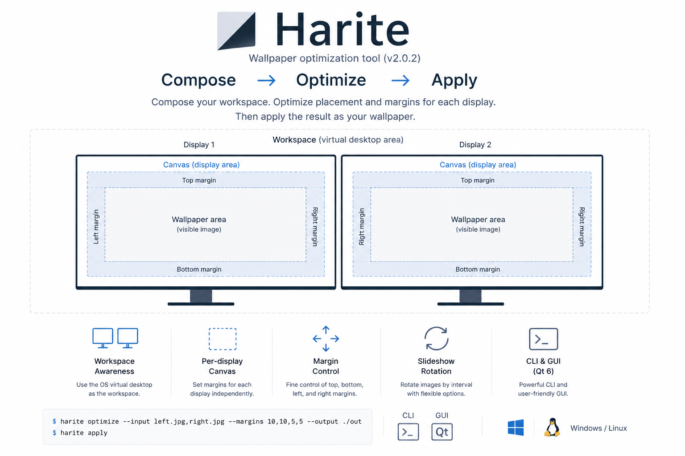

# Harite

Harite — wallpaper optimization tool (v2.0.2)



## Overview

Harite generates, arranges, and applies wallpapers in multi-display environments. It supports per-display placement, margins, slideshow rotation, and wallpaper apply plugins.

- **CLI:** `harite optimize` / `apply` / `slideshow`
- **GUI:** Qt 6 (`harite-qt` / `harite-gui` — same entry point)

## Installation

### Python package (Linux / development)

```bash
pip install harite-2.0.2-py3-none-any.whl   # or: pip install -e ".[gui-qt]"
```

For the GUI on Linux, see [requirements-linux-qt.txt](requirements-linux-qt.txt) (distro `python3-pyqt6`, etc.).

### Windows (binary zip)

Extract the onedir folders from the GitHub Release attachment to any location. **There is no installer.**

| Folder | EXE | Role |
| --- | --- | --- |
| `harite/` | `harite.exe` | CLI |
| `harite-qt/` | `harite-qt.exe` | GUI |

See [packaging/windows/README.md](packaging/windows/README.md) for build details.

#### Start menu and shortcuts

**Nothing is added automatically.** The PyInstaller onedir zip is folder-only extraction. Harite does not register Start menu entries or create desktop shortcuts on Windows (`install-desktop-entry` is **Linux/XDG only**).

To launch the GUI from the Start menu, do it manually:

- Pin `harite-qt.exe` to Start, or
- Create a shortcut (`.lnk`) to `harite-qt.exe` and place it on Start menu / Desktop.

#### CLI and PATH (optional)

To run `harite` from any directory without a full path, add the extracted `harite` folder to your **user `Path` environment variable**. This is optional.

```powershell
# Example after adding C:\Apps\harite to Path:
C:\Apps\harite\harite.exe optimize --help
```

You normally do not need `harite-qt` on `Path` (launch the GUI EXE directly).

## Updating (existing users)

From v2.0.1 to v2.0.2, **no settings or CLI migration is required** (`startup_slideshow` defaults to `false`). Replace the package binaries and restart `harite-qt` / `harite.exe`.

**v2.0.2 behavior:** the main window **×** button **hides to the tray**; use tray **Quit** to exit. For session autostart slideshow resume, see [Session autostart](#session-autostart-resume-slideshow).

**User data is not overwritten.** Default locations (see [core-spec §6.1](docs/specs/core/harite-core-spec.md)):

| Platform | settings / sources |
| --- | --- |
| Linux / XFCE | `~/.config/harite/harite-settings.json`, `harite-sources.json` |
| Windows | `%APPDATA%\harite\harite-settings.json`, `harite-sources.json` |

### Linux / XFCE (wheel)

1. Quit running `harite-qt` / `harite-gui`.
2. Download `harite-2.0.2-py3-none-any.whl` from GitHub Releases.
3. Reinstall over the existing install using the same method as the first install:

```bash
# pipx (recommended)
pipx install --force /abs/path/to/harite-2.0.2-py3-none-any.whl
# If you use distro python3-pyqt6, same as first install:
# pipx install --system-site-packages --force /abs/path/to/harite-2.0.2-py3-none-any.whl

# pip --user
python3 -m pip install --user --upgrade /abs/path/to/harite-2.0.2-py3-none-any.whl
```

1. Verify: `harite --version` → `2.0.2`
2. **No need** to run `harite install-desktop-entry` again.

### Windows (onedir zip)

1. Quit running `harite-qt.exe` / `harite.exe`.
2. Download the CLI / GUI onedir zips from GitHub Releases and **overwrite** the existing `harite/` and `harite-qt/` folders.
3. If the extract path is unchanged, shortcuts and `Path` entries **stay as they are**.
4. Verify:

```powershell
C:\Apps\harite\harite.exe --version
```

## CLI examples (v2)

Workspace geometry is detected automatically. Use `--canvas-scale` only to shrink the saved JPEG (placement always uses full geometry).

```bash
harite optimize --input left.jpg,right.jpg \
  --margins 10,10,5,5 --output ./out
```

Two inputs imply dual layout (detection failure is an error). To reduce file size:

```bash
harite optimize --input left.jpg,right.jpg --canvas-scale 50 -o ./out
```

Apply plugin and mode are set via settings JSON (`-c`). v1 flags `--resolution`, `--two-screen`, and `--plugin` are **removed in v2**.

See `harite optimize --help` and [CHANGELOG.md](CHANGELOG.md).

## GUI startup

```bash
harite-qt
# or
harite-gui
```

v2 GUI is **Qt 6 only**. GTK / `python3-gi` are not required.

On Linux/XFCE, for an application-menu launcher:

```bash
harite install-desktop-entry
```

(Writes `~/.local/share/applications/*.desktop`. Not available on Windows.)

### Session autostart (resume slideshow)

Enable **“Resume slideshow on session startup”** on the Slideshow tab to auto-start slideshow after an OS login launch **only when slideshow was running at the last exit** (not after a manual Stop or exit while stopped).

The launch command must include **`--startup-launch`** (or `HARITE_STARTUP_LAUNCH=1`). For tray-only startup, also use **`--no-present-ui-window`**.

**Linux (XFCE, etc.)** — example `~/.config/autostart/harite.desktop`:

```ini
[Desktop Entry]
Type=Application
Name=Harite
Exec=harite-qt --no-present-ui-window --startup-launch
X-GNOME-Autostart-enabled=true
```

**Windows** — place a shortcut in the Startup folder with a target like:

```text
harite-qt.exe --no-present-ui-window --startup-launch
```

The main window **×** button **hides to the tray**; use tray **Quit** to exit completely.

## Dependencies

Harite is a Python package (or a self-contained binary on Windows). Wallpaper apply and display detection may use external tools.

- **Common (Python distribution):**
  - Python 3.12+ (`pyproject.toml`)
  - `typer`, `Pillow` (bundled via wheel / editable install)

- **GUI (Qt):**
  - `PyQt6` or distro `python3-pyqt6` ([requirements-linux-qt.txt](requirements-linux-qt.txt))

- **On XFCE:**
  - `xrandr` — display information
  - `xfconf-query` — wallpaper settings (xfce plugin)

## Distribution

- Linux: `harite-<version>-py3-none-any.whl` / `.tar.gz` ([docs/release-delivery.md](docs/release-delivery.md))
- Windows: onedir zip (CLI + GUI)
- PyPI publish is TBD (GitHub Release attachments / git clone)

## License

Harite is distributed under the MIT License. Artifacts include [LICENSE](LICENSE).

Lucide SVG icons bundled with the GUI have separate upstream notices. See [THIRD_PARTY_NOTICES.md](THIRD_PARTY_NOTICES.md).
