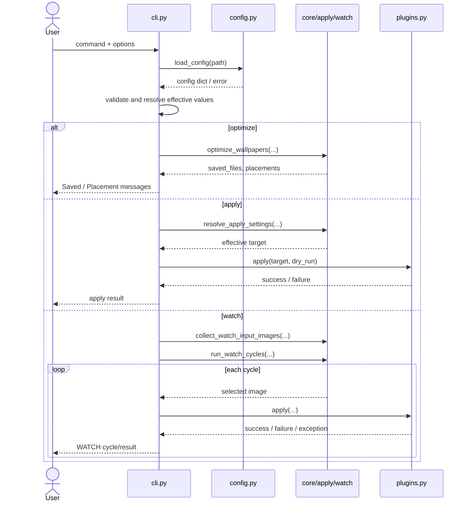
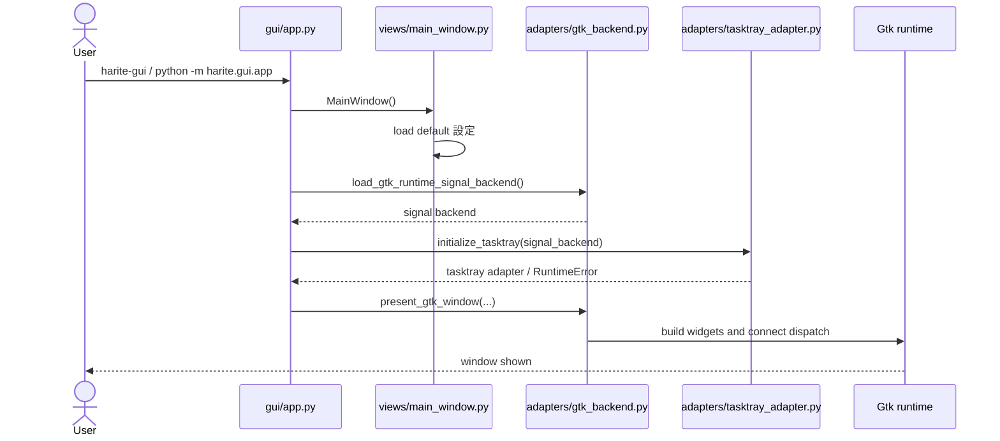
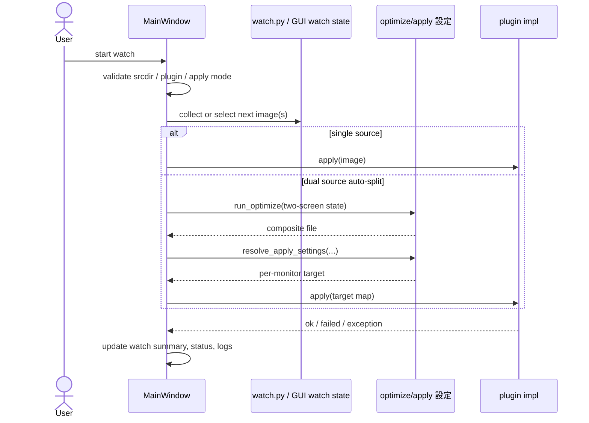
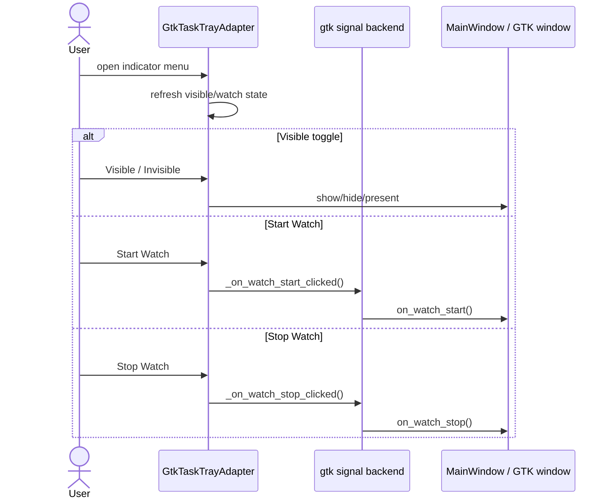
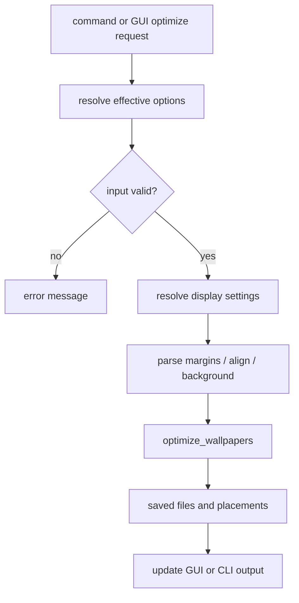
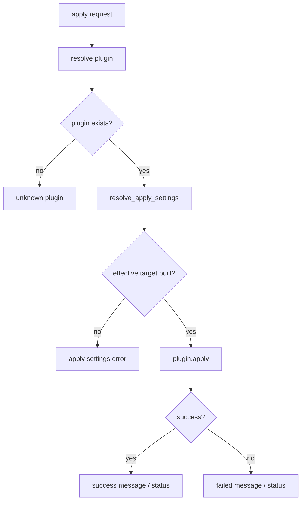
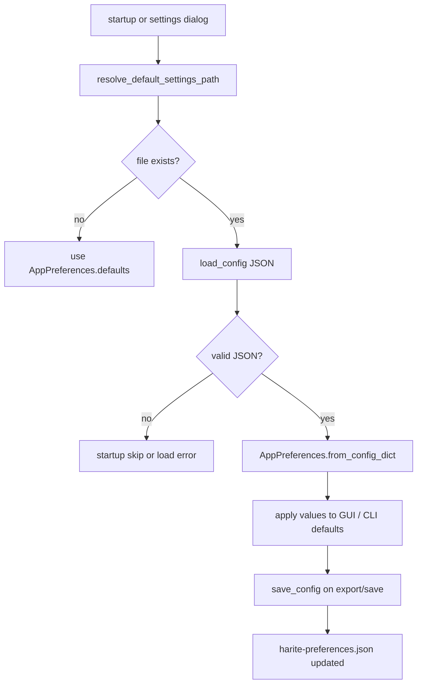

# Harite Project Initial Build Reformation WS4 仕様構成下案 (Spec Structure Draft)

最終更新: 2026-05-19

## 位置づけ

- 本書は [docs/reformation/harite-project-initial-build-reformation-ws4-spec-authoring.md](docs/reformation/harite-project-initial-build-reformation-ws4-spec-authoring.md) を受けて、仕様書正本の章構成下案を置く補助文書である。
- ここでいう「下案」は、現時点の Harite を読むための常設仕様をどう分冊するかの叩き台であり、最終決定ではない。
- planning 履歴の要約ではなく、WS4 で何を書くかの骨組みを先に固定するための文書である。

## 前提

- 仕様書正本は業務仕様書並みに分冊する前提とする。
- `docs/specs/core/` `cli/` `gui/` `watch/` は、WS4 で正本を受けるための空ディレクトリとして扱う。
- 初期開発履歴は [docs/_initial-build-history](docs/_initial-build-history) 側へ退避済みであり、正本本文はそこを直接なぞらない。
- README は導入と最小利用導線を担い、仕様書正本は「現行 Harite がどう動くか」を担う。

## 章構成下案

### 1. 基本仕様 (foundation)

配置候補:

- `docs/specs/harite-foundation-spec.md`

役割:

- Harite 全体の目的、対象利用者、対象環境、非対象、各操作面の関係をまとめる。
- 分冊仕様の入口として機能し、各詳細仕様への導線を持つ。
- README では薄すぎるが、個別分冊に散らすと見失う前提を受け持つ。

章候補:

1. 文書の目的と適用範囲
2. Harite の目的
3. 想定利用者
4. 対象環境と前提依存
5. 全体アーキテクチャ概要
6. GUI / CLI / watch / tray の関係
7. 設定 (settings) / save / apply の責務分担
8. README と仕様書の役割分担

### 2. コア仕様 (core spec)

配置候補:

- `docs/specs/core/harite-core-spec.md`

役割:

- 入出力モデル、設定モデル、表示文脈、最適化ロジック、適用ロジックなど、Harite の基底挙動を扱う。
- GUI / CLI のどちらから触っても変わらない正本部分を受け持つ。

章候補:

1. core の責務
2. データモデル
3. 入力解決と表示コンテキスト
4. 最適化ロジック
5. 適用ロジック
6. 設定 (settings) の保存と読み出し
7. エラーと失敗時の扱い
8. 他分冊との境界

### 3. CLI 仕様 (CLI spec)

配置候補:

- `docs/specs/cli/harite-cli-spec.md`

役割:

- CLI command surface を正本として定義する。
- command ごとの目的、入力、出力、終了コード、core との接続点を扱う。

章候補:

1. CLI の責務
2. command 一覧
3. `optimize`
4. `compute-placement`
5. `apply`
6. `watch`
7. `install-desktop-entry`
8. 共通オプションと終了コード
9. GUI / watch / packaging との境界

### 4. GUI 仕様 (GUI spec)

配置候補:

- `docs/specs/gui/harite-gui-spec.md`

役割:

- 現行 GUI の画面責務、操作導線、保存・適用・watch との接続、tray / icon surface をまとめる。
- 見た目の履歴ではなく、現行 UI の責務と状態遷移を受け持つ。

章候補:

1. GUI の責務
2. 起動導線
3. 画面全体構成
4. メイン操作フロー
5. 設定 (settings) 保存と再読込
6. watch との接続
7. tray / indicator / app icon surface
8. GUI での失敗時挙動
9. CLI / core との境界

### 5. watch 仕様 (watch spec)

配置候補:

- `docs/specs/watch/harite-watch-spec.md`

役割:

- watch の起動条件、継続条件、pause / retry、GUI watch と CLI watch の関係を受け持つ。
- 安定運用と incident 再発防止の観点で、曖昧にしない方がよい面をまとめる。

章候補:

1. watch の責務
2. 起動条件
3. 監視ループの基本動作
4. pause / resume / retry
5. GUI watch の責務
6. CLI watch の責務
7. ログと観測面
8. 安定性上の注意点
9. core / GUI / CLI との境界

## 補助分冊の扱い

- tray / desktop entry / platform integration は、まず GUI spec または CLI spec の一章として収める。
- これらが肥大化した場合だけ、将来 `platform` などの別分冊を検討する。
- 現時点では分冊を増やしすぎず、foundation / core / cli / gui / watch の 5 面で始める方が自然である。

## README との分担下案

- README には導入、インストール、最小の起動導線、主要コマンド例だけを置く。
- 仕様書正本には、操作面ごとの責務、状態、失敗時挙動、境界条件を置く。
- README に長い状態説明や履歴説明を戻さない。

## 追加で必須化したい章と補遺

### 1. Mermaid 図を正本へ明示的に入れる

- CLI spec には command 実行の sequence diagram を入れる。
- GUI spec には GUI 起動の sequence diagram を入れる。
- watch spec には watch 開始と tick の sequence diagram を入れる。
- GUI spec または watch spec には tray の起動と役割分担の sequence diagram を入れる。
- core / CLI / GUI / watch の各分冊には、ロジックが連結している箇所だけ flowchart を入れる。

最低限の図面候補:

1. CLI 起動から core / plugin までの sequence diagram
2. GUI 起動から GTK backend / tasktray / window present までの sequence diagram
3. watch 開始から apply までの sequence diagram
4. tray から watch start / stop / visible toggle までの sequence diagram
5. optimize の flowchart
6. apply の flowchart
7. 設定 load / save と 設定ファイル (`harite-preferences.json`) の flowchart

### 2. ソースディレクトリ構成と責務分担を foundation か GUI spec で明示する

- 正本本文のどこかで、`src/harite/` の directory 構成と責務境界を明記する。
- 特に `core` 相当、CLI、watch、plugin、GUI runtime、GUI view-model の境界は、保守者が最初に掴めるようにする。

### 3. 設定ファイル (`harite-preferences.json`) の仕様を独立して書く

- 保存場所の解決規則
- 物理 JSON 形式
- 各 key の型、既定値、意味
- GUI と CLI のどちらが読むか、どこまで共有されるか
- 不正 JSON / 欠落 key / 将来拡張時の扱い

### 4. メッセージとエラーレベルの分類をまとめる

- 現行 Harite には message catalog の集中管理はないため、出力チャネル単位で整理する。
- 少なくとも CLI 表示、GUI status / error、watch 実行メッセージ、plugin logger の 4 面で分類する。
- 重要度は `info / success / warning / error / exception` に準じて説明する。

## Mermaid 下案

### CLI シーケンス図下案 (CLI sequence draft)



### GUI 起動シーケンス図下案 (GUI startup sequence draft)



### watch シーケンス図下案 (watch sequence draft)



### tray シーケンス図下案 (tray sequence draft)



### optimize フロー図下案 (optimize flow draft)



### apply フロー図下案 (apply flow draft)



### preferences フロー図下案 (preferences flow draft)



## ソースディレクトリ構成の記述下案

```text
src/harite/
  cli.py                  CLI entrypoint と command surface
  config.py               設定ファイル (harite-preferences.json) の path 解決と JSON load/save
  preferences.py          設定モデルと JSON との相互変換
  core.py                 optimize の基底ロジック
  apply_settings.py       apply 対象の解決
  watch.py                watch の選択ループと cycle state
  plugins.py              OS / desktop plugin registry と apply 実装
  linux_xdg_launcher.py   Linux/XDG launcher 生成
  gui/
    app.py                GUI entrypoint
    views/                framework-neutral な MainWindow view-model
    controllers/          GUI から core への接続制御
    adapters/             GTK runtime, dialog, tray, signal wiring
    services/             GUI 補助サービス
    resources/            icon などの同梱リソース
```

GUI refactor 後のもう一段下の分類下案:

```text
src/harite/gui/
  app.py
    GUI 起動入口。MainWindow 生成、GTK backend load、tasktray 初期化、window present を束ねる。

  views/
    main_window.py
      framework-neutral な主状態モデル。status, logs, 設定, optimize/apply/watch の業務状態を持つ。
      1000 行超だった責務がここへ残っているが、描画・GTK 実体・補助計算は外へ分離済み。
    main_window_preview.py
      preview 表示専用の補助計算。CLI preview 文字列、display assignment、assist summary を生成する。

  controllers/
    optimize_controller.py
      GUI form state を core.optimize 実行へ橋渡しする薄い controller。
      validate, output path 採番, export 実行を受け持つ。

  services/
    cli_mapper.py
      GUI state を CLI 相当の引数列へ写像する補助サービス。
      「GUI の今の状態を CLI でどう表すか」の説明面に使える。

  adapters/
    gtk_backend.py
      GTK runtime 側の大きな統合窓口。widget object 保持、owner 同期、feedback 更新、runtime handler 呼び出しを束ねる。
    ui_adapter.py
      MainWindow method と runtime signal handler 名の対応表。dispatch table の生成と接続を担う。
    tasktray_adapter.py
      tray / indicator の生成、menu action、visible toggle、watch start/stop を担う。

    gtk_layout_builders.py
    gtk_tab_builders.py
    gtk_dialog_builders.py
      静的な widget 構成を build する層。layout, tab, dialog の構築責務を分割したもの。

    gtk_runtime_builders.py
    gtk_runtime_object_registry.py
      runtime 上で build 済み widget を組み立て、name と object の対応を作る層。

    gtk_runtime_signal_wiring.py
    gtk_runtime_sync.py
    gtk_runtime_owner_sync.py
      signal 接続、owner <-> runtime state 同期、widget 値の反映を扱う層。

    gtk_runtime_file_dialog_flow.py
    gtk_runtime_save_path_access.py
    gtk_runtime_settings_dialogs.py
    gtk_runtime_dialogs.py
      open/save/設定 各 dialog のフロー制御を分離した層。

    gtk_runtime_watch.py
    gtk_runtime_watch_ui.py
      watch timer、watch tick、watch UI label 更新を分けた層。

    gtk_runtime_margin_text.py
    gtk_runtime_margin_text_gtk.py
      margin text の正規化、GTK widget 反映、入力制約を扱う層。

    gtk_runtime_widget_access.py
    gtk_runtime_state_labels.py
    gtk_runtime_preview.py
      widget access, status/error label, preview 表示の小粒 helper 群。
```

この段の責務分割で仕様書に明記したい点:

- `main_window.py` は「業務状態と操作判断」を持ち、GTK widget の細部は持たない。
- `adapters/` は「GTK 実体との接続」を担い、さらに layout/build, signal, dialog, watch, helper の粒度まで割られている。
- `main_window_preview.py` や `services/cli_mapper.py` のような補助計算は、巨大 view-model 本体から切り出された説明可能なサブ責務である。
- したがって GUI spec では、`app -> view-model -> controller/service -> GTK adapters` の層構造として書くのが自然である。

仕様書で特に明記したい責務境界:

- `core.py` は画像処理と基底ルール、`cli.py` は command surface、`plugins.py` は OS 適用面を持つ。
- `preferences.py` は論理設定モデル、`config.py` は物理 JSON I/O を持つ。
- `gui/views/main_window.py` は GUI の状態モデル、`gui/adapters/` は GTK 実体との接続を持つ。
- `watch.py` は最小 watch ループ、GUI watch の実運用責務は `MainWindow` 側にも跨っている。

## 設定ファイル (`harite-preferences.json`) 仕様下案

### 保存場所

- Linux: `XDG_CONFIG_HOME/harite/harite-preferences.json`
- Linux で `XDG_CONFIG_HOME` が未設定: `~/.config/harite/harite-preferences.json`
- 非 Linux: `~/harite-preferences.json`

### 物理形式

- UTF-8 の JSON ファイル
- 物理 JSON はネストせず、top-level key を平坦に持つ
- 書き出し時は 2-space indent と末尾改行を付ける

### 論理グループと key 一覧

注意:

- 実装上は `OptimizePreferences` `ApplyPreferences` `WatchPreferences` に分かれるが、ファイル上は 1 つの JSON object に merge される。

optimize 面:

- `resolution`: string, default `1920x1080` だが config decode では `auto` も許容
- `scaling`: string, default `fit`
- `two_screen`: bool or `auto`, default `false`
- `l_display`: string or null
- `r_display`: string or null
- `margins`: string or null
- `align`: string or string pair, 保存時は string list
- `valign`: string or string pair, 保存時は string list
- `quality`: int, default `90`
- `background_color`: string, default `#000000` 相当の既定色
- `embed_info`: string, default `none`
- `embed_text`: string or null
- `embed_position`: string, default `auto`
- `embed_max_lines`: int, default `3`

apply 面:

- `plugin`: string, platform 既定 plugin 名
- `apply_mode`: string, 既定は session により `per-monitor-auto-split` または `single-file`

watch 面:

- `watch_interval_seconds`: int, default `60`
- `watch_srcdir_l`: string or null
- `watch_srcdir_r`: string or null

### 例

```json
{
  "resolution": "1920x1080",
  "scaling": "fit",
  "two_screen": false,
  "align": ["center", "center"],
  "valign": ["center", "center"],
  "quality": 90,
  "background_color": "#000000",
  "embed_info": "none",
  "embed_position": "auto",
  "embed_max_lines": 3,
  "plugin": "linux",
  "apply_mode": "per-monitor-auto-split",
  "watch_interval_seconds": 60,
  "watch_srcdir_l": null,
  "watch_srcdir_r": null
}
```

## メッセージと重要度の整理下案

前提:

- 現行実装には一元的な message catalog はない。
- したがって、正本では message code 一覧ではなく、出力チャネルと重要度の規約として書く方が実態に合う。

### 1. CLI 表示

- 主体: `typer.echo(...)`
- 典型: validation error, plugin unknown, watch summary, apply result
- 重要度:
  - `info`: 実行開始、完了、dry-run summary
  - `error`: 不正入力、plugin 解決失敗、apply 失敗
- exit code の代表:
  - `0`: 正常終了
  - `2`: 入力不正、config 不正、plugin 不明、サポート外
  - `3`: apply 実行失敗

### 2. GUI status / error

- 主体: `MainWindow.status_level / status_phase / status_message / last_error`
- 表示面: footer の `Status: ...` と `Error: ...`
- 重要度:
  - `idle`: 待機
  - `running`: 実行中
  - `success`: 完了
  - `error`: 失敗

### 3. watch 実行メッセージ

- CLI watch は `WATCH start` `WATCH cycle` `WATCH completed` を中心に出す。
- GUI watch は `status`, `watch summary`, `logs` を併用する。
- 重要度:
  - `info`: start, completed, selected, apply ok
  - `warning`: pause や blocked に近い再試行待ち
  - `error`: apply failed, invalid srcdir, plugin exception

### 4. plugin logger

- 主体: `logging` module in `plugins.py`
- 重要度:
  - `info`: dry-run command, discovered candidates
  - `warning`: fallback 不成立、候補不一致
  - `error`: unsupported mode, file missing, setter not found
  - `exception`: 外部 command / plugin apply の例外

仕様書での書き方の推奨:

- 個々のメッセージ文言を完全列挙するより、まずチャネル、トリガ、重要度、代表例を書く。
- 文言一覧が必要なら appendix として後置し、本文では「何が起きた時にどのレベルで伝えるか」を優先する。

## 未決定点

- foundation を独立 1 枚にするか、index 的な短文書に抑えるか。
- GUI spec に tray / icon / launcher を含め切るか、platform 面を後で分けるか。
- watch spec を GUI watch 中心で書くか、CLI watch と対等に書くか。
- 設定 (settings) を core spec に寄せるか、foundation で概説して各分冊で再定義するか。

## 現時点の推奨

- まずは 5 分冊前提で見出しだけ起こす。
- その後、各分冊で「今どうなっているか」だけを書き、履歴や没案は [docs/_initial-build-history](docs/_initial-build-history) 側に残す。
- 最初の執筆順は foundation → core → CLI → GUI → watch が自然である。
