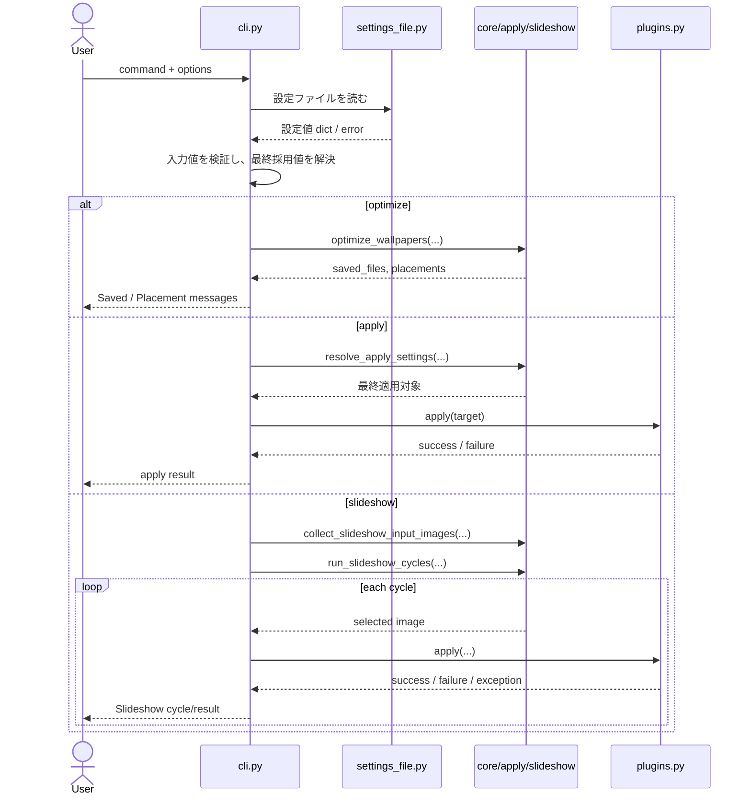

# Harite CLI 仕様 (CLI Spec)

最終更新: 2026-06-12（MAT-23 plugin 自動判定）

## 1. CLI の責務

- Harite の command surface を提供する。
- command ごとの入力検証、設定ファイル読み込み、core / plugin 呼び出し、終了コード決定を行う。

CLI は GUI と異なり、1 回の command 実行を明示的に完結させる操作面である。そのため本分冊では、各 command がどの入力を受け、どの層へ委譲し、どの終了コードで返るかを主に扱う。

## 2. command 一覧

- `optimize`
- `apply`
- `slideshow`
- `install-desktop-entry`

位置づけの違い:

- `optimize` は画像生成を担う主 command である。
- `apply` は既存または生成済み画像の適用を担う。
- `slideshow` は単発 command を継続実行へ拡張する。
- `install-desktop-entry` は Linux/XDG 向け補助 command である。

## 3. CLI シーケンス図 (CLI sequence)



## 4. `optimize`

- 入力画像、表示条件、margins、align、background_color、embed 系を受け取る。
- `--settings-file` / `-c` は optimize / apply / slideshow で受け付ける。与えられた場合は設定ファイルを読み、CLI 引数を優先して上書きする（`apply` は `apply_mode` / `plugin` / `windows_apply_span` 等を読む。§5）。
- help では `--settings-file` を optimize 用 defaults を読む option だと分かる文言で説明する。規範文言は `Optional path to optimize settings JSON` を基準にする。
- help では `--input` を、カンマ区切りまたは `--input` の繰り返しで最大 2 件まで受け付ける画像入力だと分かる文言で説明する。規範文言は `Input file(s). Use comma-separated paths or repeat --input.` を基準にする。
- **`optimize --help` の幾何説明（MAT-15 / MAT-19）:** margins は fit / shrink の制約のみ。`align` / `valign` は display スロット全面で効く。次の誤解を誘う文言は **含めない**: 「margins の内側で align が効く」「`two-screen` は `--l-display` / `--r-display` 併用時に効きが強くなる」。規範 docstring 抜粋:
  - `Geometry (core-spec §4.1): margins (left,right,top,bottom) constrain image fit/shrink; align / valign use the full display slot for positioning.`
  - `--margins` option help: `Constrain fit only; align uses full slot.`
- **廃止フラグは help に出さない:** `--resolution` / `-r`、`--two-screen` / `--no-two-screen`、`--l-display`、`--r-display`、`--scaling`。
- `scaling` は public surface から外す。optimize の拡大縮小は内部で fit 系計算を使い、`fill` / `crop` は user-facing option として露出しない。
- 成功時は `Saved:` と 1 行ずつの `Placement:` を出力する（§4.1）。

主要な流れ:

1. `--settings-file` があれば設定ファイル JSON を読み込む。
2. CLI 引数と設定ファイル値から、各オプションの最終採用値を解決する。
3. `--input` を画像ファイル列として正規化する。
4. `resolve_optimize_display_settings(...)` で workspace 検出・入力枚数・`canvas_scale_percent` から合成キャンバス寸法を確定する（内部 `resolution` は作業解像度。ユーザー向け CLI フラグは `--canvas-scale` のみ。§ display / canvas 解決）。
5. `optimize_wallpapers(...)` を呼び、出力ファイル一覧と配置結果一覧を得る。
6. 結果を stdout に出力する。

入力値の優先順位と最終採用値:

- ここでいう最終採用値とは、CLI 引数、設定ファイル値、option default を優先順位で重ねたあとに、実際に `optimize_wallpapers(...)` へ渡す値を指す。
- 優先順位は CLI 引数 > 設定ファイル値 > option default である。
- `--input` 未指定時は設定ファイル側の `input` を使えるが、最終的に入力列が空なら終了コード `2` で止める。
- `optimize` の `--input` は、各 option 値をカンマで分割し、空要素を落とした順序付き画像ファイル列として正規化する。したがって `--input a.jpg,b.jpg` と `--input a.jpg --input b.jpg` は同じ 2 件入力として扱う。
- `optimize` の public surface で使う入力画像数は最大 2 件である。3 件以上が与えられた場合は先頭 2 件だけを採用し、3 件目以降は使わない。
- 採用されない 3 件目以降の入力は存在・正当性の検証を行わず、静かに無視する。
- 2 件入力を採用した場合、先頭を left、2 件目を right として順番に割り当てる。CLI には optimize 入力の左右を明示的に入れ替える別 option は持たない。
- `optimize` の `--input` は画像ファイル列のみを受け付け、directory が渡された場合は明示エラーで終了する。
- `quality`, `embed_info`, `embed_position`, `embed_max_lines`, `background_color` は CLI 側で先に妥当性検証する。
- **意図的拡大 / auto 倍率（settings 経由）:** `--settings-file` から `l_display_scale`, `r_display_scale`, `l_auto_display_scale`, `r_auto_display_scale` を読み、`optimize_wallpapers(...)` へ渡す。CLI 専用 option は持たない（GUI Main Compose と同型）。挙動の正本は [core-spec §4.1](../core/harite-core-spec.md#41-placement-計算の現行規則)。
- `background_color` の値規則自体は `#` の有無を許容するが、CLI help と例示は shell 誤解を避けるため `E0E0E0` のような 6 桁 HEX を基準にする。
- `embed_position` は `left-top|left-bottom|right-top|right-bottom` の 4 値だけを受け付ける。help でも同じ 4 値をそのまま見せる。
- `embed_position` が未指定のときの既定値は `right-bottom` である。
- この 4 値制約は CLI 引数だけでなく `--settings-file` から読んだ値にも同じように適用する。4 値以外は不正として扱う。

display / canvas 解決（MAT-21b）:

- **入力 2 枚:** dual 必須。検出 display `< 2` は **終了コード `2`**（`DUAL_INPUT_REQUIRES_TWO_DISPLAYS`）。メッセージは [core-spec §3.1](../core/harite-core-spec.md#31-表示コンテキスト解決の現行規則) の規範文言。
- **入力 1 枚:** single。検出 1 台から virtual desktop 寸法を導き合成キャンバスを確定する。検出 0 台は **終了コード `2`**。
- **`--canvas-scale`:** 検出 desktop に対する合成キャンバス縮小率（1–100、既定 100）。CLI 明示 > settings `canvas_scale_percent` > 既定 100。
- **廃止（v2.0.0 / MAT-21b）:** `--resolution` / `-r`、`--two-screen` / `--no-two-screen`、`--l-display`、`--r-display`。settings の同名キーも読み捨て。
- `--margins` は `left,right,top,bottom` の 4 要素文字列（ピクセル）として解釈し、省略時は `(0, 0, 0, 0)` を使う。

margins / align / valign の関係（[core-spec §4.1](../core/harite-core-spec.md#41-placement-計算の現行規則) と同型）:

- `margins` は **画像の収納判定と縮小上限** に使う（display 矩形から控除した利用可能領域）。
- `align` / `valign` は各 display **スロット全面**（`screen_w × screen_h`）の余白で寄せる。margins の内側セルへ align しない。
- paste 座標に margins の `+= ml` オフセットは **付けない**。したがって help で「margins の内側で align が効く」と読んではいけない。

canvas scale（現行）:

- 未指定時は `resolve_optimize_display_settings(...)` が workspace 検出・入力枚数・`canvas_scale_percent` から合成キャンバスを解決する（詳細は core-spec §3.1）。
- 方針の正本: [two-screen 整理メモ §6](../../working/20260611-two-screen-display-params-clarification.md#6-将来整理の方向オーナー判断確定-2026-06-12)。

主な失敗条件:

- 設定ファイル読み込み失敗
- 画像入力不正
- display 未検出 / dual 入力に対する display 不足 / `canvas_scale_percent` 不正
- background color や embed 系 option 不正

### 4.1 `Placement:` 出力

各入力画像ごとに 1 行を stdout へ出す。形式:

```text
Placement: {image_name} @ ({x},{y}) {width}x{height} scale={scale} posit={left|right}
```

| フィールド | 意味 |
| --- | --- |
| `image_name` | 入力画像のファイル名（パス末尾） |
| `x`, `y` | **合成キャンバス**上の貼り付け左上座標（ピクセル、原点は左上） |
| `width`, `height` | 配置後の画像ピクセルサイズ（scale 適用後） |
| `scale` | 適用した拡大縮小倍率（原寸なら `1.0`） |
| `posit` | two-screen / 複数入力時のスロット: `left` / `right`。単一入力で左右の区別が無いときは行末から省略可 |

`rotation` / `score` は内部互換フィールドであり、CLI 一行出力には含めない。

**margins と Placement の関係:** [core-spec §4.1 Placement 座標と margins](../core/harite-core-spec.md#41-placement-計算の現行規則) を正とする。margins は x/y に直接効かないため、原寸収まり時は margins を変えても Placement の x/y が同じになることがある（仕様）。

**embed 重畳ガード:** `--embed-info` が有効かつ embed 領域がいずれかの貼り付け画像矩形と交差する場合、**出力を保存せず** 終了コード `2` で止める。stdout には次の規範文言（または同等の英語）を出し、**embed_position の選び直し**（または align / valign / margins の調整）を促す:

```text
Embed position overlaps pasted image. Choose another embed_position (left-top, left-bottom, right-top, right-bottom) or adjust align, valign, or margins.
```

### 短縮形オプション

- `optimize` で使える短縮形: `--input` / `-i`、`--output` / `-o`、`--settings-file` / `-c`

### 主な option の既定値

| option | 既定値 |
|---|---|
| `--output` | `.`（カレントディレクトリ） |
| `--background-color` | `1E1E1E` |
| `--quality` | `90` |
| `--embed-info` | `none` |
| `--embed-position` | `right-bottom` |

### 設定ファイル内 bool 値の解釈規則

- 設定ファイル内の bool 値は `true/false/1/0/yes/no/on/off`（大文字小文字不問）を受理する。Python の bool/int 型 `True`/`False`/`1`/`0` も受理する。これ以外の値は不正として終了コード `2` で止める。

## 5. `apply`（MAT-22）

- 直前の `optimize` 結果を OS 壁紙へ適用する。GUI の **Apply** ボタン（`last_saved_files` → `resolve_apply_settings`）と同型。
- **`apply_mode` / `plugin` / `windows_apply_span` は settings 正本**（`--settings-file` / `-c` 推奨）。CLI に `--auto-split` / `--left-file` / `--right-file` / `--per-monitor` は **持たない**（v2.0.0 で廃止）。

### 典型フロー

```text
harite optimize -i "left.jpg,right.jpg" -c settings.json -o ./out
harite apply -c settings.json
```

シェル 1 行化: `harite optimize ...; harite apply -c settings.json`

### 合成ファイルの解決（`--file`）

| 条件 | 採用する composite |
| --- | --- |
| `--file` 指定あり | その path（上級・既存 JPEG 用。非推奨） |
| `--file` 省略 | `.harite-last-optimize.json` から `composite_path` を読む |

追跡ファイル（`last_optimize_run.py`）:

- **書き込み:** `optimize` 成功時。`Saved:` 出力と同タイミング。
- **配置:** `{output_dir}/.harite-last-optimize.json` および設定ディレクトリ（`resolve_default_settings_path().parent`）の同名ファイル（最新 run のコピー）。
- **内容:** `composite_path`（絶対 path）、`output_dir`（絶対 path）。
- **読み込み:** `apply` で `--file` 未指定時。探索順は `--output` ヒント → 設定ディレクトリ → カレントディレクトリ。欠落・不正・参照ファイル不存在は終了コード `2`。

### apply mode と plugin

- `apply_mode` は `--settings-file` から `ApplySettings` として読む。未指定時は `AppSettings._default_apply_mode(default_plugin)`（GUI と同型）。
- `plugin` は settings `plugin` > OS 既定 plugin の順。CLI `--plugin` は **廃止**（MAT-23）。
- `windows_apply_span` が有効かつ Windows Span 経路のとき、`ensure_span_style()` を best-effort 実行する（GUI B-lite と同型）。
- `resolve_apply_settings(...)` は `output_dir=composite_path.parent` を渡す（split 出力先は合成画像の親 directory）。
- plugin が `False` を返した場合は終了コード `3`。

### 廃止（v2.0.0 / MAT-22）

- `--auto-split`, `--left-file`, `--right-file`, `--per-monitor`
- 旧実装の「`apply` は settings を読まない」経路（MAT-22 で `--settings-file` / `-c` 対応に置換）

### 未知 plugin 時の動作

- 未知 plugin が指定された場合は `Unknown plugin: {name}` を出力し、続けて `Available plugins: {カンマ区切りの一覧}` を出力して終了コード `2` で終了する。

### 短縮形オプション

- `apply` で使える短縮形: `--settings-file` / `-c`、`--output` / `-o`、`--file` / `-f`

## 6. `slideshow`

- command 名も `slideshow` とし、public surface の機能名と揃える。
- 入力 directory を 1 件または最大 2 件の source directory として扱う。
- `mode`, `interval_sec` を CLI option で扱う。`plugin` は settings / OS 既定（§8）。
- `--settings-file` / `-c` で `harite-settings.json` 相当の JSON を読み込める。優先順位は **CLI 引数 > settings > 既定値**。
- settings から読む slideshow **専用**キー: `slideshow_srcdir_l`, `slideshow_srcdir_r`, `slideshow_interval_seconds`, `slideshow_mode`, `slideshow_l_auto_display_scale`, `slideshow_r_auto_display_scale`, `plugin`。
- `--input` / `--interval-sec` は settings 未指定時は必須。`--settings-file` がある場合は settings 値で補完できる（CLI が指定されていれば CLI を優先）。
- CLI `slideshow` の `--mode` 既定値は `sequential` である（settings 未使用時）。settings の `slideshow_mode` 既定は GUI と同様 `random`。
- help では `--input` を、カンマ区切りまたは `--input` の繰り返しで source directory を指定できる option だと分かる文言で説明する。規範文言は `Input directories. Use comma-separated paths or repeat --input.` を基準にする。
- help では `--settings-file` を harite-settings を読む option だと分かる文言で説明する。規範文言は `Optional path to harite-settings.json` を基準にする。

### settings 読込と optimize 経路（MAT-11 / MAT-17）

- CLI は settings の **srcdir パス** を `--input` の代替として使う。`slideshow_source_id_*` / `slideshow_profile_id` は **catalog 解決しない**（GUI が保存した `slideshow_srcdir_*` が空のときは CLI 単独では開始できない）。
- **毎 cycle** で GUI と同型の `run_slideshow_optimize` を通す。settings の取り込みは次のとおり（[core-spec §6.3](../core/harite-core-spec.md) と同型）:
  - **optimize 面から:** `canvas_scale_percent`, `margins`, `align`, `valign`, `quality`, `background_color`, `embed_*` 等（**手動 `l/r_display_scale` は slideshow 経路では使わない**）
  - **slideshow 面から:** `slideshow_l_auto_display_scale`, `slideshow_r_auto_display_scale`（MAT-14b auto。**optimize 面の `l_auto_display_scale` は slideshow 経路では使わない**）
  - **apply 面から:** `apply_mode`, `plugin`, `windows_apply_span`
- **single**（1 directory）: 選択 1 枚 → `harite_slideshow.jpg` → plugin apply。
- **dual**（2 directories）: L/R 各 side で独立 cycle 選択 → optimize → `per-monitor-auto-split`（Windows は Span composite）。plugin は `linux` / `windows` のみ。2 ディスプレイ検出が必須。
- 作業ディレクトリは `{Pictures}/Harite/slideshow/`（slideshow-spec §6.1）。
- remote source の **sync-on-tick**、op log、`SLIDESHOW_TICK` / `SLIDESHOW_APPLY` は GUI 専用。

slideshow command の意味:

- 入力 directory から画像一覧を集め、一定間隔で次画像を選んで apply する。
- plugin はスタートアップフェーズ（`Slideshow start` メッセージ出力の直後）で解決し、未知 plugin は終了コード `2` で止める。各サイクルで実 apply を行う。

入力 directory の受理規則:

- `slideshow` の `--input` は 1 件または 2 件の directory を受け付ける。
- 各 option 値はカンマで分割し、空要素を落として順序付き directory 列へ正規化する。
- したがって `--input dir1,dir2` と `--input dir1 --input dir2` は同じ 2 directory 入力として扱う。
- `slideshow` の public surface で使う source directory 数は最大 2 件である。3 件以上が与えられた場合は先頭 2 件だけを採用し、3 件目以降は使わない。
- 採用済み directory の順序は保持され、画像列収集時もその順で連結する。
- 正規化後の各 directory は既存 directory でなければならない。
- CLI は採用済み source directory 群から画像列を収集し、1 本の cycle 候補列として扱う。GUI の `Srcdir-L` / `Srcdir-R` のような左右別面の owner state は CLI current command には持たない。

CLI surface の整理方針:

- `mode` は CLI / helper だけの概念に留めず、GUI 側にも user-visible な選択面を持つ前提で扱う。
- `log_level` は option 名と実体のずれが大きいため、public surface から外し、固定の実行メッセージ方針へ寄せる。

`mode` と実行メッセージ:

- `mode=sequential` は index を進めながら順番に選ぶ。
- `mode=random` は可能なら直前画像を避けて選ぶ。
- `log_level` option は持たず、CLI は固定の実行メッセージ方針を採る。
- 固定方針では `Slideshow start` を開始時に出し、継続実行の通常停止は `Ctrl+C` による `Slideshow interrupted by user` を中心に扱う。
- `Slideshow cycle=...` は常時出さず、実 apply 中に `apply_failed` または `apply_error` が発生したサイクルでだけ出す。
- したがって成功サイクルだけが続く通常運用では cycle 行を出さない。

slideshow helper の計算規則:

- `select_next_image(...)` の `sequential` は `selected_index = index % len(images)` で選び、次 state の `index` は `index + 1` になる。
- `random` では、候補数が 2 件以上かつ `previous_selected` が現在候補に含まれている場合だけ、`candidates = [img for img in images if img != previous_selected]` を作ってその中から 1 件選ぶ。
- `random` では `index` を進めず、そのまま保持する。したがって現行 random の状態更新で効いているのは `previous_selected` と `completed` である。
- `run_slideshow_cycle(...)` は、選ばれた画像を `previous_selected` に入れ、`completed = state.completed + 1` とした新 state を返す。
- `run_slideshow_cycles(...)` は各サイクル後に `on_cycle(selected, state.completed - 1)` を呼ぶため、callback 側へ渡る cycle 番号は 0 始まりである。
- sleep は継続実行を続ける場合にだけ `sleep_fn(interval_sec)` を呼ぶ。
- ただし CLI の user-facing `Slideshow cycle=` 表示は callback 値をそのまま出さず、`cycle_index + 1` を使う。したがって内部 callback は 0 始まり、stdout 表示は 1 始まりである。
- 実 apply では `apply_ok` は成功時だけ、`apply_failed` は plugin が `False` を返したときだけ、`apply_error` は plugin 例外時だけ増える。`apply_failed_total = apply_failed + apply_error` は completed 行でだけ計算する。

出力先:

- 実行メッセージの出力先は CLI の `typer.echo(...)` による標準出力 (stdout) である。
- 現行 CLI `slideshow` command には専用保存先や履歴ファイル出力はない。
- plugin 側の logger は別系統であり、CLI の固定実行メッセージ方針とは分けて考える。

### `Slideshow start` メッセージのフィールド

- 開始時に出力するメッセージの正確な形式は次のとおり:

  ```
  Slideshow start: input={input_summary} images={count} interval_sec={interval_sec} mode={mode} plugin={plugin}
  ```

- `input` は採用済み source directory をカンマ区切りで結合した文字列、`images` は収集済み画像ファイル数。このメッセージは plugin 解決の**前**に出力される。

### サイクル失敗時の exit code

- 各サイクルでの apply 失敗（plugin が `False` を返す、または plugin 例外）は slideshow ループを中断せず、exit code にも反映しない。
- `Ctrl+C` による正常停止は終了コード `0` で終了する。

### 画像収集規則

- 各 source directory の**直接の子ファイル**のみを対象とする（再帰なし）。
- 収集対象の拡張子は `.jpg`, `.jpeg`, `.png`, `.bmp`（大文字小文字不問）のみ。
- 各 directory 内でのファイル順はファイル名の**ソート順**（`sorted()`）で確定し、複数 directory の場合は directory の採用順に連結する。

### エラーメッセージ

- `--mode` に `sequential`/`random` 以外の値が指定された場合は `--mode must be one of: sequential, random` を出力して終了コード `2` で終了する。
- 指定 directory に対象拡張子の画像ファイルが 1 件もない場合は `no image files found in --input directory` を出力して終了コード `2` で終了する。

## 7. `install-desktop-entry`

- Linux/XDG 限定 command とする。
- user-local の `.desktop` launcher を生成する。

launcher 生成の実際:

- 既定の出力先は XDG data home 配下の `applications/harite.desktop` である。
- `Exec` は実行中 Python を使った `-m harite.gui.app` 形式で書かれる。
- `Icon` は package resource の product icon から解決し、優先順は `harite_app.svg`、`harite.svg`、最後に icon theme 名 `harite` である。

Windows / macOS ではサポート外であり、終了コード `2` で終了する。Linux でも既存ファイル衝突は `--force` の有無で扱いが変わる。

### `--output` オプション

- `--output` で任意の出力先ファイルパスを指定できる。未指定時は XDG data home 配下の `applications/harite.desktop` を既定パスとして使用する。

## 8. 共通オプションと終了コード

- 主な終了コード:
  - `0`: 正常終了
  - `2`: 入力不正、設定ファイル不正、plugin 解決失敗、サポート外
  - `3`: apply 失敗

共通的な振る舞い:

- `--version` は callback で処理し、値表示後に正常終了する。
- subcommand 未指定時は簡易ヘルプ文言を出して正常終了する。
- Typer / Click の parse error は framework 側の終了に委ねるが、業務上の入力不正は Harite 側で `2` に寄せる。

### Typer シェル補完（ルート `harite --help`）

Click / Typer が自動付与する補助 option。Harite 独自の業務仕様ではない。

| option | 役割 |
| --- | --- |
| `--install-completion` | 現在のシェル向けに tab 補完スクリプトをインストールする（bash / zsh / fish 等。環境依存） |
| `--show-completion` | 補完スクリプトを stdout に出力する（手動設定用） |

**MAT-19 確定:** 残す。Typer / Click がルート `harite --help` に自動付与する補助 option として提供する。`--help` には各 option の短い説明（install / show completion）が付く。

### plugin 名の決定規則（MAT-23）

- `apply` / `slideshow` は **CLI `--plugin` を持たない**。plugin 名は次の順で決定する:
  1. `--settings-file` の `plugin` キー（あれば）
  2. 以下の OS 既定（`_default_plugin_name()`）:
     - `sys.platform` が `win32` → `windows`、`darwin` → `macos`、それ以外 → `linux` を preferred とする。
     - preferred が plugin registry に登録されていれば採用。
     - registry が空でなければ先頭エントリ (`available[0]`)。
     - registry が空の場合は `windows` にフォールバック。
- GUI Settings の `plugin` キーと同じ settings 面を CLI も読む。

## 9. メッセージ方針

Harite 固有の stdout 実行メッセージは、言語に応じた自然な user-facing 表現を使う。英語表記では通常の文やラベルとして読める形を優先し、全部大文字の強い prefix は使わない。

各 command の代表メッセージは以下のとおり（詳細は各 command 節を参照）:

| command | 代表メッセージ |
|---|---|
| `optimize` | `Saved: {paths}`、`Placement: ...`（§4.1）。重畳時は保存せずエラー（§4） |
| `apply` | `Plugin '{plugin}' applied wallpaper: {path}` / `failed to apply wallpaper: {path}` |
| `slideshow` | `Slideshow start`、`Slideshow interrupted by user`、`Slideshow completed`（将来） |
| `install-desktop-entry` | `Installed desktop entry: {path}` |

`Slideshow completed` は bounded run など将来の明示完了経路向けである。**現行実装は無限ループのため到達しない**（`Ctrl+C` が唯一の通常停止出口）。

重要度の見方:

- 明示的な prefix を持たない message もあるが、終了コードと併せて判断する。
- slideshow の詳細行は通常の info 相当、plugin 例外や apply failure は error 相当として読む。
- plugin logger の出力有無や出力先は Python logging 側の設定に依存するため、CLI `slideshow` command の stdout 実行メッセージとは分けて考える。

## 10. core / GUI / packaging との境界

- core 挙動の正本は [core-spec](../core/harite-core-spec.md)
- GUI 側の状態や tray は [gui-spec](../gui/harite-gui-spec.md)

境界整理:

- CLI は option surface と終了コードを決めるが、最適化や apply target 解決の業務規則自体は core に置く。
- `slideshow` command は CLI 面の実行メッセージと plugin 呼び出しを持つが、最小ループの挙動は slideshow helper に委譲する。
- desktop entry 生成は packaging / launcher 面にまたがるが、CLI からの起動導線としてここに置く。
