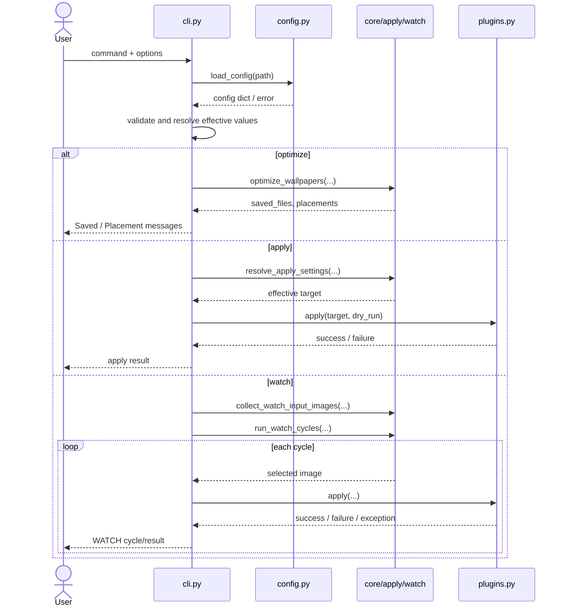

# Harite CLI 仕様 (CLI Spec)

最終更新: 2026-05-19

## 1. CLI の責務

- Harite の command surface を提供する。
- command ごとの入力検証、config 読み込み、core / plugin 呼び出し、終了コード決定を行う。

## 2. command 一覧

- `optimize`
- `compute-placement`
- `apply`
- `watch`
- `install-desktop-entry`

## 3. CLI シーケンス図 (CLI sequence)

## 4. `optimize`

- 入力画像、表示条件、margins、align、background_color、embed 系を受け取る。
- `--config` が与えられた場合は config を読み、CLI 引数を優先して上書きする。
- 成功時は `Saved:` と `Placement:` を出力する。

## 5. `compute-placement`

- 単一入力に対する placement 計算面を持つ。
- 現時点では簡易 surface であり、詳細な正本は実装拡張に応じて見直す。

## 6. `apply`

- plugin を解決し、`single-file` または per-monitor target を適用する。
- dry-run が既定であり、`--do-it` で実適用に進む。

## 7. `watch`

- 入力 directory を監視ではなく周期実行対象として扱う。
- `mode`, `interval_sec`, `iterations`, `log_level`, `plugin`, `dry_run` を扱う。

## 8. `install-desktop-entry`

- Linux/XDG 限定 command とする。
- user-local の `.desktop` launcher を生成する。

## 9. 共通オプションと終了コード

- 主な終了コード:
  - `0`: 正常終了
  - `2`: 入力不正、config 不正、plugin 解決失敗、サポート外
  - `3`: apply 失敗

## 10. メッセージと重要度

- `info`: 実行開始、完了、dry-run summary
- `error`: validation error, unknown plugin, apply failed
- watch では `WATCH start`, `WATCH cycle`, `WATCH completed` を中心に状態を出す

## 11. core / GUI / packaging との境界

- core 挙動の正本は [docs/specs/core/harite-core-spec.md](docs/specs/core/harite-core-spec.md)
- GUI 側の状態や tray は [docs/specs/gui/harite-gui-spec.md](docs/specs/gui/harite-gui-spec.md)
