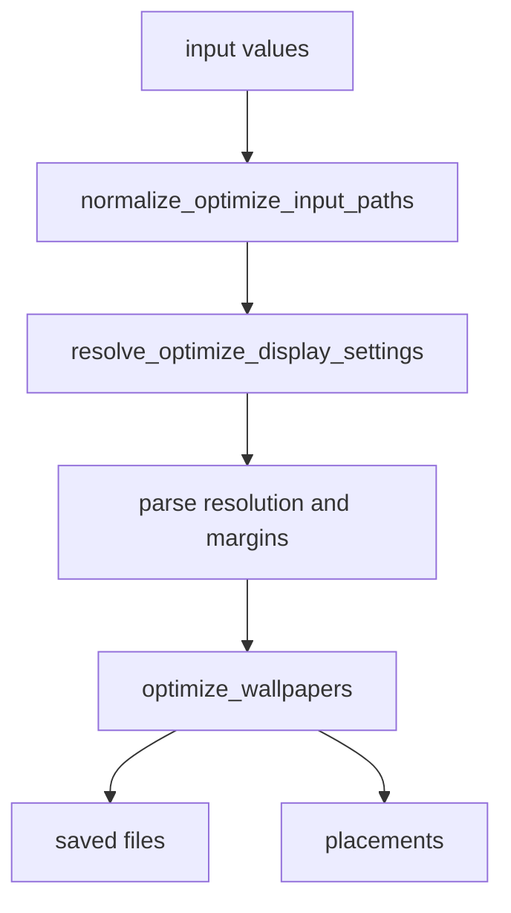
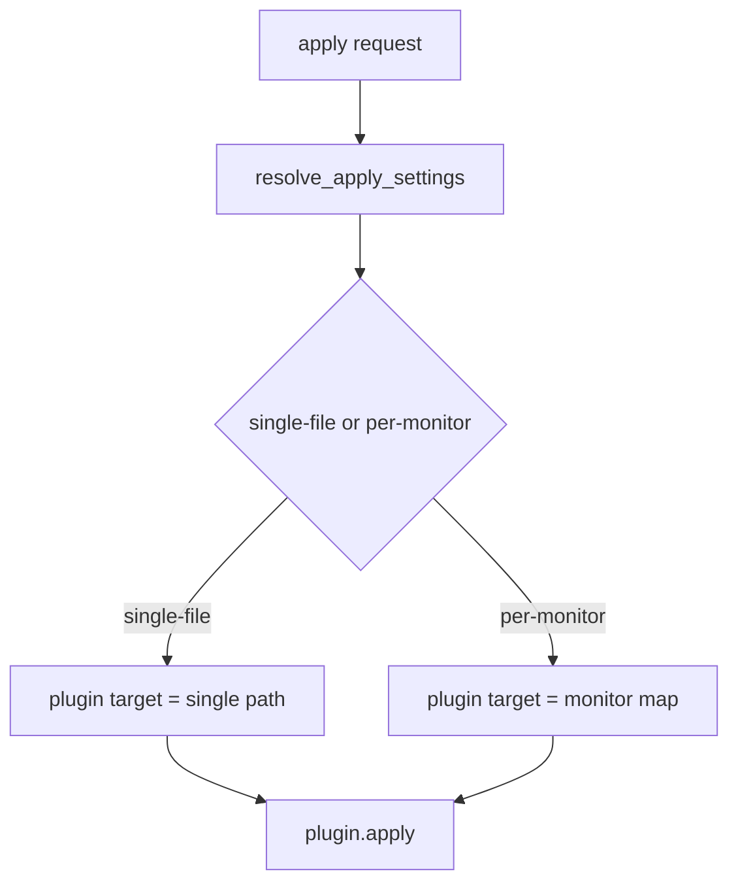
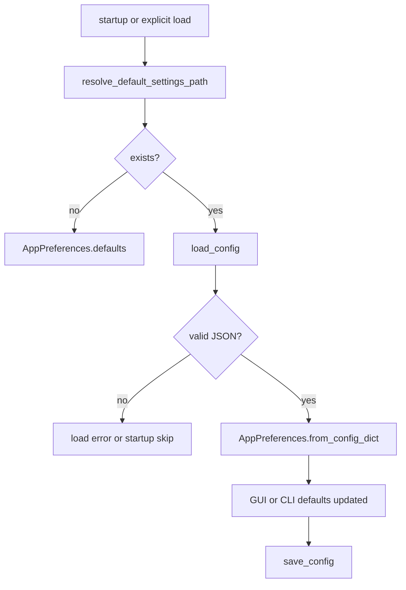

# Harite コア仕様 (Core Spec)

最終更新: 2026-05-19

## 1. コア (core) の責務

- 入力画像、表示条件、最適化条件、適用条件の基底ルールを扱う。
- GUI / CLI のどちらから呼ばれても変わらない挙動を受け持つ。
- plugin 実行そのものではなく、plugin へ渡す target の解決までを含む。

## 2. データモデル

- optimize 入力は 1 個以上の画像パスである。
- 画面条件は `resolution`, `two_screen`, `l_display`, `r_display` などで表現する。
- 設定は `OptimizePreferences`, `ApplyPreferences`, `WatchPreferences`, `AppPreferences` として論理分割される。

## 3. 入力解決と表示コンテキスト

- optimize 入力は画像ファイルのみを受け付け、directory は受け付けない。
- two-screen 文脈では、resolution と左右 display 情報の整合が必要である。
- watch 入力は directory 単位で扱い、画像列を cycle の対象とする。

## 4. 最適化ロジック

- optimize は表示条件解決の後に実行される。
- margins, align, valign, background_color, embed_info 系は optimize 実行前に正規化される。

## 5. 適用ロジック

- apply target は `single-file`, `per-monitor-explicit`, `per-monitor-auto-split` の面で解決される。
- plugin 実行は別面だが、どの target を渡すかは core 側の責務である。

## 6. 設定 (settings) の保存と読み出し

### 6.1 設定ファイル (`harite-preferences.json`) の保存場所

- Linux: `XDG_CONFIG_HOME/harite/harite-preferences.json`
- Linux で `XDG_CONFIG_HOME` 未設定: `~/.config/harite/harite-preferences.json`
- 非 Linux: `~/harite-preferences.json`

### 6.2 物理形式

- UTF-8 JSON
- top-level key は平坦
- 保存時は 2-space indent と末尾改行を付ける

### 6.3 論理グループ

- optimize 面: `resolution`, `scaling`, `two_screen`, `l_display`, `r_display`, `margins`, `align`, `valign`, `quality`, `background_color`, `embed_info`, `embed_text`, `embed_position`, `embed_max_lines`
- apply 面: `plugin`, `apply_mode`
- watch 面: `watch_interval_seconds`, `watch_srcdir_l`, `watch_srcdir_r`

### 6.4 設定ファイル load / save flow

## 7. エラーと失敗時の扱い

- 不正入力は基本的に `ValueError` として表現される。
- config 読み込みでは `FileNotFoundError` と `ValueError` を区別する。
- apply target 解決失敗は plugin 実行前に止める。

## 8. メッセージ分類

- CLI は `typer.echo(...)` で info / error を表す。
- GUI は `status_level`, `status_phase`, `status_message`, `last_error` で表す。
- plugin logger は `info / warning / error / exception` を使う。

## 9. 他分冊との境界

- command surface の詳細は [docs/specs/cli/harite-cli-spec.md](docs/specs/cli/harite-cli-spec.md)
- GUI の状態遷移と画面責務は [docs/specs/gui/harite-gui-spec.md](docs/specs/gui/harite-gui-spec.md)
- watch 実行面は [docs/specs/watch/harite-watch-spec.md](docs/specs/watch/harite-watch-spec.md)
