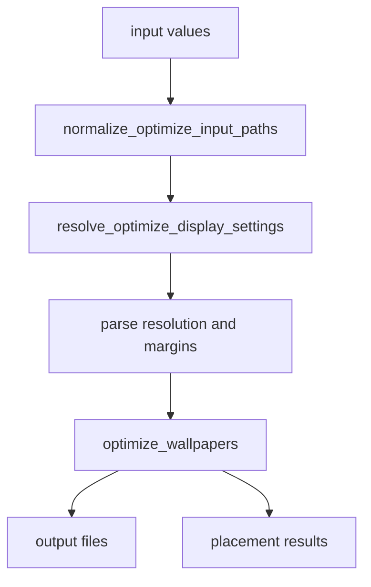
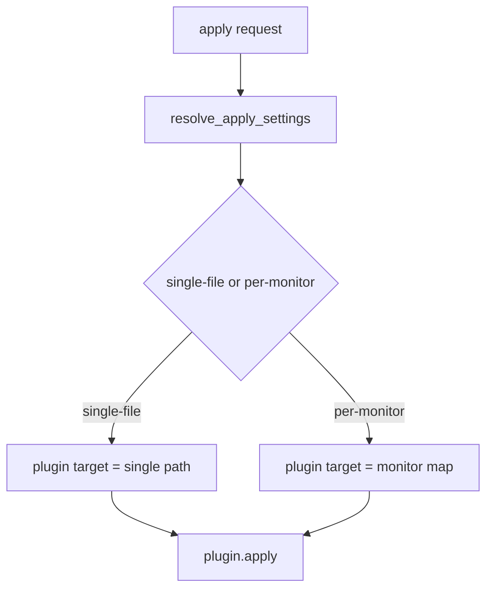
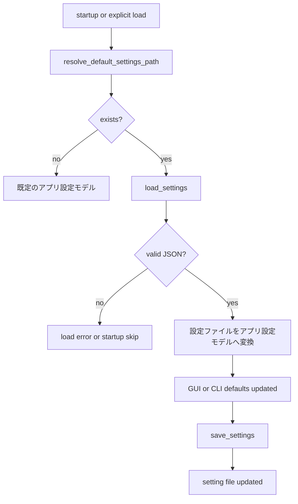

# Harite コア仕様 (Core Spec)

最終更新: 2026-05-19

## 1. コア (core) の責務

- 入力画像、表示条件、最適化条件、適用条件の基底ルールを扱う。
- GUI / CLI のどちらから呼ばれても変わらない挙動を受け持つ。
- plugin 実行そのものではなく、plugin へ渡す target の解決までを含む。
- plugin 名の選択、plugin registry 解決、plugin ごとの target 受理可否判定は呼び出し側 / plugin 側で扱う。

core が扱うもの:

- 入力値の正規化
- 表示条件の解決
- 最適化実行に必要な基底パラメータ
- apply target の解決
- 設定モデルと設定ファイルの相互変換

core が直接の主責務としないもの:

- CLI の option surface
- GUI widget や dialog の詳細
- tray の UI 操作
- plugin ごとの実際の OS 呼び出し

## 2. データモデル

- optimize 入力は 1 個以上の画像パスである。
- 画面条件は `resolution`, `two_screen`, `l_display`, `r_display` などで表現する。
- 設定は最適化設定モデル、適用設定モデル、スライドショー設定モデル、アプリ設定モデルとして論理分割される。

主要モデルの整理:

- optimize 面は、入力画像、target resolution、margins、align、background_color、embed 系で構成される。
- apply 設定面は、`plugin`, `apply_mode` など呼び出し側が保持する適用条件で構成される。
- apply target 面は、core が解決した単一画像 path または monitor map で構成され、plugin 名そのものは含めない。
- スライドショー面は、入力 directory 群、interval、mode、サイクル state で構成される。
- 設定面は、optimize / apply / slideshow の論理グループを 1 つの設定ファイルへ統合して保存する。

mode 値の扱い:

- スライドショー mode の内部値と設定値は `sequential` / `random` で統一する。
- mode の既定値は `random` とする。

補足:

- `PlacementResult` は `image_path`, `x`, `y`, `width`, `height`, `rotation`, `scale`, `score`, `posit` を持つ。
- `posit` は two-screen optimize 時に `left` / `right` を入れる用途で使う。
- `PlacementResult` は `to_dict()` を持ち、JSON 直列化可能な辞書へ変換できる。

## 3. 入力解決と表示コンテキスト

- optimize 入力は画像ファイルのみを受け付け、directory は受け付けない。
- two-screen 文脈では、resolution と左右 display 情報の整合が必要である。
- スライドショー入力は directory 単位で扱い、画像列を cycle の対象とする。

入力解決の基本原則:

- optimize は「何を出力したいか」を先に確定させるため、入力画像と表示条件の両方を要件とする。
- single-screen と two-screen では、必要なパラメータの意味が一部変わる。
- slideshow は optimize と異なり、単発の画像ではなく候補集合を扱う。

two-screen 文脈で重要な点:

- `resolution` は最終的な合成面の大きさを表す。
- `l_display` と `r_display` は左右画面の幅・高さを表し、auto-split の根拠になる。
- 表示条件が不足または矛盾する場合は、core 側で早めに入力不正として止める。

### 3.1 表示コンテキスト解決の現行規則

- display の並び順は `order_displays(...)` で決まり、キーは `(x_offset, y_offset, name)` の昇順である。two-screen 文脈ではこの先頭 2 件を左・右 display として使う。
- virtual desktop 解像度は、検出 display 群に対して `min_x = min(x_offset)`, `max_x = max(x_offset + width)`, `min_y = min(y_offset)`, `max_y = max(y_offset + height)` を求め、`resolution = (max_x - min_x, max_y - min_y)` で作る。
- `build_two_screen_optimize_context(...)` は display が 2 件未満なら `None` を返す。2 件以上ある場合だけ、ordered 先頭 2 件から `l_display = (left.width, left.height)`, `r_display = (right.width, right.height)` を作る。
- `resolve_optimize_display_settings(...)` は、空文字を除いた入力列の件数が 2 件以上のときだけ two-screen context 取得を試みる。入力が 1 件しかない場合、display 自動解決は行わない。
- `two_screen` が未指定なら自動判定であり、初期値は `effective_two_screen = context is not None` である。明示指定がある場合はその bool 値を優先する。
- `resolution`, `l_display`, `r_display` は、値が `None` または `auto` のときだけ未確定扱いとなる。context が得られていて `effective_two_screen=True` の場合に限って、`resolution = "{virtual_w}x{virtual_h}"`, `l_display = "{left_w}x{left_h}"`, `r_display = "{right_w}x{right_h}"` を自動補完する。
- 自動判定で context が得られなかった場合だけ、最後に `effective_two_screen=False` へ戻る。`resolution` が最後まで確定しなければ入力不正として止める。

## 4. 最適化ロジック

- optimize は表示条件解決の後に実行される。
- margins, align, valign, background_color, embed_info 系は optimize 実行前に正規化される。

最適化ロジックの考え方:

- まず入力群を画像ファイルとして正規化する。
- 次に表示条件を single-screen / two-screen 文脈で解決する。
- その後、margins や位置指定などの付帯条件を正規化して optimize 実行へ渡す。
- 実行結果は出力ファイル一覧と配置結果一覧として返り、GUI / CLI はそれを表示面へ転写する。

### 4.1 placement 計算の現行規則

- 現行実装の拡大縮小は `scaling` 引数名にかかわらず `_scale_to_fit(...)` で行われ、式は `scale = min(max_w / w, max_h / h)` である。
- リサイズ後の大きさは `nw = max(1, int(w * scale))`, `nh = max(1, int(h * scale))` で決まる。
- 単一画像の `compute_placement(...)` は、この `nw`, `nh` を使って `x = max(0, (target_w - nw) // 2)`, `y = max(0, (target_h - nh) // 2)` を返す。現行の単独 placement は常に中央寄せである。
- `optimize_wallpapers(...)` の現行幾何計算では、`scaling` も fit 相当の `_scale_to_fit(...)` 以外へ分岐しない。
- `optimize_wallpapers(...)` では、まず target 全体に対して `inner_w = max(1, w_target - (ml + mr))`, `inner_h = max(1, h_target - (mt + mb))` を作り、ここから各画像の cell を決める。
- single-screen では `count = len(items)` とし、各 cell 幅は `cell_w = max(1, inner_w // count)`、cell 高さは `cell_h = inner_h` である。
- single-screen の各画像 `i` の基準位置は `x_base = ml + i * cell_w`, `y_base = mt` である。cell 内の余りは `space_x = max(0, cell_w - nw)`, `space_y = max(0, cell_h - nh)` とし、`align` が `left|center|right` なら `inner_x = 0|space_x // 2|space_x`、`valign` が `top|center|bottom` なら `inner_y = 0|space_y // 2|space_y` になる。最終位置は `x = x_base + inner_x`, `y = y_base + inner_y` である。
- two-screen で `l_display`, `r_display` が与えられた場合、画像数は 2 件へ固定され、左右分割位置は `split_x = round((left_w / (left_w + right_w)) * w_target)` で求める。現行実装では `w_target > 1` のとき `split_x` を `1..w_target-1` に clamp する。
- explicit two-screen の左右 cell 幅は `left_region_w = max(1, split_x - (ml + mr))`, `right_region_w = max(1, (w_target - split_x) - (ml + mr))` である。cell 高さは各 display 高さをそのまま使わず、`max(1, min(h_target, display_h) - (mt + mb))` に切り詰める。
- explicit two-screen の最終 x 座標は、左が `x = ml + inner_x`、右が `x = split_x + ml + inner_x` である。y 座標は左右とも `y = mt + inner_y` である。
- two-screen だが display 情報が未指定のときは、左右幅を `left_slice_w = max(1, w_target // 2)`, `right_slice_w = max(1, w_target - left_slice_w)` で二分し、それぞれから `ml + mr` を引いた値を cell 幅に使う。

### 4.2 background color 正規化の現行規則

- `background_color` が tuple/list で 3 要素以上ある場合、先頭 3 要素を RGB とみなし、それぞれ `int(...)` 化したうえで `0..255` に clamp する。
- tuple/list からの正規化結果は `#{red:02X}{green:02X}{blue:02X}` の 6 桁大文字 HEX 文字列である。
- 文字列入力では、前後空白を除去して大文字化し、先頭の `#` はあってもなくてもよい。長さが 6 桁で 16 進数として解釈できる場合だけ有効値とみなす。
- tuple/list 変換や HEX 解析に失敗した場合、現行実装は既定色 `#1E1E1E` へフォールバックする。
- 背景画像生成や auto-split 出力の塗りつぶしには、正規化後 HEX を `background_color_rgb(...)` で `(R, G, B)` の整数 tuple へ戻した値を使う。

### 4.3 embed 余白領域の現行規則

- GUI / Settings / CLI / core の `embed_position` は `left-top|left-bottom|right-top|right-bottom` で統一する。
- `embed_position` が未指定のときの既定値は `right-bottom` である。
- したがって現行の設定値・GUI state・CLI 引数では、`embed_position` はこの 4 値だけを正規入力として保持する。
- single-screen の embed 領域では、まず `usable_left = max(0, ml)`, `usable_right = max(usable_left, w_target - max(0, mr))`, `usable_width = max(0, usable_right - usable_left)` を作る。
- そのうえで左右半分は `left_slice_width = usable_width // 2`, `right_slice_width = usable_width - left_slice_width` で分ける。single-screen では `left-top` は左半分上端、`left-bottom` は左半分下端、`right-top` は右半分上端、`right-bottom` は右半分下端に対応する。
- two-screen で display 情報がある場合も、配置面は left display / right display の上側・下側 4 位置だけを持つ。`left-top` は left display の上端、`left-bottom` は left display の下端、`right-top` は right display の上端、`right-bottom` は right display の下端に対応する。slice 内部の横範囲は `x0 = offset_x + ml`, `x1 = max(x0, offset_x + slice_w - mr)` であり、上端側は `(x0, 0, x1, mt)`、下端側は `(x0, slice_h - mb, x1, slice_h)` を基底にする。
- 描画前には `area_w = x1 - x0`, `area_h = y1 - y0` を求め、`area_w < 40` または `area_h < 12` なら何も描かない。
- フォントサイズ候補は `preferred_size = max(12, min(24, area_h // (max_lines + 1)))` で決め、1 行高さは `line_h = max(10, bbox("Ag").height + 2)` 相当で求める。
- 実際に描く行数は `fit_lines = area_h // line_h`, `line_limit = min(max(1, embed_max_lines), fit_lines)` で決め、超過した行は末尾に `...` を付けて切り詰める。
- 実際の描画開始 x 座標は左端ぴったりではなく、`quartile_offset = max(4, min(max(1, area_w // 4), max(1, longest_px // 4 or 1)))` を使って `text_x = x0 + quartile_offset` に置く。y 座標は `text_y = y0 + 2` から始める。
- 各行の最大描画幅は `max_text_w = max(0, area_w - quartile_offset - 4)` であり、`_truncate_to_width(...)` によってこの幅に収まるよう末尾 `...` 付きで再切り詰めする。
- 行ごとの描画は `text_y + line_h > y1` になった時点で打ち切る。したがって line_limit に達していなくても、縦方向に収まらなければそれ以上は描かない。

### 4.4 embed 情報行の構成規則

- `embed_info=none` では情報行は空である。
- `embed_info=params|combo` では、1 行目に `res={w_target}x{h_target} margins={ml},{mr},{mt},{mb}`、2 行目に `align={align}/{valign} inputs={input_count}` を入れる。
- `two_screen=True` かつ `l_display`, `r_display` がある場合は、追加行として `two_screen=1 l={left_w}x{left_h} r={right_w}x{right_h}` を入れる。display 情報が欠ける場合は `two_screen=1` だけを入れる。
- `embed_info=free|combo` では `embed_text` を改行単位で split し、各行を trim したうえで空行を捨てる。
- 最終的な embed 行列は、params 系行の後ろに free text 行を連結した順序で構成する。

embed 情報:

- optimize は `embed_info`, `embed_text`, `embed_position`, `embed_max_lines`, `embed_font` を受け取れる。
- 情報行の構成規則は 4.4 を参照する。
- 位置解決、描画領域、行数制約は 4.3 を参照する。

## 5. 適用ロジック

- apply target は `single-file`, `per-monitor-explicit`, `per-monitor-auto-split` の面で解決される。
- plugin 実行は別面だが、どの target を渡すかは core 側の責務である。
- core は `apply_mode`, 入力 file 群, display 条件, `output_dir` から target を解決する。
- 選択済み plugin が monitor map を受け付けるか、どの setter / fallback を使うかは core ではなく呼び出し側 / plugin 側の責務である。

apply mode ごとの意味:

- `single-file`: 単一画像を plugin へそのまま渡す。
- `per-monitor-explicit`: 左右 monitor ごとの明示 mapping を作って渡す。分岐条件と mapping 構成は 5.1 を参照する。
- `per-monitor-auto-split`: 合成画像から monitor map を作って渡す。分岐条件は 5.1、split 計算は 5.2 を参照する。

monitor map 解決:

- `per-monitor-explicit` の mapping 構成規則は 5.1 を参照する。
- `per-monitor-auto-split` は `build_auto_split_display_map(...)` を経由し、最終的には `split_composite_for_displays(...)` で `{display.name: output_path}` を構成する。
- `split_composite_for_displays(...)` の切り出し比率と fit 再配置の規則は 5.2 を参照する。

### 5.1 apply target 解決の分岐規則

- `resolve_apply_settings(...)` は `apply_mode` を小文字化・trim したうえで判定する。未指定相当は `single-file` として扱う。
- `single-file` では、そのまま `target = str(file)` を返し、display 検出や monitor map 構成は行わない。
- `per-monitor-explicit` では、まず ordered display を取得し、ordered display が 2 件未満ならエラーになる。
- `per-monitor-explicit` の mapping は空 dict から始め、`left_file` があれば `ordered_displays[0].name` に、`right_file` があれば `ordered_displays[1].name` に対応付ける。
- `left_file`, `right_file` の両方が欠けて mapping が空のままなら、現行実装は `--per-monitor requires --left-file/--right-file or --auto-split` で止める。
- `per-monitor-auto-split` でも ordered display が 2 件未満ならエラーになる。
- `per-monitor-auto-split` では `target = build_auto_split_display_map(file, ordered_displays[:2], output_dir or file.parent)` を呼ぶ。つまり `output_dir` 未指定時の split 出力先既定値は合成画像 `file` の親 directory である。
- auto-split の結果が空 mapping なら `per-monitor split failed` で止める。
- `apply_mode` が既知の 3 種 (`single-file`, `per-monitor-explicit`, `per-monitor-auto-split`) 以外なら `unknown apply mode` として止める。
- monitor map を受け付けない plugin に per-monitor target を渡せるかどうかは、この節ではなく plugin / 呼び出し側で扱う。

### 5.2 auto-split の現行規則

- `split_composite_for_displays(...)` は、まず display 群から virtual desktop 幅を `min_x = min(d.x_offset)`, `max_x = max(d.x_offset + d.width)`, `virtual_w = max(1, max_x - min_x)` で作る。
- 各 display `d` に対して、合成画像上の横方向 crop 比率を `left_norm = (d.x_offset - min_x) / virtual_w`, `right_norm = (d.x_offset + d.width - min_x) / virtual_w` で求める。
- 実際の crop 範囲は `left = round(left_norm * comp_w)`, `right = round(right_norm * comp_w)` を `0..comp_w` に clamp して作る。`right <= left` になった場合でも、少なくとも 1px 幅は残すよう補正する。
- crop box は `(left, 0, right, comp_h)` であり、現行 auto-split は y 方向を分割せず、常に full-height の縦スライスを切り出す。
- 各 display 向け出力画像は fit で再配置され、scale は `min(target_w / region_w, target_h / region_h)`、リサイズ後は `new_w = max(1, int(region_w * scale))`, `new_h = max(1, int(region_h * scale))` である。
- display 向け最終画像は `target_w x target_h` の背景キャンバスを作り、中央寄せオフセット `ox = (target_w - new_w) // 2`, `oy = (target_h - new_h) // 2` で貼り付ける。
- 出力ファイル名は原則 `composite_path.stem + "_" + display.name + ".jpg"` であり、display 名が空のときだけ `display_{x_offset}` を代替名に使う。

不正条件の代表:

- 2 画面未検出のまま per-monitor apply を要求した場合
- auto-split に失敗して monitor map を構成できない場合

## 6. 設定 (settings) の保存と読み出し

### 6.1 設定ファイル (`harite-settings.json`) の保存場所

- Linux: `XDG_CONFIG_HOME/harite/harite-settings.json`
- Linux で `XDG_CONFIG_HOME` 未設定: `~/.config/harite/harite-settings.json`
- 非 Linux: `~/harite-settings.json`

### 6.2 物理形式

- UTF-8 JSON
- top-level key は平坦
- 保存時は 2-space indent と末尾改行を付ける

補足:

- 論理的には optimize / apply / slideshow の 3 群に分かれるが、物理ファイルはネストせず 1 object に merge される。
- そのため設定ファイルは人手でも編集しやすい一方、論理境界は本文で補う必要がある。

### 6.3 論理グループ

- optimize 面: `resolution`, `two_screen`, `l_display`, `r_display`, `margins`, `align`, `valign`, `quality`, `background_color`, `embed_info`, `embed_text`, `embed_position`, `embed_max_lines`
- apply 面: `plugin`, `apply_mode`
- スライドショー面: `slideshow_interval_seconds`, `slideshow_mode`, `slideshow_srcdir_l`, `slideshow_srcdir_r`

主要 key の意味:

- `two_screen` は単なる bool ではなく `auto` を取りうる。
- `align` と `valign` は論理上 pair だが、保存時には list 表現になる。
- `plugin` は platform 既定値を持つが、設定ファイルで上書きできる。
- `apply_mode` は desktop session により既定値が変わりうる。
- `slideshow_mode` は slideshow 関連 key の 1 つとして、interval や srcdir と同じ load / save flow に従う。
- `slideshow_mode` の保存値は `sequential` または `random` であり、未指定時の既定値は `random` である。
- `slideshow_srcdir_l` と `slideshow_srcdir_r` は、GUI slideshow の継続運用面と直接つながる。

### 6.4 設定ファイル load / save flow

読み出し時の扱い:

- ファイル不存在は「設定なし」として扱える文脈と、明示 load 失敗として扱う文脈がある。
- JSON 不正は `ValueError` として扱う。
- 欠落 key は defaults で補われる。

## 7. エラーと失敗時の扱い

- 不正入力は基本的に `ValueError` として表現される。
- 設定ファイル読み込みでは `FileNotFoundError` と `ValueError` を区別する。
- apply target 解決失敗は plugin 実行前に止める。

代表的な失敗面:

- optimize 入力が directory だった場合
- resolution や margins の形式が不正だった場合
- slideshow の入力 directory が存在しない、または空だった場合
- per-monitor apply の前提条件を満たさない場合
- 設定ファイルが見つからない、または JSON として不正だった場合

## 8. メッセージ分類

- CLI は `typer.echo(...)` で info / error を表す。
- GUI は `status_level`, `status_phase`, `status_message`, `last_error` で表す。
- plugin logger は `info / warning / error / exception` を使う。

本文での分類方針:

- core では個別文言の完全列挙は行わず、どの失敗がどのチャネルへ流れるかを優先して説明する。
- CLI は利用者向けの即時表示、GUI は状態表示、plugin logger は実行環境観測という住み分けで捉える。
- slideshow は CLI / GUI の両面にまたがるため、summary 系メッセージと failure 系メッセージを分けて説明する。

## 9. 他分冊との境界

- command surface の詳細は [docs/specs/cli/harite-cli-spec.md](docs/specs/cli/harite-cli-spec.md)
- GUI の状態遷移と画面責務は [docs/specs/gui/harite-gui-spec.md](docs/specs/gui/harite-gui-spec.md)
- slideshow 実行面は [docs/specs/slideshow/harite-slideshow-spec.md](docs/specs/slideshow/harite-slideshow-spec.md)
