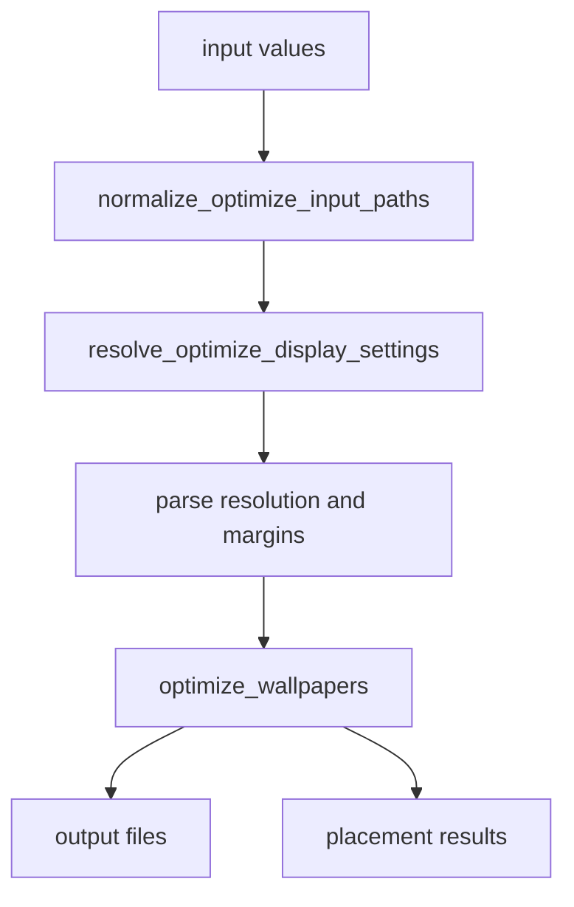
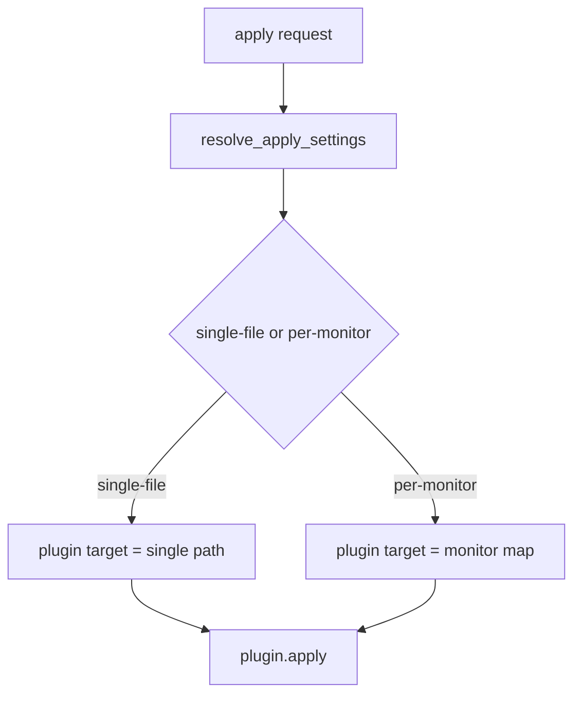
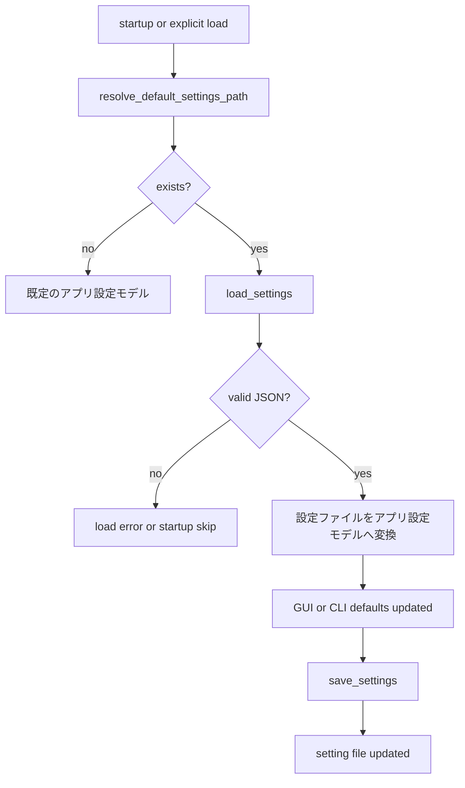

# Harite コア仕様 (Core Spec)

最終更新: 2026-06-11

## 1. コア (core) の責務

- 入力画像、表示条件、最適化条件、適用条件の基底ルールを扱う。
- GUI / CLI のどちらから呼ばれても変わらない挙動を受け持つ。
- plugin 実行そのものではなく、plugin へ渡す target の解決までを含む。
- plugin 名の選択、plugin registry 解決、plugin ごとの target 受理可否判定は呼び出し側 / plugin 側で扱う。

core が扱うもの:

- 入力値の正規化
- 表示条件の解決
- 最適化実行に必要な基底パラメータ
- apply target の解決
- 設定モデルと設定ファイルの相互変換

core が直接の主責務としないもの:

- CLI の option surface
- GUI widget や dialog の詳細
- tray の UI 操作
- plugin ごとの実際の OS 呼び出し

## 2. データモデル

- optimize 入力は 1 件または 2 件の画像パスである。
- 画面条件は `resolution`, `two_screen`, `l_display`, `r_display` などで表現する。
- 設定は最適化設定モデル、適用設定モデル、スライドショー設定モデル、アプリ設定モデルとして論理分割される。

主要モデルの整理:

- optimize 面は、入力画像、target resolution、margins、align、background_color、embed 系で構成される。
- apply 設定面は、`plugin`, `apply_mode` など呼び出し側が保持する適用条件で構成される。
- apply target 面は、core が解決した単一画像 path または monitor map で構成され、plugin 名そのものは含めない。
- スライドショー面は、入力 directory 1 件または最大 2 件、interval、mode、サイクル state で構成される。
- **source registry**（名前付き directory catalog / L-R profile）は [source-spec §3](../source/harite-source-spec.md) が正本。実行時は展開済み path を slideshow 面へ渡す。
- 設定面は、optimize / apply / slideshow の論理グループを 1 つの設定ファイルへ統合して保存する。

mode 値の扱い:

- スライドショー mode の内部値と設定値は `sequential` / `random` で統一する。
- helper / core は mode を呼び出し側から明示的に受け取る。既定値の決定は CLI / GUI / settings 側の責務である。

補足:

- `PlacementResult` は `image_path`, `x`, `y`, `width`, `height`, `rotation`, `scale`, `score`, `posit` を持つ。
- `posit` は two-screen optimize 時に `left` / `right` を入れる用途で使う。
- `PlacementResult` は `to_dict()` を持ち、JSON 直列化可能な辞書へ変換できる。

## 3. 入力解決と表示コンテキスト

- optimize 入力は画像ファイルのみを受け付け、directory は受け付けない。
- two-screen 文脈では、resolution と左右 display 情報の整合が必要である。
- スライドショー入力は 1 件または最大 2 件の directory として扱う。

入力解決の基本原則:

- optimize は「何を出力したいか」を先に確定させるため、入力画像と表示条件の両方を要件とする。public surface では入力画像は最大 2 件まで採用する。
- single-screen と two-screen では、必要なパラメータの意味が一部変わる。
- slideshow は optimize と異なり、単発の画像ではなく、1 件または最大 2 件の input directory を source として扱う。
- スライドショー helper は、採用済み source directory 群を順に検証し、各 directory から集めた画像列をその順のまま連結した 1 本の候補列へ正規化する。

two-screen 文脈で重要な点:

- `resolution` は最終的な合成面の大きさを表す。
- `l_display` と `r_display` は左右画面の幅・高さを表し、auto-split の根拠になる。
- 表示条件が不足または矛盾する場合は、core 側で早めに入力不正として止める。

### 3.1 表示コンテキスト解決の現行規則

- display の並び順は `order_displays(...)` で決まり、キーは `(x_offset, y_offset, name)` の昇順である。two-screen 文脈ではこの先頭 2 件を左・右 display として使う。
- virtual desktop 解像度は、検出 display 群に対して `min_x = min(x_offset)`, `max_x = max(x_offset + width)`, `min_y = min(y_offset)`, `max_y = max(y_offset + height)` を求め、`resolution = (max_x - min_x, max_y - min_y)` で作る。
- `build_two_screen_optimize_context(...)` は display が 2 件未満なら `None` を返す。2 件以上ある場合だけ、ordered 先頭 2 件から `l_display = (left.width, left.height)`, `r_display = (right.width, right.height)` を作る。
- `resolve_optimize_display_settings(...)` は、空文字を除いた入力列の件数が 2 件以上のときだけ two-screen context 取得を試みる。入力が 1 件しかない場合、display 自動解決は行わない。
- CLI / GUI の public surface では、optimize 入力が 3 件以上与えられても先頭 2 件だけを採用する。two-screen 文脈の left / right 割当は、この採用済み先頭 2 件の順序で決まる。
- `two_screen` が未指定なら自動判定であり、初期値は `effective_two_screen = context is not None` である。明示指定がある場合はその bool 値を優先する。
- `resolution`, `l_display`, `r_display` は、値が `None` または `auto` のときだけ未確定扱いとなる。context が得られていて `effective_two_screen=True` の場合に限って、`resolution = "{virtual_w}x{virtual_h}"`, `l_display = "{left_w}x{left_h}"`, `r_display = "{right_w}x{right_h}"` を自動補完する。
- 自動判定で context が得られなかった場合だけ、最後に `effective_two_screen=False` へ戻る。`resolution` が最後まで確定しなければ入力不正として止める。
- `resolve_optimize_display_settings` は解像度文字列の `WxH` フォーマット自体を検証しない。`WxH` 形式の検証は CLI の `parse_resolution`、GUI の独自解析など呼び出し側レイヤーの責務である。
- `normalize_optimize_input_paths` はディレクトリパスを `ValueError` で拒否するが、存在しないファイルや非画像ファイルは検証しない。これらは `optimize_wallpapers` 処理中に黙ってスキップされる。

### 3.2 `display_context.py` ヘルパー関数

- `order_displays(displays, *, limit)`: display 群を `(x_offset, y_offset, name)` の昇順にソートして返す。`limit` を指定すると先頭 `limit` 件に絞る。
- `get_display_at_index(index, displays)`: ordered 後の display リストから指定インデックスの display を返す。範囲外なら `None`。
- `closest_display_for_offset(x_offset, y_offset, displays)`: 指定 offset に最も近い display をマンハッタン距離で探す。`(display, distance)` を返す。display が存在しない場合は `(None, None)`。
- `build_two_screen_optimize_context(displays)`: ordered 先頭 2 件から `TwoScreenOptimizeContext`（`resolution`, `l_display`, `r_display` を持つ）を構築して返す。display が 2 件未満の場合は `None`。3 画面以上の環境では先頭 2 台の display のみから virtual resolution を算出し、3 台目以降は無視する。

### 3.3 `workspace.py` — display 検出

`detect_displays()` は OS ごとに `Display(name, width, height, x_offset, y_offset, primary, scale_percent)` の列を返す。下流の `order_displays` / `build_two_screen_optimize_context` / `resolve_optimize_display_settings` は **Linux / Windows で同一経路** を使う（`scale_percent` は参照しない付加情報）。

| OS | 入口 | 名前 (`Display.name`) | ジオメトリ | `scale_percent` |
| --- | --- | --- | --- | --- |
| Linux | `xrandr --query` 解析 | コネクタ名（例: `HDMI-1`, `DP-1`） | width / height / x_offset / y_offset / primary | `None` |
| Windows | Win32 `EnumDisplayMonitors` + `GetMonitorInfoW` | デバイス名（例: `\\.\DISPLAY1`） | `MONITORINFOEX.rcMonitor` から physical pixel | `GetDpiForMonitor` の effective DPI から算出（例: 150） |
| macOS | `system_profiler SPDisplaysDataType` | 空文字（現行） | width / height のみ | `None` |

Windows の display 検出規則:

- PowerShell / Qt / WMI 製品名は **使わない**。core は Win32 API のみで検出する。
- プロセスを Per-Monitor DPI aware（`SetProcessDpiAwarenessContext(PMv2)`）に best-effort で昇格し、失敗時のみ `SetProcessDPIAware()` に fallback する。取得矩形は **physical pixel** ベースとする（Windows 設定の「拡大/縮小」150% 環境でも、壁紙 optimize は物理解像度を使う）。
- 各モニターについて `GetDpiForMonitor(..., MDT_EFFECTIVE_DPI, ...)` で effective DPI を取得し、`scale_percent = round(dpi_x * 100 / 96)` を `Display.scale_percent` に格納する（Windows 設定 UI の「150%（推奨）」と同系統）。取得失敗時は `None`。
- 論理解像度との関係: `logical ≈ physical * 100 / scale_percent`（参考。下流は physical のみ使用）。
- `EnumDisplayMonitors` が 0 件または失敗した場合のみ、`GetSystemMetrics` による **primary 1 枚 fallback**（name 空・offset 0）を返してよい。fallback 時は `GetDpiForSystem()` で primary の `scale_percent` を best-effort 取得してよい。
- WMI `UserFriendlyName`（製品名）や Auto-Split ファイル名補完は **本節の対象外**（plugin / 将来検討）。

## 4. 最適化ロジック

- optimize は表示条件解決の後に実行される。
- margins, align, valign, background_color, embed_info 系は optimize 実行前に正規化される。

最適化ロジックの考え方:

- まず入力群を画像ファイルとして正規化する。
- 次に表示条件を single-screen / two-screen 文脈で解決する。
- その後、margins や位置指定などの付帯条件を正規化して optimize 実行へ渡す。
- 実行結果は出力ファイル一覧と配置結果一覧として返り、GUI / CLI はそれを表示面へ転写する。

### 4.1 placement 計算の現行規則

母体 `wallpaperoptimizer` 準拠（MAT-01b、2026-06-09）:

- **拡大しない（既定）。** 画像 + margins が display 矩形に収まるときは **原寸**（`scale = 1.0`）。収まらないときのみ `_downsize_to_fit_margins(...)` で **縮小のみ**（二段 proportional shrink）。
- **意図的拡大:** Compose の source scale（100% / 125% / 150% / 200%）は **元画像サイズのみ** に掛ける。display / composite 解像度は変えない。100% は上記 MAT-01b 経路、それ以外は upscale 後に収納判定し、display 矩形（margins 込み）に収まらなければエラー（縮小フォールバックなし）。align / valign は upscale 後の `(nw, nh)` に対して適用する。
- **auto 倍率:** `auto` ON かつ手動 scale が 100% のとき、画像短辺と display slot 短辺（margins 控除後）を比較し、≤1/2 → 1.5x、≤1/4 → 2.0x を自動適用。手動 % は auto より優先。Main optimize は `l_auto_display_scale` / `r_auto_display_scale`、Slideshow optimize は `slideshow_l_auto_display_scale` / `slideshow_r_auto_display_scale`（別キー・別 UI）。
- `scaling` 引数・設定キーは optimize 幾何に **影響しない**（合意済み）。Settings の `scaling` 値や `compute_placement(..., scaling=...)` の引数は **互換用シグネチャ** であり、配置計算では参照されない。
- 各入力は **display スロット**（矩形 + 非対称 margins）に割り当てる。two-screen では L margins `(ml, 0, mt, mb)`、R margins `(0, mr, mt, mb)`。
- **align / valign** は display 矩形の原点 `(0,0)` を left/top とし、**スロット全面**（`screen_w × screen_h`）の余白で寄せる。margins は **収納判定と縮小上限** に使い、paste 座標の `+= ml` オフセットには使わない（margin-inner cell へ align しない）。
- **計算順（入力ごと）:** display slot 解決 → 画像サイズ決定（scale → `_resolve_intentional_image_dimensions`）→ align/valign（`_allocate_on_display`）→ paste（`origin + inner`）。
- two-screen で `l_display`, `r_display` がある場合、`split_x = round(left_w / (left_w + right_w) * w_target)`（`1..w_target-1` に clamp）。左画像は `x ∈ [0, split_x)`、右画像は `x = split_x + inner_x`（母体 `_mergeWallpaper` 同型）。
- single-screen 1 枚: display = 全面 `(w_target, h_target)`、margins `(ml, mr, mt, mb)`。
- single-screen 複数枚: 横幅を等分した display スライス。先頭スライスは `(ml,0,mt,mb)`、末尾は `(0,mr,mt,mb)`、中間は `(0,0,mt,mb)`。
- `compute_placement(...)` は `_resolve_native_dimensions` + display 中央寄せ（down-only）。
- `optimize_wallpapers` は 3 枚以上も等幅スライスで処理する（CLI/GUI public surface は先頭 2 件制限は従来どおり）。

#### Placement 座標と margins の関係（CLI `Placement:` 出力の読み方）

- `PlacementResult.x` / `y` は **合成キャンバス上の貼り付け左上**（ピクセル）。`width` / `height` は scale 適用後の画像サイズ。
- **margins は x/y に直接加算しない**（§4.1 の paste 規則）。align / valign は display スロット全面で効く。
- **原寸で display スロットに収まるとき:** margins を増やしても **x/y は変わらないことがある**（align/valign が同じなら paste 位置は不変）。margins の効きは主に **収納判定・縮小** 経由で `width` / `height` / `scale` に現れる。
- **収まらないとき:** margins が縮小上限を変え、縮小後の `(nw, nh)` に対して align/valign が再計算されるため、**x/y も変わりうる**。
- 母体比較で判然としなかったのは、この「直接オフセットしない」規則のため。**正本は本節と §4.1** とする。意図的な角寄せで画面端が欠けるのはユーザー調整の範囲（再作成でよい）。

**画像読み込みとリサイズ:**

- リサイズは `Image.LANCZOS`（`Image.Resampling.LANCZOS` と同値）を使用する。`optimize_wallpapers` と `compute_placement` で適用する。
- 入力画像は `Image.open(...).convert("RGB")` で読み込むため、RGBA 画像はアルファチャンネルを廃棄して RGB に変換してから処理される。
- 読み込みに失敗した画像は黙ってスキップする。全画像の読み込みが失敗した場合でも、背景色のみの JPEG が出力される（空のキャンバスが保存される）。
- 0×0 サイズの画像に対して downsize 経路は `(1, 1, 1.0)` を返し、ゼロ除算を回避する。

### 4.2 background color 正規化の現行規則

- `background_color` が tuple/list で 3 要素以上ある場合、先頭 3 要素を RGB とみなし、それぞれ `int(...)` 化したうえで `0..255` に clamp する。
- tuple/list からの正規化結果は `#{red:02X}{green:02X}{blue:02X}` の 6 桁大文字 HEX 文字列である。
- 文字列入力では、前後空白を除去して大文字化し、先頭の `#` はあってもなくてもよい。長さが 6 桁で 16 進数として解釈できる場合だけ有効値とみなす。
- tuple/list 変換や HEX 解析に失敗した場合、現行実装は既定色 `#1E1E1E` へフォールバックする。
- 背景画像生成や auto-split 出力の塗りつぶしには、正規化後 HEX を `background_color_rgb(...)` で `(R, G, B)` の整数 tuple へ戻した値を使う。

### 4.3 embed 余白領域の現行規則

- GUI / Settings / CLI / core の `embed_position` は `left-top|left-bottom|right-top|right-bottom` で統一する。
- `embed_position` が未指定のときの既定値は `right-bottom` である。
- したがって現行の設定値・GUI state・CLI 引数では、`embed_position` はこの 4 値だけを正規入力として保持する。
- `embed_position` に 4 値以外が渡された場合、`resolve_embed_margin_region` は `None` を返し、embed 描画は行われない。
- single-screen の embed 領域では、まず `usable_left = max(0, ml)`, `usable_right = max(usable_left, w_target - max(0, mr))`, `usable_width = max(0, usable_right - usable_left)` を作る。
- そのうえで左右半分は `left_slice_width = usable_width // 2`, `right_slice_width = usable_width - left_slice_width` で分ける。single-screen では `left-top` は左半分上端、`left-bottom` は左半分下端、`right-top` は右半分上端、`right-bottom` は右半分下端に対応する。
- two-screen で display 情報がある場合も、配置面は left display / right display の上側・下側 4 位置だけを持つ。`left-top` は left display の上端、`left-bottom` は left display の下端、`right-top` は right display の上端、`right-bottom` は right display の下端に対応する。slice 内部の横範囲は `x0 = offset_x + ml`, `x1 = max(x0, offset_x + slice_w - mr)` であり、上端側は `(x0, 0, x1, mt)`、下端側は `(x0, slice_h - mb, x1, slice_h)` を基底にする。
- 描画前には `area_w = x1 - x0`, `area_h = y1 - y0` を求め、`area_w < 40` または `area_h < 12` なら何も描かない。
- **重畳ガード（MAT-20）:** 全画像の paste 完了後、`resolve_embed_margin_region` で得た embed 領域（AABB）と、各 `PlacementResult` の貼り付け矩形 `(x, y, x+width, y+height)` の **軸平行交差** を検査する。1 件でも交差すれば **エラー** とし、出力 JPEG は保存しない（embed 指定の意図に反する黙りスキップを避ける）。精密な字形クリッピングや画面外欠けの自動補正は行わない。
- エラー文言（規範）: `Embed position overlaps pasted image. Choose another embed_position (left-top, left-bottom, right-top, right-bottom) or adjust align, valign, or margins.` CLI は終了コード `2`（[cli-spec §4](../cli/harite-cli-spec.md)）。GUI も同一メッセージで失敗扱いとする。
- フォントサイズ候補は `preferred_size = max(12, min(24, area_h // (max_lines + 1)))` で決め、1 行高さは `line_h = max(10, bbox("Ag").height + 2)` 相当で求める。
- 実際に描く行数は `fit_lines = area_h // line_h`, `line_limit = min(max(1, embed_max_lines), fit_lines)` で決め、超過した行は末尾に `...`（スペース+三点リーダー）を付けて切り詰める。
- 実際の描画開始 x 座標は左端ぴったりではなく、`quartile_offset = max(4, min(max(1, area_w // 4), max(1, longest_px // 4 or 1)))` を使って `text_x = x0 + quartile_offset` に置く。y 座標は `text_y = y0 + 2` から始める。
- 各行の最大描画幅は `max_text_w = max(0, area_w - quartile_offset - 4)` であり、`_truncate_to_width(...)` によってこの幅に収まるよう末尾 `...`（スペース+三点リーダー）付きで再切り詰めする。
- 行ごとの描画は `text_y + line_h > y1` になった時点で打ち切る。したがって line_limit に達していなくても、縦方向に収まらなければそれ以上は描かない。
- 描画色は `(235, 235, 235)`（ほぼ白の薄いグレー）で固定。
- `_load_preferred_font` のフォント探索順: まず CLI/GUI から渡された `embed_font` パスを試し、次に OS 別 CJK 対応フォント候補（Windows: `meiryo.ttc` → `msgothic.ttc` → `YuGothM.ttc`、Linux: Noto Sans CJK 各パス、macOS: ヒラギノ各パス）を存在確認して順に試す。すべて失敗した場合は `ImageFont.load_default()` にフォールバックする。

### 4.4 embed 情報行の構成規則

`optimize_wallpapers` は `embed_info`, `embed_text`, `embed_position`, `embed_max_lines`, `embed_font` を受け取り、以下の規則で情報行を構成する。

- `embed_info=none` では情報行は空である。
- `embed_info=params|combo` では、1 行目に `res={w_target}x{h_target} margins={ml},{mr},{mt},{mb}`、2 行目に `align={align}/{valign} inputs={input_count}` を入れる。
- `two_screen=True` かつ `l_display`, `r_display` がある場合は、追加行として `two_screen=1 l={left_w}x{left_h} r={right_w}x{right_h}` を入れる。display 情報が欠ける場合は `two_screen=1` だけを入れる。
- `embed_info=free|combo` では `embed_text` を改行単位で split し、各行を trim したうえで空行を捨てる。
- 最終的な embed 行列は、params 系行の後ろに free text 行を連結した順序で構成する。

### 4.5 出力形式とファイル名の規則

- 出力形式は常に JPEG である。入力画像の形式に関わらず、`optimize_wallpapers` の出力は JPEG として保存される。
- `output_path` が指定されている場合、拡張子がなければ `.jpg` を付加する。
- `output_path` が未指定の場合、`output_dir` に `harite_output_{NNNN}.jpg`（NNNN は 4 桁ゼロ埋め、1 始まり）という名前で保存する。番号は存在しないファイル名が見つかるまで 1 から順に増やす（存在ベースの連番）。

## 5. 適用ロジック

- apply target は `single-file`, `per-monitor-explicit`, `per-monitor-auto-split` の面で解決される。
- plugin 実行は別面だが、どの target を渡すかは core 側の責務である。
- core は `apply_mode`, 入力 file 群, display 条件, `output_dir` から target を解決する。
- 選択済み plugin が monitor map を受け付けるか、どの setter / fallback を使うかは core ではなく呼び出し側 / plugin 側の責務である。

apply mode ごとの意味:

- `single-file`: 単一画像を plugin へそのまま渡す。
- `per-monitor-explicit`: 左右 monitor ごとの明示 mapping を作って渡す。分岐条件と mapping 構成は 5.1 を参照する。
- `per-monitor-auto-split`: 合成画像から monitor map を作って渡す。分岐条件は 5.1、split 計算は 5.2 を参照する。

monitor map 解決:

- `per-monitor-explicit` の mapping 構成規則は 5.1 を参照する。
- `per-monitor-auto-split` は `build_auto_split_display_map(...)` を経由し、最終的には `split_composite_for_displays(...)` で `{display.name: output_path}` を構成する。
- `split_composite_for_displays(...)` の切り出し比率と fit 再配置の規則は 5.2 を参照する。

### 5.1 apply target 解決の分岐規則

- `resolve_apply_settings(...)` は `apply_mode` を小文字化・trim したうえで判定する。未指定相当は `single-file` として扱う。
- `single-file` では、そのまま `target = str(file)` を返し、display 検出や monitor map 構成は行わない。
- `per-monitor-explicit` では、まず ordered display を取得し、ordered display が 2 件未満ならエラーになる。
- `per-monitor-explicit` の mapping は空 dict から始め、`left_file` があれば `ordered_displays[0].name` に、`right_file` があれば `ordered_displays[1].name` に対応付ける。
- `left_file`, `right_file` の両方が欠けて mapping が空のままなら、現行実装は `--per-monitor requires --left-file/--right-file or --auto-split` で止める。
- `per-monitor-auto-split` でも ordered display が 2 件未満ならエラーになる。
- `per-monitor-auto-split` では `target = build_auto_split_display_map(file, ordered_displays[:2], output_dir or file.parent)` を呼ぶ。つまり `output_dir` 未指定時の split 出力先既定値は合成画像 `file` の親 directory である。
- auto-split の結果が空 mapping なら `per-monitor split failed` で止める。
- `apply_mode` が既知の 3 種 (`single-file`, `per-monitor-explicit`, `per-monitor-auto-split`) 以外なら `unknown apply mode` として止める。
- monitor map を受け付けない plugin に per-monitor target を渡せるかどうかは、この節ではなく plugin / 呼び出し側で扱う。

### 5.2 auto-split の現行規則

- `split_composite_for_displays(...)` は、まず display 群から virtual desktop 幅を `min_x = min(d.x_offset)`, `max_x = max(d.x_offset + d.width)`, `virtual_w = max(1, max_x - min_x)` で作る。
- 各 display `d` に対して、合成画像上の横方向 crop 比率を `left_norm = (d.x_offset - min_x) / virtual_w`, `right_norm = (d.x_offset + d.width - min_x) / virtual_w` で求める。
- 実際の crop 範囲は `left = round(left_norm * comp_w)`, `right = round(right_norm * comp_w)` を `0..comp_w` に clamp して作る。`right <= left` になった場合でも、少なくとも 1px 幅は残すよう補正する。
- crop box は `(left, 0, right, comp_h)` であり、現行 auto-split は y 方向を分割せず、常に full-height の縦スライスを切り出す。
- 各 display 向け出力画像は fit で再配置され、scale は `min(target_w / region_w, target_h / region_h)`、リサイズ後は `new_w = max(1, int(region_w * scale))`, `new_h = max(1, int(region_h * scale))` である。
- display 向け最終画像は `target_w x target_h` の背景キャンバスを作り、中央寄せオフセット `ox = (target_w - new_w) // 2`, `oy = (target_h - new_h) // 2` で貼り付ける。
- 出力ファイル名は原則 `composite_path.stem + "_" + display.name + ".jpg"` であり、display 名が空のときだけ `display_{x_offset}` を代替名に使う。
- 各 display 向け画像の JPEG 出力品質は **90 固定**であり、`optimize_wallpapers(...)` の `quality` 引数とは独立する。
- `build_auto_split_display_map` は `background_color` を `split_composite_for_displays` へ渡さない。そのため letterbox 領域の背景色は内部デフォルト（`#1E1E1E` 系）で固定され、`optimize_wallpapers` の `background_color` 引数とは独立する。
- `display.name` が空文字のとき、出力ファイル名は `display_{x_offset}.jpg` にフォールバックするが、返却される monitor map の dict キーは空文字 `""` のままである（ファイル名と dict キーが一致しない）。これは per-monitor plugin のマッチングに影響する可能性がある。

不正条件の代表:

- 2 画面未検出のまま per-monitor apply を要求した場合
- auto-split に失敗して monitor map を構成できない場合

## 6. 設定 (settings) の保存と読み出し

### 6.1 設定ファイル (`harite-settings.json`) の保存場所

`resolve_default_settings_path()` が返す既定 path は次のとおり。

| プラットフォーム | 既定 path |
| --- | --- |
| Linux（`XDG_CONFIG_HOME` 設定時） | `$XDG_CONFIG_HOME/harite/harite-settings.json` |
| Linux（`XDG_CONFIG_HOME` 未設定） | `~/.config/harite/harite-settings.json` |
| Windows | `%APPDATA%\harite\harite-settings.json`（= `AppData\Roaming\harite\harite-settings.json`） |

Windows の補足:

- `%APPDATA%` は環境変数 `APPDATA` を指す。未設定時は `Path.home() / "AppData" / "Roaming"` を Roaming 相当として使う。
- 旧 `%USERPROFILE%\harite-settings.json`（ホーム直下）からの **読み取り互換・自動移行は行わない**。
- 初回 save 時に `harite/` ディレクトリを作成する（`save_settings` の `mkdir(parents=True)`）。

### 6.2 物理形式

- UTF-8 JSON
- top-level key は平坦
- 保存時は 2-space indent と末尾改行を付ける

補足:

- 論理的には optimize / apply / slideshow の 3 群に分かれるが、物理ファイルはネストせず 1 object に merge される。
- そのため設定ファイルは人手でも編集しやすい一方、論理境界は本文で補う必要がある。

### 6.3 論理グループ

- optimize 面: `resolution`, `two_screen`, `l_display`, `r_display`, `l_display_scale`, `r_display_scale`, `l_auto_display_scale`, `r_auto_display_scale`, `margins`, `align`, `valign`, `scaling`, `quality`, `background_color`, `embed_info`, `embed_text`, `embed_position`, `embed_max_lines`
- apply 面: `plugin`, `apply_mode`
- スライドショー面: `slideshow_interval_seconds`, `slideshow_mode`, `slideshow_srcdir_l`, `slideshow_srcdir_r`, `slideshow_l_auto_display_scale`, `slideshow_r_auto_display_scale`
- スライドショー registry 追跡（任意）: `slideshow_source_id_l`, `slideshow_source_id_r`, `slideshow_profile_id` — [source-spec §6.4](../source/harite-source-spec.md)

意図的拡大 / auto倍率 の設定キーと optimize 経路（§4.1 参照）:

| キー | 論理グループ | Main optimize | Slideshow optimize |
| --- | --- | --- | --- |
| `l_display_scale` / `r_display_scale` | optimize | 使用 | **使用しない**（slideshow 経路は手動 100% 固定。UI は Main のみ） |
| `l_auto_display_scale` / `r_auto_display_scale` | optimize | 使用 | **使用しない** |
| `slideshow_l_auto_display_scale` / `slideshow_r_auto_display_scale` | slideshow | 使用しない | **使用**（auto のみ Slideshow 専用） |

- GUI: Main Compose に手動 % + auto。Slideshow タブに auto のみ（手動 % UI なし）。
- CLI: `optimize` は optimize 面の 4 キーを settings から読む。`slideshow` は上表どおり `build_slideshow_optimize_config` で合成する。

主要 key の意味:

- `scaling` キーは設定ファイルに保存・復元されるが、optimize 計算に影響しない。optimize の拡大縮小は内部で常に fit 相当（`_scale_to_fit`）を使用する。
- `two_screen` は単なる bool ではなく `auto` を取りうる。
- `align` と `valign` は論理上 pair だが、保存時には list 表現になる。
- `plugin` は platform 既定値を持つが、設定ファイルで上書きできる。
- `apply_mode` は desktop session により既定値が変わりうる。
- `slideshow_mode` は slideshow 関連 key の 1 つとして、interval や srcdir と同じ load / save flow に従う。
- `slideshow_mode` の保存値は `sequential` または `random` であり、未指定時の既定値は `random` である。
- `slideshow_srcdir_l` と `slideshow_srcdir_r` は、GUI slideshow の継続運用面と直接つながる。

### 6.4 設定ファイル load / save flow

読み出し時の扱い:

- ファイル不存在は「設定なし」として扱える文脈と、明示 load 失敗として扱う文脈がある。
- JSON 不正は `ValueError` として扱う。
- 欠落 key は defaults で補われる。

## 7. エラーと失敗時の扱い

- 不正入力は基本的に `ValueError` として表現される。
- 設定ファイル読み込みでは `FileNotFoundError` と `ValueError` を区別する。
- apply target 解決失敗は plugin 実行前に止める。

代表的な失敗面:

- optimize 入力が directory だった場合
- resolution や margins の形式が不正だった場合
- slideshow の入力 directory が存在しない、または空だった場合
- per-monitor apply の前提条件を満たさない場合
- 設定ファイルが見つからない、または JSON として不正だった場合

## 8. メッセージ分類

- CLI は `typer.echo(...)` で info / error を表す。
- GUI は `status_level`, `status_phase`, `status_message`, `last_error` で表す。
- plugin logger は `info / warning / error / exception` を使う。

本文での分類方針:

- core では個別文言の完全列挙は行わず、どの失敗がどのチャネルへ流れるかを優先して説明する。
- CLI は利用者向けの即時表示、GUI は状態表示、plugin logger は実行環境観測という住み分けで捉える。
- slideshow は CLI / GUI の両面にまたがるため、summary 系メッセージと failure 系メッセージを分けて説明する。

## 9. 他分冊との境界

- command surface の詳細は [cli-spec](../cli/harite-cli-spec.md)
- GUI の状態遷移と画面責務は [gui-spec](../gui/harite-gui-spec.md)
- slideshow 実行面は [slideshow-spec](../slideshow/harite-slideshow-spec.md)
- source registry は [source-spec](../source/harite-source-spec.md)
