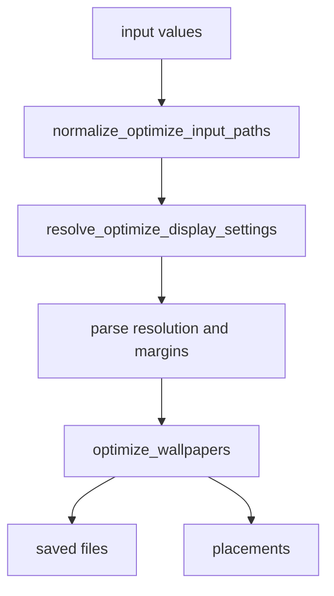
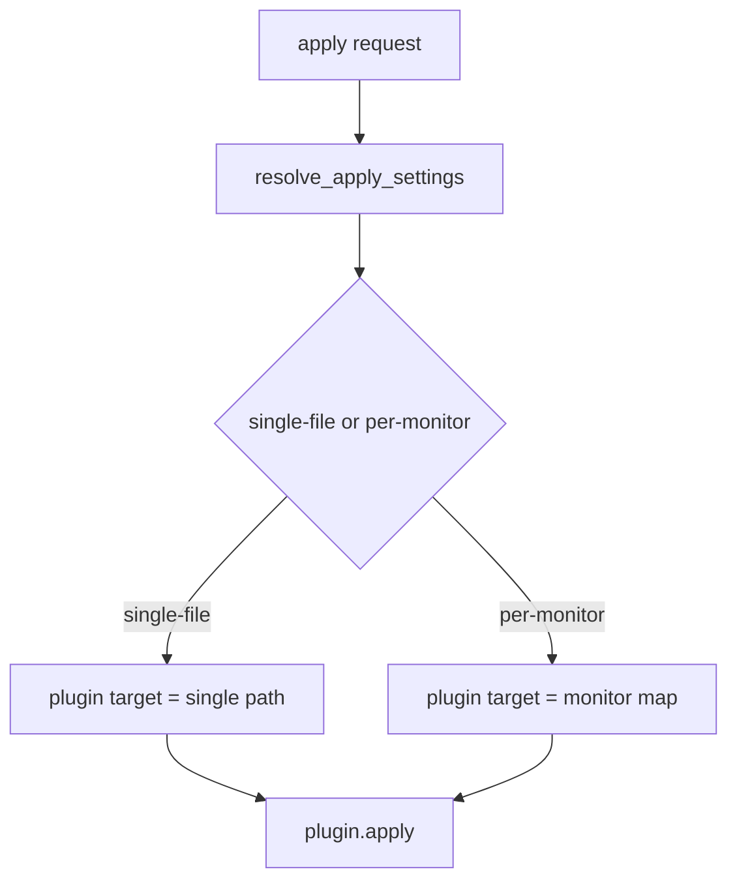
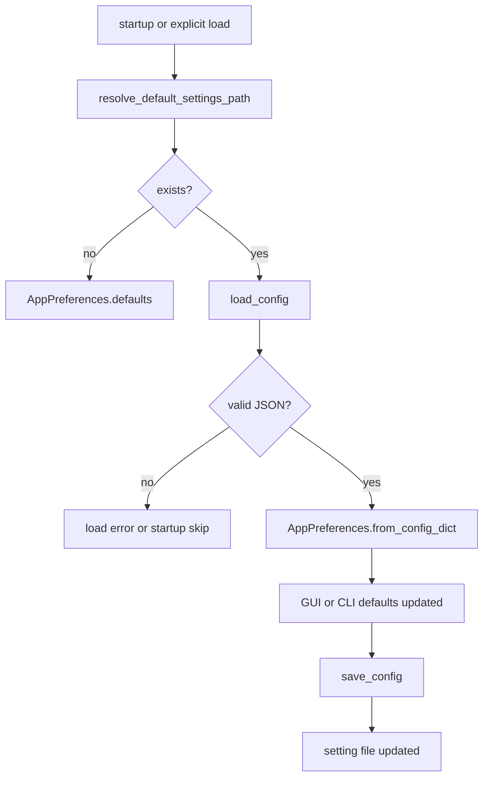

# Harite コア仕様 (Core Spec)

最終更新: 2026-05-19

## 1. コア (core) の責務

- 入力画像、表示条件、最適化条件、適用条件の基底ルールを扱う。
- GUI / CLI のどちらから呼ばれても変わらない挙動を受け持つ。
- plugin 実行そのものではなく、plugin へ渡す target の解決までを含む。

core が扱うもの:

- 入力値の正規化
- 表示条件の解決
- 最適化実行に必要な基底パラメータ
- apply target の解決
- 設定モデルと設定ファイルの相互変換

core が直接の主責務としないもの:

- CLI の option surface
- GUI widget や dialog の詳細
- tray の UI 操作
- plugin ごとの実際の OS 呼び出し

## 2. データモデル

- optimize 入力は 1 個以上の画像パスである。
- 画面条件は `resolution`, `two_screen`, `l_display`, `r_display` などで表現する。
- 設定は `OptimizePreferences`, `ApplyPreferences`, `WatchPreferences`, `AppPreferences` として論理分割される。

主要モデルの整理:

- optimize 面は、入力画像、target resolution、margins、align、background_color、embed 系で構成される。
- apply 面は、`plugin_name`, `apply_mode`, target file または monitor map で構成される。
- watch 面は、入力 directory 群、interval、mode、cycle state で構成される。
- 設定面は、optimize / apply / watch の論理グループを 1 つの設定ファイルへ統合して保存する。

補足:

- `PlacementResult` は `image_path`, `x`, `y`, `width`, `height`, `rotation`, `scale`, `score`, `posit` を持つ。
- `posit` は two-screen optimize 時に `left` / `right` を入れる用途で使う。
- `PlacementResult` は `to_dict()` を持ち、JSON 直列化可能な辞書へ変換できる。

## 3. 入力解決と表示コンテキスト

- optimize 入力は画像ファイルのみを受け付け、directory は受け付けない。
- two-screen 文脈では、resolution と左右 display 情報の整合が必要である。
- watch 入力は directory 単位で扱い、画像列を cycle の対象とする。

入力解決の基本原則:

- optimize は「何を出力したいか」を先に確定させるため、入力画像と表示条件の両方を要件とする。
- single-screen と two-screen では、必要なパラメータの意味が一部変わる。
- watch は optimize と異なり、単発の画像ではなく候補集合を扱う。

two-screen 文脈で重要な点:

- `resolution` は最終的な合成面の大きさを表す。
- `l_display` と `r_display` は左右画面の幅・高さを表し、auto-split の根拠になる。
- 表示条件が不足または矛盾する場合は、core 側で早めに入力不正として止める。

## 4. 最適化ロジック

- optimize は表示条件解決の後に実行される。
- margins, align, valign, background_color, embed_info 系は optimize 実行前に正規化される。

最適化ロジックの考え方:

- まず入力群を画像ファイルとして正規化する。
- 次に表示条件を single-screen / two-screen 文脈で解決する。
- その後、margins や位置指定などの付帯条件を正規化して optimize 実行へ渡す。
- 実行結果は saved files と placements として返り、GUI / CLI はそれを表示面へ転写する。

embed 情報:

- optimize は `embed_info`, `embed_text`, `embed_position`, `embed_max_lines`, `embed_font` を受け取れる。
- `embed_info` は `none|params|free|combo` を取り、`params` / `combo` では resolution, margins, align/valign, input count, two-screen 情報を行へ整形する。
- `embed_position` は `auto|top|bottom|left|right` を取り、core 側では margin 内の表示領域へ解決する。
- `embed_max_lines` は描画前に適用され、行数超過時は切り詰める。

## 5. 適用ロジック

- apply target は `single-file`, `per-monitor-explicit`, `per-monitor-auto-split` の面で解決される。
- plugin 実行は別面だが、どの target を渡すかは core 側の責務である。

apply mode ごとの意味:

- `single-file`: 単一画像を plugin へそのまま渡す。
- `per-monitor-explicit`: 左右 monitor ごとに明示画像を渡す。Linux plugin と 2 画面検出を前提とする。
- `per-monitor-auto-split`: 合成画像を画面条件に基づいて自動分割し、monitor map を作る。Linux plugin と 2 画面検出を前提とする。

monitor map 解決:

- `per-monitor-explicit` は ordered display の先頭 2 件に対して `left_file` / `right_file` を割り当てる。
- `per-monitor-auto-split` は `build_auto_split_display_map(...)` を経由し、最終的には `split_composite_for_displays(...)` で `{display.name: output_path}` を構成する。
- `split_composite_for_displays(...)` は display の `x_offset` と幅から virtual desktop 上の切り出し範囲を計算し、各 display size に fit するファイルを出力する。

不正条件の代表:

- Linux 以外の plugin で per-monitor apply を要求した場合
- 2 画面未検出のまま per-monitor apply を要求した場合
- auto-split に失敗して monitor map を構成できない場合

## 6. 設定 (settings) の保存と読み出し

### 6.1 設定ファイル (`harite-preferences.json`) の保存場所

- Linux: `XDG_CONFIG_HOME/harite/harite-preferences.json`
- Linux で `XDG_CONFIG_HOME` 未設定: `~/.config/harite/harite-preferences.json`
- 非 Linux: `~/harite-preferences.json`

### 6.2 物理形式

- UTF-8 JSON
- top-level key は平坦
- 保存時は 2-space indent と末尾改行を付ける

補足:

- 論理的には optimize / apply / watch の 3 群に分かれるが、物理ファイルはネストせず 1 object に merge される。
- そのため設定ファイルは人手でも編集しやすい一方、論理境界は本文で補う必要がある。

### 6.3 論理グループ

- optimize 面: `resolution`, `scaling`, `two_screen`, `l_display`, `r_display`, `margins`, `align`, `valign`, `quality`, `background_color`, `embed_info`, `embed_text`, `embed_position`, `embed_max_lines`
- apply 面: `plugin`, `apply_mode`
- watch 面: `watch_interval_seconds`, `watch_srcdir_l`, `watch_srcdir_r`

主要 key の意味:

- `two_screen` は単なる bool ではなく `auto` を取りうる。
- `align` と `valign` は論理上 pair だが、保存時には list 表現になる。
- `plugin` は platform 既定値を持つが、設定ファイルで上書きできる。
- `apply_mode` は desktop session により既定値が変わりうる。
- `watch_srcdir_l` と `watch_srcdir_r` は、GUI watch の継続運用面と直接つながる。

### 6.4 設定ファイル load / save flow

読み出し時の扱い:

- ファイル不存在は「設定なし」として扱える文脈と、明示 load 失敗として扱う文脈がある。
- JSON 不正は `ValueError` として扱う。
- 欠落 key は defaults で補われる。

## 7. エラーと失敗時の扱い

- 不正入力は基本的に `ValueError` として表現される。
- config 読み込みでは `FileNotFoundError` と `ValueError` を区別する。
- apply target 解決失敗は plugin 実行前に止める。

代表的な失敗面:

- optimize 入力が directory だった場合
- resolution や margins の形式が不正だった場合
- watch の入力 directory が存在しない、または空だった場合
- per-monitor apply の前提条件を満たさない場合
- 設定ファイルが見つからない、または JSON として不正だった場合

## 8. メッセージ分類

- CLI は `typer.echo(...)` で info / error を表す。
- GUI は `status_level`, `status_phase`, `status_message`, `last_error` で表す。
- plugin logger は `info / warning / error / exception` を使う。

本文での分類方針:

- core では個別文言の完全列挙は行わず、どの失敗がどのチャネルへ流れるかを優先して説明する。
- CLI は利用者向けの即時表示、GUI は状態表示、plugin logger は実行環境観測という住み分けで捉える。
- watch は CLI / GUI の両面にまたがるため、summary 系メッセージと failure 系メッセージを分けて説明する。

## 9. 他分冊との境界

- command surface の詳細は [docs/specs/cli/harite-cli-spec.md](docs/specs/cli/harite-cli-spec.md)
- GUI の状態遷移と画面責務は [docs/specs/gui/harite-gui-spec.md](docs/specs/gui/harite-gui-spec.md)
- watch 実行面は [docs/specs/watch/harite-watch-spec.md](docs/specs/watch/harite-watch-spec.md)
