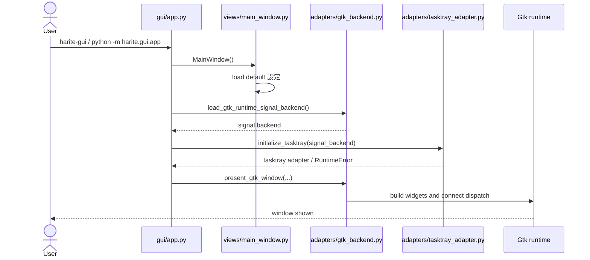
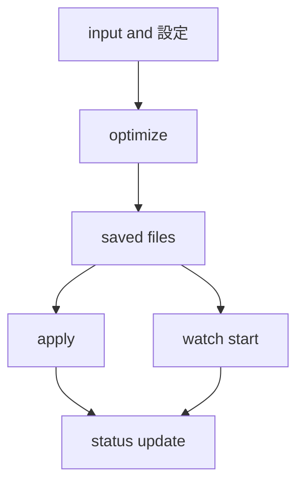
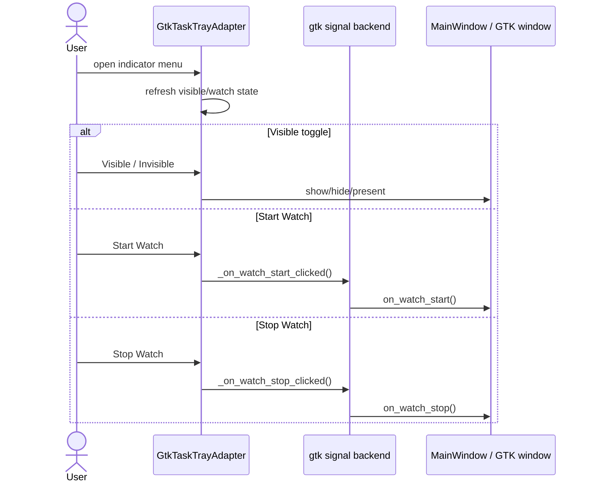

# Harite GUI 仕様 (GUI Spec)

最終更新: 2026-05-19

## 1. GUI の責務

- GUI は日常操作面として、compose -> optimize -> apply -> watch の導線を提供する。
- framework-neutral な状態モデルと GTK runtime を分離し、保守可能性を確保する。

## 2. GUI 起動導線



## 3. 画面全体構成

- title / menu / flow / save-as
- compose / input / position
- margins tab
- action cluster
- watch tab
- status footer

## 4. メイン操作フロー



## 5. 設定 (settings) 保存と再読込

- startup 時に既定の設定ファイル (settings file) を読む。
- 設定 dialog (settings dialog) から apply / load / save を行える。
- 物理保存先と key 仕様は core spec に従う。

## 6. watch との接続

- GUI watch は `MainWindow` 側に運用責務を持つ。
- watch start 時に srcdir, plugin, apply_mode, dual-source 条件を検証する。
- watch tick は GTK runtime timer と owner state の同期で動く。

## 7. tray / indicator / app icon surface



- tray は可視状態切り替えと watch 開始停止の補助面である。
- icon は watch 状態に応じて切り替わる。

## 8. GUI の層構造

```text
app -> views/main_window -> controllers/services -> adapters(GTK runtime)
```

### 詳細分類

```text
views/
  main_window.py          主状態モデル
  main_window_preview.py  preview 補助計算
controllers/
  optimize_controller.py  optimize bridge
services/
  cli_mapper.py           GUI state to CLI args
adapters/
  gtk_backend.py          GTK runtime 統合窓口
  ui_adapter.py           signal dispatch table
  tasktray_adapter.py     tray / indicator
  gtk_layout_builders.py / gtk_tab_builders.py / gtk_dialog_builders.py
  gtk_runtime_*           signal, sync, dialog, watch, helper 群
```

## 9. GUI での失敗時挙動

- GUI は `status_level`, `status_phase`, `status_message`, `last_error` を持つ。
- footer に `Status:` と `Error:` を表示する。
- watch, apply, 設定, input dialog などの failure は phase 単位で表示する。

## 10. メッセージ分類

- `idle`: 待機
- `running`: 実行中
- `success`: 完了
- `error`: 失敗

## 11. CLI / core / watch との境界

- core 挙動は [docs/specs/core/harite-core-spec.md](docs/specs/core/harite-core-spec.md)
- CLI command surface は [docs/specs/cli/harite-cli-spec.md](docs/specs/cli/harite-cli-spec.md)
- watch 詳細は [docs/specs/watch/harite-watch-spec.md](docs/specs/watch/harite-watch-spec.md)
