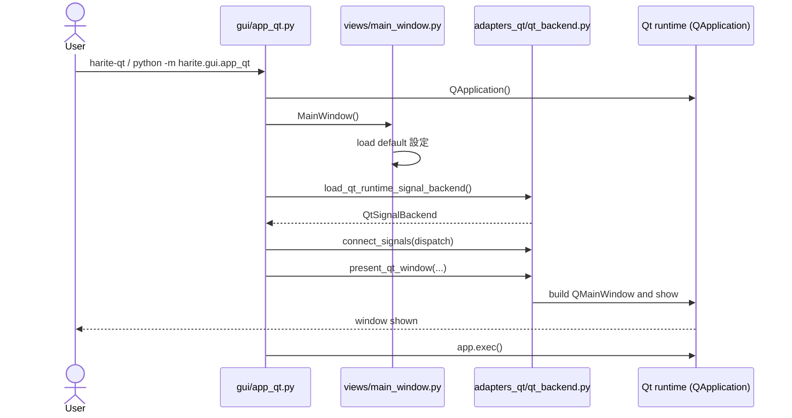
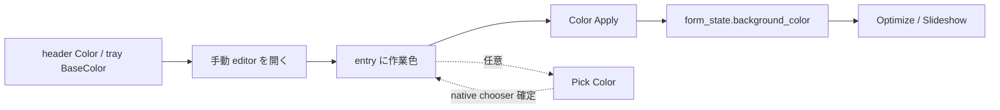
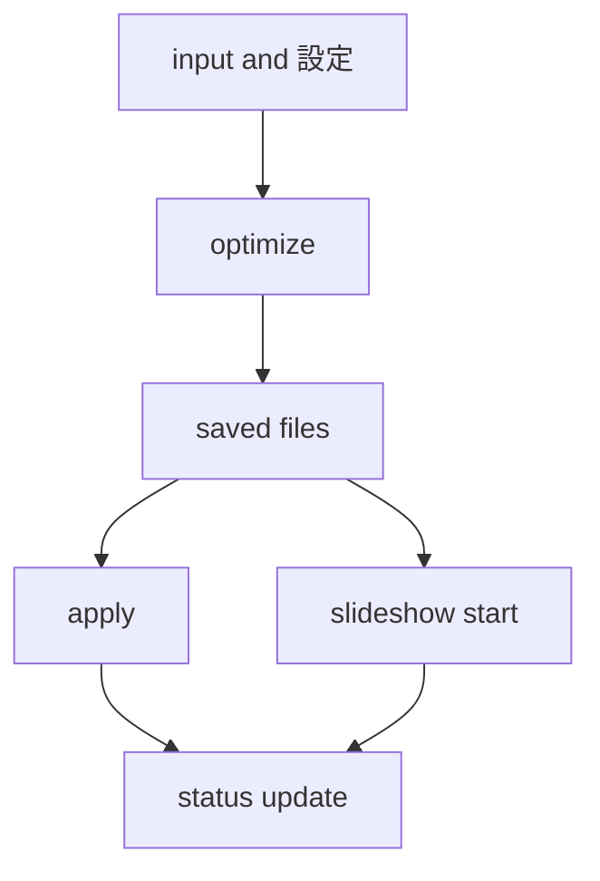
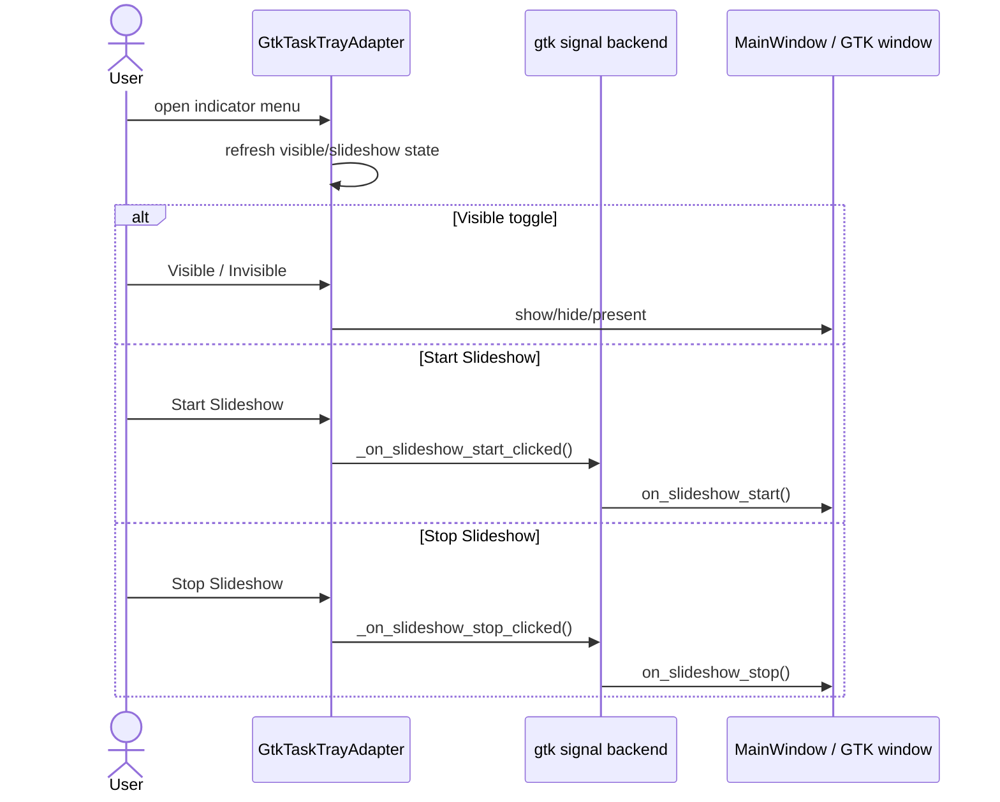

# Harite GUI 仕様 (GUI Spec)

最終更新: 2026-06-09

## 1. GUI の責務

- GUI は日常操作面として、compose -> optimize -> apply -> slideshow の導線を提供する。
- framework-neutral な状態モデル（`views/`）と runtime（`adapters/` または `adapters_qt/`）を分離し、保守可能性を確保する。
- GUI は `MainWindow` を中心に、設定、スライドショー、status、message history を一貫した状態として保持する。
- エントリーポイントは GTK backend（`harite-gtk` / `app.py`）と Qt backend（`harite-qt` / `app_qt.py`）の 2 系統を持つ。いずれも同じ `MainWindow` を生成し、framework 固有の処理は各 adapters 側が担う。

### 1.1 本書の読み方

| 層 | 節 | 内容 |
| --- | --- | --- |
| **本編** | §2–5 | 起動、Main（+ Margins Drawer）/ Slideshow 骨格、settings |
| **本編** | §6 | slideshow 接続（registry・remote・start/tick） |
| **付録** | §7 以降 | tray、icon、backend 差分 |

catalog / remote の契約詳細は [source-spec](../source/harite-source-spec.md)。tick 算法は [slideshow-spec](../slideshow/harite-slideshow-spec.md)。

## 2. GUI 起動導線

### GTK backend（harite-gtk）


GTK 起動時の実際の流れ:

- entrypoint は最初に `MainWindow()` を生成し、ここで既定の設定ファイル読み込みまで完了する。
- その後に GTK signal backend の読み込み、signal dispatch 接続、tray 初期化、実 window 表示を順に試みる。
- GTK / PyGObject が利用できない場合や tray 初期化が失敗した場合でも、entrypoint 全体は即失敗せず、可能な範囲で `window.show()` へフォールバックする。
- したがって GTK 起動は、GTK runtime の完全初期化に成功する経路と、部分機能で継続する経路の 2 面を持つ。

### Qt backend（harite-qt）



Qt 起動時の実際の流れ:

- `QApplication` を生成してから `MainWindow()` を生成する。
- `load_qt_runtime_signal_backend()` で `QtSignalBackend` を得て、`RUNTIME_HANDLER_MAP` から生成した dispatch を `connect_signals()` で渡す。
- `present_qt_window()` が `QMainWindow` を構築して表示し、`app.exec()` でイベントループに入る。
- PyQt6 が利用できない場合は即座に `SystemExit` で終了し、GTK backend と異なりフォールバック経路は持たない。

### 共通事項

- 両 backend とも `MainWindow` owner state を共有する。`ui_adapter.py` の `RUNTIME_HANDLER_MAP` は両 backend が共用する handler 名 / method 名の対応表である。
- ウィンドウタイトルは `Harite`、ウィンドウアイコンは `harite_app.svg` を使う（両 backend 共通）。
- ウィンドウの初期サイズは 900×640 を基準とする。

## 3. 画面全体構成

layout 戦略:

- GUI は top-level window の直下を単一の縦積み root container とし、header、center body、footer の 3 層で構成する。
- center body は notebook を 1 つ持ち、tab 順は `Main`、`Slideshow (...)` の **2 枚**とする（P-08）。
- `Main` は日常操作の主導線（compose / optimize / apply）と **margin 調整**（4 辺 spin 常設 + 補助 Drawer）を担う。`Slideshow` は継続実行面。
- page ごとの内容は page shell を使って中央寄せしつつ、各 page 内では必要に応じて fill と center を切り替える。
- **options drawer の開閉**では、tab 正面の中核 widget を上下にシフトさせない（§3 *Options drawer — window frame resize*）。
- GUI の常設補助説明面は以下である。
  - header の flow legend
  - footer の status / slideshow summary / error
  - Main tab の apply mode radio tooltip（§3 action cluster）
  - Main tab の margin widget tooltip（line limit / 優先規則 / behavior。§3 Main tab — Margins Drawer 参照）
  - Slideshow tab の mode help（Drawer 内）
  - settings dialog の state/notice
  - color dialog の state/notice
- これらの補助説明面は、操作 widget と同一 row に埋め込まず、対応する操作面の近傍に独立 row または独立 block として置く。
- したがって GUI layout の基本方針は「window 全体は縦 3 層」「center body は notebook」「各 page は独立した責務を持つ」である。

Main Window:

- header は 2 行構成で、1 行目は title を左、command bar を右に置く。
- command bar には `Color`、`Settings`、`About` を右寄せで並べる。
- 2 行目の flow row では左に `Compose -> Optimize -> Apply` を置き、右に `Export Image` を置く。
- flow row の `Export Image` は optimize 結果画像の書き出し導線であり、設定ファイル保存とは別面である。
- flow row の左端には導線説明として flow legend を常設する。進行段階に応じて **現在段階のみ Bold**（GTK markup / Qt RichText）とする。
  - input 準備完了〜optimize 前: **Compose**
  - optimize 完了〜apply 前（`can_apply`）: **Optimize**
  - apply 完了（`status_phase=apply` かつ `status_message` に completed）: **Apply**
  - 判定は `flow_legend_surface.flow_legend_active_step(owner)`。runtime は `sync_flow_legend_from_owner` で `lblFlowLegend` を更新する。
- footer も 2 行構成で、1 行目は左に `Status`、右に `Slideshow summary` を置く。
- footer 2 行目は separator の下に `Error` を置き、status と error を縦 2 段で分離する。
- footer の `Status`、`Slideshow summary`、`Error` は実行状態と失敗面を読むための常設説明面である。
- footer の `Error` は `Status` / `Slideshow summary` と **視覚的に区別**する（例: 赤系 foreground）。同一の muted 色で status と error を並べない。
- footer の `Status` 行に `{Phase}: {state}` 形式を常設しない。進行中の slideshow 状態は `Slideshow summary` に寄せる。内部の `status_phase` は保持してよい。
- footer の `Slideshow summary` と notebook の `Slideshow (...)` タブ見出しは **同一の実行状態**（`stopped` / `running` / `paused`）で同期する。`refresh_slideshow_summary_label` が両方を `Slideshow ({state})` 形式へ更新する。

Main tab:

- `Main` tab は縦積みの `main_col` を持ち、上から **margin cross-grid（外周 4 spin、内包 compose grid）**、**action cluster**、**Margins options Drawer トリガ**、（開時）**Margins options Drawer** の順とする（P-08）。
- margin cross-grid は top / left / right / bottom の 4 辺 margin spin を **compose grid を内包する** 外周配置とする（上段 top、中段は left | compose | right、下段 bottom）。**embed pattern / margin text / position は Drawer 内**（正面常設は 4 spin のみ）。
- compose grid は左・中央・右の 3 列構成で、左 panel と右 panel は display ごとの入力・方向操作面、中央 panel は pick state と swap 操作面とする。
- 中央 panel は direction toggle 群と **同型 3 行**とし、上段に pick state label、**中段**（Left-L … Right-L / Left-R … Right-R と同高）に **`Swap L/R`** button を置く（§4.1）。
- 左右 panel は同型で、上段に十字配置の direction toggle と `Open-L/R`、下段に選択 path 表示と `Clear-L/R` を置く。
- Main tab の選択 path 表示（`entPathL` / `entPathR`）は full path をそのまま出さず、共通 helper `format_input_display(...)` で **basename の省略表示** にする（§6.1 参照）。
- direction toggle 群は `Top/Bottom/Left/Right` を display ごとに十字状へ配置し、画像 picker button を中央に置く。toggle tooltip は `{Direction} alignment-{L|R}`（例: `Top alignment-L`）。
- action cluster は横 3 群構成で、左から preview サムネ群、`Optimize` button 群、`Apply` button 群を置く（P-04）。**セクション見出し label は持たない**（`Preview` / `Optimize` / `Apply` の見出し行なし）。
- action cluster の 3 群は **上端揃え** とする。
- `Apply` button は **自然幅**（列いっぱいに伸ばさない）。`No Split` / `Auto-Split`（Windows: `Span`）radio 行は Apply button の直下で **水平センタリング** する。
- `Optimize` 群は **`Optimize` button のみ**（icon + 文字列）。結果は **footer `Status` / `Error`** に出す。`Optimize result:` 常設 label は持たない。
- `Apply` 群は **`Apply` button** と **`apply mode row`**（`No Split` / `Span|Auto-Split` radio）のみ。`Apply target:` 常設 label と `apply mode help row` は持たない。
- apply mode の意味説明は **radio 群（および `Apply` button）の tooltip** に載せる（`apply_mode_help_text(...)` の全文。mode 切替で tooltip を更新する）。
- `Preview` 群は **左右サムネ 2 枚のみ**（横並び）。idle 時は空枠（中央に `not-ready` 等の文言を出さない）。optimize 後は画像を表示する。
- Preview 群に **常設しない**: assignment / result / `Preview:` / `Preview source:` / `Assist:` 行。
- Main action cluster の補助説明の載せ先:

| 旧常設 | 載せ先 |
| --- | --- |
| `Optimize result:` | footer `Status`（成功）/ `Error`（失敗） |
| `Apply target:` | footer `Status`（apply 直後） |
| apply mode help | apply mode radio 群 tooltip |
| Preview 補助 label 群 | 原則なし（サムネと enable/disable で足りる） |

Main tab — Margins options Drawer（P-08）:

- 補助面は **options drawer**（トリガ label は `More margin options…`、rename 可）内に置く。Slideshow の `More slideshow options…` と対称。
- Drawer 内:
  - `embed pattern` — `Off` / `Settings` / `Text only` / `Both` の radio row
  - `margin text notebook` — `Settings` page と `Text` page の 2 page 構成。`Settings` page は preview label 中心、`Text` page は margin text entry
  - `position selector` — `Left` / `Right` 列 × `Top` / `Bottom` radio。Main tab の direction toggle 十字（画像の push 方向）とは **独立**（§8 `margin text position`）
- Drawer 内に **常設 label は置かない**: `Main Window Current alignment:` 見出し、`align=...` / `margins=...` の状態列挙、line limit / 優先規則 / behavior の 3 行 notes block（C-04a 済みと同型）。
- **widget tooltip** — 載せ先と文の対応:

| 載せ先 widget | tooltip 文 |
| --- | --- |
| `embed pattern` の mode label | `Line limits are chosen automatically for the selected margin text mode.` |
| `Text` page の margin text entry | 同上 |
| `position selector` | `Rule: margins define area; align/valign act inside it.` |
| cross-grid、各辺 margin label | `Current behavior: margins are global to the composite canvas.` |
| center stack 全体（任意） | 上記 3 文を連結した tooltip |

- **footer `Status`**（§9）: margin text preflight の成否と寸法要約（§8 `margin text preflight の現行規則`）。
- **Drawer 開閉視認性:** Slideshow options Drawer（P-07）と **同型** — 開時は drawer 面板を theme chrome tint、上辺 1px `mid`、トリガ chevron up（閉=down）、`More…` / `Fewer…` ラベル反転。実装は `slideshow_options_drawer` と同パターンを margins 用に再利用または共通化する。

Options drawer — window frame resize（Main + Slideshow 共通）:

- 開く: drawer 表示に必要な分だけ **top-level window の高さを増やす**。tab 正面の中核（Main: cross-grid / action cluster、Slideshow: profile / srcdir / interval 行）の **画面上位置は維持**する（tab 内 stretch サンドイッチで上寄せしない）。
- 閉じる: **開く直前の window 高さに復元**する。
- ウィンドウが既に `minimumSizeHint` より高い場合（手動リサイズなしの既定起動を含む）は、tab 内容の **高さ差分**（例: `main_col` / `slideshow_tab_box` の `minimumSizeHint` 増分）を window に加算して伸ばす。
- 実装入口: `drawer_window_resize.py`。Main は `margins_options_drawer`、Slideshow は `slideshow_options_drawer` から呼ぶ。

Slideshow tab:

- `Slideshow` tab の正面（中核）は縦積みで、CODH keyword chip、profile row、srcdir row、interval/start/stop row、`More slideshow options…` トリガの順とする（**上下 expanding spacer は持たない** — 開閉時の余白吸収は window 枠伸縮に委ねる）。
- **CODH keyword chip**: タブ右上角に read-only muted label（`CODH: {keyword}`）。L/R いずれか（または profile 経由）が CODH keyword preset のときのみ表示。編集は Manage Presets タブ。
- **profile row** は tab 幅中央に `combo_slideshow_profile`（`— none —` + profile 名一覧）を 1 本置く。常設の「選択で L/R を一括反映」類の補助 label は **持たない**（tooltip で足りる）。
- srcdir row は **Main tab compose grid と同型**の左・中央・右 3 列とする。左右 panel は上から **`combo_slideshow_source_l/r`（Saved source）**、`Srcdir-L/R` button、`L:` / `R:` path label、右下に `Clear-L/R` を持つ。中央 panel には **`Swap L/R`** button のみを置く（§4.1 / §4.2）。
- **interval/start/stop row** は正面に `Interval`、spin、`Slideshow Start`、`Slideshow Stop` を 1 行にまとめ、視線の終点とする。
- **補助面（Drawer）** — 正面からは `manage registry row`、`mode row`、`mode help row`、`detail row`（current/output）を除き、**開閉パネル（Drawer）** 内へ移す。トリガ label は `More slideshow options…`（rename 可）。Drawer 内に置くもの:
  - `Mode` + sequential/random + 短い mode help（1 行まで）
  - `btn_manage_source_registry`（`Manage sources and profiles…`）— 専用 Sources タブは **作らない**
  - `Slideshow current` / output 表示（path は tooltip または footer 要約で足りる場合は常設 label を省略してよい）
  - CODH keyword 入力は Manage dialog Presets タブ内
- registry / remote の Refresh 前は確認ダイアログを出す。
- 補助面は **options drawer**（`More slideshow options…`）内に置き、Slideshow tab 正面は中核のみとする。
- **Drawer 開閉視認性:** 開時は drawer 面板を **theme chrome tint**（`Window` と `WindowText` を 6% 混合 → `QPalette.Window` + `autoFillBackground`、子 widget へ QSS を当てない）、上辺は 1px `QFrame`（`palette(mid)`）、トリガのみ scoped QSS（chrome 背景・上左右枠）+ chevron up（閉=down）。`Fewer…` / `More…` ラベル反転は維持。入口: `slideshow_options_drawer.apply_slideshow_options_drawer_open_state`。

Dialogs:

- settings dialog は単一の縦積み editor box を持ち、上から `header row`、`settings rows`、`actions row`、`notice separator`、`state/notice` を並べる。
- settings dialog の header row は左に title、右に `Save Settings` を置く。
- settings dialog の `Save Settings` は設定ファイル保存を指し、main window の `Export Image` や image export dialog とは別の保存面である。
- settings dialog の現行 runtime 実装で常設 row として露出するのは `Resolution`、`Scaling`、`Plugin`、`Apply` である。
- settings dialog の `Apply` row は radio を横並びに持つが、main tab の apply mode help label に相当する補助説明 row は持たない。
- settings dialog は下段に `Settings: current values` を起点とする state label と notice label を持つ。
- optimize 結果画像の書き出しには別の image export dialog を使い、user-facing surface は dialog title に `Export Image`、状態表示に `Export path`、選択結果表示に `Export target` を使う。
- color dialog の組み立て・操作・backend 差分は **§3.1 Color dialog** を正本とする。
- about dialog は content 全体を window 内で上下中央寄せし、icon、title、version、description、credits、license、close button を縦積みする。
- about dialog の `Version`、`description`、`Credits`、`License` は product 情報を読むための常設情報 label 群である。
- dialog 群は main window より小さい独立 window として扱い、settings だけ resizable、color/about は fixed-size 寄りの扱いを取る。

### 3.1 Color dialog（背景色）

MAT-03（2026-06-09）で Qt の組み立てと操作契約を GTK と揃えた。本節が color dialog の正本である。

#### Window

- title: `Background Color`
- main window より小さい **独立 window**（non-modal、fixed-size 寄り）
- 既定サイズ: **420×360**（GTK / Qt 共通）
- 実装: GTK `build_color_dialog_section`、`Qt` `build_color_dialog`

#### 縦積み（上→下）

| 段 | user-facing | 役割 |
| --- | --- | --- |
| 1 | `Background color (#RRGGBB)` | 編集面タイトル |
| 2 | picker host | backend 固有の色選択・プレビュー面（下記） |
| 3 | hex entry | `#RRGGBB` リテラル。Apply の読取元 |
| 4 | actions row | `Pick Color` / `Color Apply` / `Color Cancel`（横並び） |
| 5 | separator | state / notice との区切り |
| 6 | `Color: {hex}` | 直近に Apply 済みの確定色（state label） |
| 7 | notice label | 検証エラー等（例: `Color: invalid background color`） |

#### picker host（backend 差分）

| backend | picker host の中身 | `Pick Color` |
| --- | --- | --- |
| GTK | 可能なら `ColorChooserWidget` を embedded。選択は entry と同期 | embedded 有効時は **非表示** |
| Qt | caption `Current background color` + **現在色 preview**（`QLabel` + `background-color` stylesheet）。entry / `Pick Color` / `set_color` と同期。無効 hex は `Invalid color` 表示 | **常設**。native `QColorDialog.getColor` を開く |

Qt は picker host へ **非 native `QColorDialog` を embedded しない**。Windows では別窓 `Select Color` が重複起動し、host が空の白枠になるため（MAT-03 調査）。

#### 操作フロー（2 段）



1. **編集（作業色）** — picker host / hex entry / `Pick Color` で `#RRGGBB` を決める。この時点では **Optimize には未反映**。
2. **確定（システム書き戻し）** — `Color Apply` が entry を `get_pending_color()` で読み、`on_set_color(color)` → `form_state.background_color` と settings キャッシュへ反映。成功時は dialog を閉じ、`lblColorState` を更新。

#### シグナル契約（GTK / Qt 共通）

| 操作 | handler 経路 | 備考 |
| --- | --- | --- |
| header `Color` / tray `BaseColor` | `on_color_clicked` → `refresh_color_dialog_from_getter` → `on_set_color(None)` → `ColorDialog.open_dialog()`（**show のみ**） | Qt は **起動時に native chooser を自動では開かない** |
| `Pick Color` | `pick_color()` → native chooser → `set_color`（entry + preview 同期） | Apply 前の作業色 |
| `Color Apply` | `on_color_dialog_apply_clicked` → `get_pending_color()`（**entry 読取**）→ `on_set_color(color)` | invalid 時は notice を出し dialog を開いたまま |
| `Color Cancel` | `on_color_dialog_canceled` → dialog close | `form_state` は変更しない |

#### Optimize との接続

- `OptimizeController` は `form_state.background_color` を `optimize_wallpapers(..., background_color=...)` へ渡す。
- Color dialog で **Apply していない作業色**は Optimize に影響しない。

## 4. メイン操作フロー



- GUI は日常操作面として apply や slideshow を直接起動するが、内部では core / plugin / slideshow helper の経路を利用する。

Optimize / Apply クリック後の feedback（GTK / Qt 共通、P-04）:

- action cluster に **result / target 常設 label は置かない**。成否は **footer `Status` / `Error`**（owner の `status_message` / `last_error` を `_sync_feedback_from_owner` で反映）と **preview サムネ** で読む。
- `Optimize` クリック成功時: `btnSetWall` を有効化し、preview を更新、footer に `optimize completed` 等の人間語を出す。
- `Optimize` クリック失敗時: `btnSetWall` を無効化し、footer `Error` に失敗理由を出す。
- handler 未接続時: footer `Error` に `handler not connected`。
- 成功 / 失敗後の owner 同期は **`_sync_preview_state_from_owner`、`_sync_action_availability_from_owner`、`_sync_feedback_from_owner`** とし、input 変更時の `sync_input_state_from_owner` で action cluster へ `not-run` 系文言を復元してはならない。
- `Apply` クリック成功時: footer `Status` に apply 完了メッセージ（owner `status_message`）。

apply mode の user-facing 意味:

- action cluster の apply mode は GUI 上 `No Split` と第 2 択（Linux: `Auto-Split`、Windows: **`Span`**）である。
- `No Split` は内部的に `single-file` へ対応し、最適化済み画像を 1 ファイルのまま plugin apply する。
- Linux の `Auto-Split` は内部的に `per-monitor-auto-split` へ対応し、最適化済み画像を display ごとに分割して apply する。
- Windows の **`Span`** も内部値は `per-monitor-auto-split` だが、Apply target は **合成 1 ファイル**（Windows plugin）。OS **Span 表示** と組み合わせて左右見え方を揃える。per-monitor map は約束しない。
- Windows で display が 2 枚以上検出された場合、Main タブの既定選択は **Span** とする。No Split も選択可能。
- Settings の **`windows_apply_span`**（bool、既定 `false`）が有効なときだけ、Span モード Apply 前に HKCU `WallpaperStyle=22` を best-effort 設定する（B-lite）。Span 選択は Apply 時 Span 切替への同意とみなす。
- apply mode の全文説明は `apply_surface.apply_mode_help_text(...)` を **radio 群 tooltip** へ載せる（platform 別文言。常設 help row は持たない）。
- CLI にある `per-monitor-explicit` は expert 向け escape hatch として残るが、GUI 主導線には露出しない。
- GUI は plugin 名を settings から保持するが、target 解決規則は core に従う。
- `_default_apply_mode` は XFCE セッション時 `per-monitor-auto-split`、Windows plugin かつ display 2 枚以上時も `per-monitor-auto-split`（UI 上 Span）、それ以外は `single-file`。
- `_default_plugin_name` はプラットフォームマップ（`linux`→`linux`、`win32`→`windows`、`darwin`→`macos`）から初期値を決定する。マップに該当しないプラットフォームでは `linux` を既定とし、その値が `available_plugins` に存在しない場合は先頭の利用可能 plugin を使う。

### 4.1 L/R swap と Slideshow srcdir clear

| Handler | 呼び出し元 | Owner 操作 | Widget 同期 |
| --- | --- | --- | --- |
| `on_swap_input_paths()` | Main 中央 `Swap L/R` | `input_path_l` ↔ `input_path_r` を swap | `_apply_input_paths()` 経由で path 表示を更新 |
| `on_swap_slideshow_srcdirs()` | Slideshow 中央 `Swap L/R` | `slideshow_srcdir_l` ↔ `slideshow_srcdir_r` を swap | srcdir label（`L:` / `R:` 行）を更新 |
| `on_clear_slideshow_srcdir(side)` | Slideshow `Clear-L/R` | 指定 side の srcdir のみ `""` | 該当 label を空表示に更新 |

- 上記 3 handler は `ui_adapter.py` の `RUNTIME_HANDLER_MAP` に追加し、GTK / Qt 両 backend が同じ handler 名で `MainWindow` メソッドへ dispatch する。
- `side` 引数は `on_clear_input` と同型で、`"L"` / `"R"`（大文字小文字は strip 後に正規化）を受け付ける。不正 side は `False` を返し message history に理由を残す。
- **Swap** は path / srcdir の **値のみ**入れ替える。ファイル移動、registry 更新、direction toggle、pick state、apply mode は変更しない。
- **Swap** は片方だけ値がある場合も実行可能（空 ↔ 値の入れ替え）。
- **Clear-L/R**（Slideshow）は Main の `on_clear_input` と同型の per-side clear とする。**Clear both（同時クリア）は提供しない**。
- srcdir clear 後、両方非空でなければ `can_start_slideshow` は `False` となり Start を無効化する（§6 既存ガード）。実行中 slideshow を **自動 stop しない**（Main path clear と同様、owner 値と widget 表示の更新のみ）。
- swap / clear 後は `_sync_action_availability_from_owner`（または同等）で Start / Apply 等の有効状態を再評価する。
- Qt backend が development focus。GTK backend は maintenance mode だが、上記 handler と widget 配置は同一契約とする。

### 4.2 Slideshow source registry

catalog 契約は [source-spec §7](../source/harite-source-spec.md)。

| Widget / Handler | 用途 |
| --- | --- |
| `combo_slideshow_profile` | profile 選択 → L/R 一括反映 |
| `combo_slideshow_source_l` / `combo_slideshow_source_r` | 側別 saved source 選択 |
| `btn_manage_source_registry` | Manage dialog を開く |
| `source_registry_dialog` | sources + profiles CRUD（modal） |
| `on_select_slideshow_profile(profile_id \| none)` | profile → `resolve_profile_members` → owner / combo / label 更新 |
| `on_select_slideshow_source(side, source_id \| none)` | 側別 `resolve_source` → owner / label 更新 |
| `on_manage_source_registry()` | dialog 表示。Close 後に tab 上 combo を catalog から再構築 |
| `bootstrap_preset_sources` | startup および Manage dialog Close 後（[source-spec §13.4](../source/harite-source-spec.md)） |

**Saved source と Srcdir ブラウズの併存:**

| 操作 | owner path | registry tracking（`slideshow_source_id_*` / `slideshow_profile_id`） | combo 表示 |
| --- | --- | --- | --- |
| Saved combo で source 選択 | `resolve_source` → `slideshow_srcdir_*` 更新 | 当該 side の source id を記録 | 選択 source 名 |
| Saved combo で `— none —` | path **は変更しない** | 当該 side の source id のみクリア | `— none —` |
| Srcdir-L/R ブラウズ確定 | 従来どおり path 直書き | 当該 side の source id をクリア | `— none —` |
| Profile 選択 | L/R 両 path を profile から展開 | `slideshow_profile_id` + 両 source id を記録 | 各 side を対応 source に |
| Clear-L/R（§4.1 拡張） | 当該 side path を `""` | 当該 side source id + **`slideshow_profile_id` をクリア** | 当該 side saved combo → `— none —`。**Profile combo → `— none —`** |
| Swap L/R（§4.1 拡張） | `slideshow_srcdir_l/r` swap | `slideshow_source_id_l/r` swap。`slideshow_profile_id` は **クリア**（L/R 対応が崩れるため） |

- slideshow tick 中は `slideshow_srcdir_l/r` の path のみ参照する（[slideshow-spec §6.6](../slideshow/harite-slideshow-spec.md)）。
- **Start 直前**に tracking `source_id` / `profile_id` から [source-spec §6.4](../source/harite-source-spec.md) に従い再 resolve し、`slideshow_srcdir_*` を上書きしてから画像収集する。
- registry 外 path（ブラウズのみ）も **許容**する。Saved combo が `— none —` でも path label に basename 省略表示があれば Start ガードは従来どおり評価する。
- profile / source の **ordered list 化・profile 周回**は行わない。

**Manage dialog（Local / Presets タブ）:**

- **Sources** は `QTabWidget` で **Local** と **Presets** に分離（ALL タブなし）。Profiles セクションはタブの下に共通配置。
- **Local タブ:** local-dir 一覧（名前昇順）、Delete、Add local（name + Browse + path）。
- **Presets タブ:** remote/preset 一覧（provider グループ見出し + 名前昇順）、**keyword(CODH)**、Refresh。
  - グループ見出し: `JMA 天気図` / `NDL 図版` / `CODH 江戸` / `その他`（`harite-preset:` の preset_id 接頭辞で分類）。
  - Delete は **Local タブのみ**（preset は materialize で再出現しうる）。
- **keyword(CODH)**: Presets タブ内に常設 `QLineEdit`（ラベル `keyword(CODH)`、初期値 `桜`、`maxLength=16`）。`codh-edo-spots-keyword` / `codh-edo-shops-keyword` 選択時のみ enabled。編集中のドラフトは **preset 選択変更・Enter・フォーカス移動では破棄しない**（Close / Refresh 確定まで field 上の最新文字列を保持）。Refresh 前および Close 時に `harite-settings.json` の `codh_keyword` へ反映（[source-spec §15.4.2](../source/harite-source-spec.md)）。
- **Linux IME（Qt）:** `harite-qt` 起動時に `prepare_qt_input_method_env()` が `GTK_IM_MODULE` / `XMODIFIERS` から `QT_IM_MODULE` を補完する。**fcitx + pip PyQt6:** distro の fcitx Qt6 プラグイン（`fcitx5-frontend-qt6`）は **pip 同梱 Qt6 と非互換**（`Qt_6_PRIVATE_API` 未定義シンボルでロード失敗；MAT-06 viper3 確定）。Harite は pip venv へ symlink **しない**。**回避:** distro `python3-pyqt6`（Debian/Ubuntu/Mint: apt、`--system-site-packages` venv）+ `fcitx5-frontend-qt6`。**distro PyQt6 + SVG:** Harite のボタン／トレイアイコンは package 内 `.svg` を `QIcon` / `QPixmap` で読む。distro `python3-pyqt6` のみでは SVG プラグインが無く **アイコンが null** になりうる（`python3-pyqt6.qtsvg` を追加；起動時 `warn_missing_qt_svg_support()`）。`keyword(CODH)` は `configure_text_input_widget` で IME 有効化。Windows は本節の対象外。
- Profiles: 一覧、L/R slot combo（source id または empty）、Add / Delete profile。
- 保存は `harite-sources.json` へ即 write。settings dialog とは別 surface。
- dialog Close 後、Slideshow tab の profile / saved source combo を reload する。

**§4.1 との関係:**

- `on_swap_slideshow_srcdirs()` は §4.1 に加え、上表の tracking swap / profile id クリアを行う。
- `on_clear_slideshow_srcdir(side)` は path に加え、当該 side の source id tracking と saved combo を `— none —` に同期する。

- Qt backend が development focus。GTK は maintenance mode だが widget / handler は同一契約とする。
- core API は `harite.sources` のみ使用。CLI surface は追加しない。

### 4.3 単 display — 第二スロット disabled

検出は `len(detect_displays()) < 2` のみ。

| Tab | `len < 2` で disabled にする widget（第二スロット＝現 UI ラベル R） |
| --- | --- |
| Main | R 十字 direction、`Open-R` / `Clear-R`、Preview 右列、`Swap L/R` |
| Slideshow | `combo_slideshow_source_r`、`Srcdir-R`、`Clear-R`、R path 表示、`Swap L/R` |

Main tab Margins Drawer の `position selector`（Left/Right × Top/Bottom）は **合成画像上の埋め込み角** を指し、第二スロット（モニタ R）ではない。単 display でも 4 角すべて選択可能とする。

据え置き（実行時無視）: `combo_slideshow_profile`、`More slideshow options…` Drawer 内。profile の R slot や saved R は start 直前 resolve で参照しない。

GTK / Qt は `harite.gui.dual_display_ui` 経由で同一 widget 名を同期する。

## 5. 設定 (settings) 保存と再読込

- startup 時に既定の設定ファイル (settings file) を読む。
- 設定 dialog (settings dialog) から apply / load / save を行える。
- 物理保存先と key 仕様は core spec に従う。

設定読み込みの扱い:

- startup では既定 path を解決し、ファイルが存在する場合だけ読み込みを試みる。
- startup 読み込みで `FileNotFoundError`, `OSError`, `ValueError` が起きた場合は、GUI 全体を失敗させず message history に skip 理由を残して続行する。
- startup 読み込み時は、既存の `status_level`, `status_phase`, `status_message`, `last_error` を退避し、設定反映後に復元することで、起動直後の status を不必要に上書きしない。
- startup で owner（`MainWindow`）へ設定を反映したあと、各 backend は **`connect_signals` 完了時点**で owner → widget の非 preview 状態（input / main / margins / slideshow / feedback）を同期する。GTK は `_sync_non_preview_state_from_owner`、Qt も同型。これにより事前配置した既定 settings が起動直後の widget に載る。

設定 dialog の責務:

- dialog を開く時点で form state を取り込み、必要なら two-screen 状態を同期する。
- apply ではアプリ設定モデルを GUI state に展開し、optimize / apply / slideshow の各状態へ反映する。
- save では現在の GUI state をアプリ設定モデルへ戻して JSON payload を作り、指定 path または既定 path へ保存する。
- load では指定 path の JSON を読み込み、設定ファイルからアプリ設定モデルへ変換したうえで GUI state に反映する。

## 6. slideshow との接続

- GUI のスライドショー機能は `MainWindow` 側に運用責務を持つ。
- slideshow start 時に srcdir（空不可）と plugin（解決可否）を検証する。apply_mode は start 時に検証しない。
- dual-source（Srcdir-L と Srcdir-R の両方に画像が存在する）実行では、GUI の apply_mode 設定値にかかわらず常に `per-monitor-auto-split` を使用する。single-source 実行では常に `single-file` を使用する。
- slideshow tick は runtime timer（GTK: GLib timeout / Qt: `QTimer`）と owner state の同期で動く。
- GUI は CLI slideshow helper をそのまま露出するのではなく、GUI 状態管理を被せたうえで利用する。
- GUI は slideshow tab に mode 選択面を持つ。
- mode の user-facing 表記は `sequential` / `random` とする。
- slideshow tab の mode 既定値は `random` とする。
- `slideshow_interval_seconds` の既定値は `60`（秒）である。
- mode は slideshow 関連設定値として load / save 対象に含める。
- mode 選択面は manage registry row（または srcdir row）の下、interval/start/stop row の上に独立 row として置く。
- mode help row は選択中 mode の簡潔な補助説明を表示する user-facing surface とし、`sequential` 時は `Sequential rotates images.`、`random` 時は `Random rotates images.` を表示する。

### 6.1 path 省略表示（Main input / Slideshow current）

GTK / Qt 両 backend で、次の user-facing surface は **同じ省略規則** を使う。

| surface | 表示内容 | helper |
| --- | --- | --- |
| Main tab `entPathL` / `entPathR` | 選択画像 path | `format_input_display(...)` |
| Slideshow tab `Slideshow current` | 現在 tick の L/R 選択画像 path | `format_slideshow_path_display(...)` → 内部で `format_input_display(...)` |

省略規則:

- 表示対象は path の **basename** とする（directory 部分は出さない）。
- basename が 36 文字以下ならそのまま表示する。
- 36 文字を超える場合は `head + "..." + tail` へ切り詰める。既定では末尾 12 文字を残し、head 側は `36 - 12 - 3` 文字を使う（preview assignment 表示と同型）。
- owner 側の `slideshow_current_display` 文字列も、上記規則で整形した L/R を含める。

### 6.2 Interval spin と settings の優先順位

`slideshow_interval_seconds` は settings JSON の load / save 対象であるが、**実行時の有効値は slideshow tab の Interval spin が起点** となる。

| タイミング | 挙動 |
| --- | --- |
| 起動時 settings load / Settings Apply | settings 値を owner `slideshow_interval_seconds` へ反映し、spin も同期する |
| spin 変更（`value-changed`） | `on_slideshow_interval_change` で owner を即更新する（Save 前でもセッション中有効） |
| **Start 直前** | spin の現値を owner へ **必ず commit** する（`value-changed` 未発火でも可）。GTK / Qt 共通 |
| Start 成功後 | runtime timer は commit 後の `slideshow_interval_seconds` で起動する |
| 実行中の spin 変更 | owner のみ更新。timer は再起動せず、新 interval は **次回 Start 以降** で有効 |

したがって、ユーザーが spin を 3 秒に変えて Start した場合、保存済み settings が 60 秒でも **3 秒がその Start の timer に使われる**。tray の Start も同じ backend 経路のため同規則が適用される。

実装参照: `commit_slideshow_interval_from_spin(...)`（`gtk_runtime_slideshow_ui.py`）、各 backend の `_on_slideshow_start_clicked(...)`。

### 6.3 source registry 接続

- Slideshow tab の registry UI は §4.2 の layout / handler に従う。catalog 永続化は [source-spec](../source/harite-source-spec.md) が正本。
- startup / settings load 後、backend は catalog を load し、[source-spec §13.4](../source/harite-source-spec.md) `bootstrap_preset_sources` のち tab 上 combo を構築する（§6.5）。settings の任意 key `slideshow_source_id_l/r` / `slideshow_profile_id` があれば、対応 combo 選択を復元してよい（path は従来どおり `slideshow_srcdir_*` が実行値）。
- Saved / Profile 選択および Srcdir ブラウズの優先関係は §4.2 の併存表が正本。**`— none —` は source id のみクリアし path は維持**、**Srcdir ブラウズは registry 外 path として combo を `— none —` に戻す**。

### 6.4 Registry resolve at start

- `on_slideshow_start`（tray Start 含む）の画像収集前に §4.2 / [slideshow-spec §6.6](../slideshow/harite-slideshow-spec.md) の resolve を行う。
- Manage dialog Close で catalog を保存したとき、実行中 slideshow が [source-spec §7.6](../source/harite-source-spec.md) の「影響あり」変更を含めば **stop** する。

### 6.5 Remote source と preset

catalog / cache / provider の契約は [source-spec §12–16](../source/harite-source-spec.md)。

**Startup（Slideshow combo 構築前）:**

| 順序 | 処理 |
| --- | --- |
| 1 | `materialize_source_catalog_at_path` — preset bootstrap（`sync=False`）、孤児 cache 削除、CODH keyword migrate |
| 2 | **ネットワーク sync は行わない**（[source-spec §12.4.1](../source/harite-source-spec.md) — 再起動のみでは `latest.*` は変わらない） |
| 3 | §4.2 の profile / saved source combo を再構築 |

`combo_slideshow_profile` / `combo_slideshow_source_l` / `combo_slideshow_source_r` は、同梱 preset 由来の source / profile を user 追加分とあわせて列挙する。

**Combo 表示（catalog `name` とは別。GUI 接頭辞 `*` のみ）:**

| エントリ種別 | 表示 | 内部値 |
| --- | --- | --- |
| `local-dir` | `name` | source / profile `id` |
| preset 由来（`notes` に `harite-preset:{preset_id}`） | `*{name}` | source / profile `id` |
| 未選択 | `— none —` | none |

選択時の handler・tracking・start 前 resolve は §4.2 / §6.4 と同型。

**Slideshow Interval 下限（preset 駆動）:**

| タイミング | 契約 |
| --- | --- |
| saved source / profile 選択変更 | `catalog_slideshow_interval_floor`（[source-spec §13.3](../source/harite-source-spec.md)）を求め、戻り値があれば `slideshow_interval_seconds` と spin を **その秒数以上**へ引き上げ |
| profile 選択 | profile テンプレートに `min_slideshow_interval_seconds` があればそれを使う。無ければ members の各 source preset 下限の **最大値** |
| 側別 source 選択 | 当該 source の `harite-preset:{id}` から同梱 preset の `min_slideshow_interval_seconds` を参照（`notes` に interval 行は書かない） |

**`remote-jma-weather-map` 実行（Start 直前 Sync）:**

| 項目 | 契約 |
| --- | --- |
| `on_slideshow_start` 直前 | 実行 L/R が参照する当該 source それぞれで `sync_remote_source`（[source-spec §12.4](../source/harite-source-spec.md)） |

**Manage dialog:**

| 項目 | 契約 |
| --- | --- |
| remote source 行の Refresh | 選択中 `remote-*` に `sync_remote_source`（CODH keyword preset は flush 後）。意味は [source-spec §12.4.2](../source/harite-source-spec.md) — JMA=鮮度更新、NDL/CODH=表示候補の再抽選（Start 直前 sync と重複しうる） |
| Start 直前 sync | L/R それぞれで `sync_remote_source`。失敗時は `remote sync failed ({L\|R} — {source名}): …`。**再起動 + Start** で日次の絵替え入口になりうる（§12.4.1） |
| Profile 行 icon | Lucide `bookmark` / `star` / `folder-heart` のいずれか（package resource） |
| Manage 行 icon | Lucide `archive`（package resource） |

**Backend:** Qt が development focus。GTK は maintenance mode（同一契約）。

### slideshow start / tick / stop

- GUI の slideshow source は `Srcdir-L` と `Srcdir-R` の 2 面で固定する。
- **検出 2 枚以上**（`len(detect_displays()) >= 2`）: Start は **両方非空** のときのみ有効（従来どおり）。
- **検出 1 枚**: Start は Srcdir-L のみ非空で有効。第二スロット（R）UI は disabled。profile / saved source の R 指定は実行時に無視。start は L source のみで single-file apply。
- start では有効な source 面から画像を収集する。有効面がすべて空なら `slideshow srcdir is required` で止める。
- start 時点では slideshow tab 上の mode 選択値を採用する。
- start 時点で各 source から初回選択を行い、現在表示を更新してから apply を試みる。
- tick では次画像を選び直し、現在表示を更新したうえで apply を行う。
- apply に失敗した場合はスライドショー実行を停止し、status と message history に failure を残す。
- monitor 検出欠落のような一部条件では stop ではなく pause として扱い、状態表示を `paused` へ更新する。
- 実行中に mode 選択値を変えても進行中の run には反映しない。新しい mode を使うには stop 後に start し直す。
- dual-source auto-split 実行中の optimize 出力管理（差し替え・純増ギャップ）は [slideshow-spec §6.2–6.3](../slideshow/harite-slideshow-spec.md) を参照する。

### Windows dual-source slideshow

- plugin が `windows` かつ **display 2 枚以上** 検出時、Srcdir-L / Srcdir-R の dual-source slideshow を **開始できる**。
- 各 start / tick では GUI apply mode 設定にかかわらず `per-monitor-auto-split` 相当の optimize → composite を行い、core が **single-file + `windows_span`** に解決してから windows plugin へ apply する（Span 表示は OS 設定 + opt-in registry）。
- per-monitor 分割ファイルは slideshow 作業ディレクトリに **生成しない**（composite スロット `harite_slideshow.jpg` のみ）。
- `windows_apply_span`（Settings）が有効なとき、tick apply 前に `ensure_span_style()` を best-effort 呼び出す（Main タブ Apply B-lite と同型）。
- registry 自動復元は **実装しない**（slideshow 中の書き戻しは表示崩れリスク）。

### GUI single-srcdir slideshow

- Start は **Srcdir-L と Srcdir-R の両方非空** のときのみ有効。片方のみの Start は採用しない。
- 代替: CLI `harite slideshow --input <directory>`（[cli-spec §6](../cli/harite-cli-spec.md)）。

### 出力ディレクトリ（手動 Optimize と slideshow）

| 用途 | ディレクトリ | 既定の解決 |
| --- | --- | --- |
| 手動 Optimize / Export Image | `form_state.output_dir` | Linux: ピクチャ根（XDG）。Windows: `SHGetFolderPathW` Pictures → `~/Pictures` |
| slideshow 作業（dual-source composite 等） | `{ピクチャ根}/Harite/slideshow/` | 上記ピクチャ根の製品サブディレクトリ（§6.1 / slideshow-spec） |

- slideshow 作業ディレクトリは **ピクチャ配下** とし、`XDG_CACHE_HOME` は使わない。XFCE 系 plugin が `xfconf-query` で参照する壁紙 path の実体が、キャッシュ削除等で消えないようにするため。
- slideshow tab の `Slideshow output` は作業ディレクトリを示す。Main 導線の出力先表示とは別である。
- dual-source 作業ディレクトリの整理は [slideshow-spec §6.2–6.3](../slideshow/harite-slideshow-spec.md)（R1–R5）。
- `on_slideshow_stop` 時は作業ディレクトリのスロットファイルを削除せず、追跡 state のみクリアする。

### エッジケース

- `SlideshowCycleState`（L・R）は `on_slideshow_stop` / `on_slideshow_start` でリセットされない。`mode=sequential` の場合、再起動後も前回の画像インデックスから継続する。
- `slideshow_output_display` の初期値は `"Slideshow output: ."` であり、`_update_slideshow_output_display()` 呼び出し前は一時的にドット表示になりうる。
- `slideshow_interval_seconds` をスライドショー実行中に変更した場合、モデル値のみが更新される。runtime timer（GTK / Qt）は再起動されず、新しいインターバルは次回の start 以降で有効になる（§6.2）。
- `_apply_slideshow_selection` で L・R 両方の選択画像が `"-"`（選択なしセンチネル）の場合、apply を行わず `(True, None)` を返す（成功扱いだが壁紙は変更されない）。
- `on_slideshow_tick()` を `slideshow_running=False` の状態で呼んだ場合、`False` を返してログのみ出力する。スライドショーの進行は行わない。
- `on_settings_dialog_open` は L・R 両方の input path が設定されている場合のみ two-screen 設定を同期する。片側のみの場合は two-screen 同期をスキップする。

## 7. tray / indicator / app icon surface



- tray は可視状態切り替えと slideshow 開始停止の補助面である。
- icon は slideshow 状態に応じて切り替わる。

tray 初期化の前提:

- task tray binding は `AyatanaAppIndicator3` を先に試し、利用できない場合に `AppIndicator3` を試す。
- tray 初期化には signal backend が main GTK window を解決できることが必要で、window を解決できない場合は task tray adapter を作らず初期化失敗として扱う。

icon / resource surface:

- main window と about dialog は product icon として `harite_app.svg` を優先利用する。
- main GTK window では window icon surface に `harite_app.svg` を与え、GTK runtime がそれを採る環境では taskbar / launcher / window surface 側の application identity に使われる。
- about dialog では window icon に加えて dialog content 内にも `harite_app.svg` を表示する。
- task tray indicator は slideshow 実行中に `harite.svg`、停止中に `harite_off.svg` を使い分ける。
- task tray indicator の icon surface は application icon の再利用ではなく、slideshow 状態を示す専用の product icon surface として分ける。
- product icon resource が見つからない場合、tray は system theme icon へフォールバックする。
- tray fallback は slideshow 実行中に `applications-graphics`、停止中に `media-playback-pause` を使う。
- header / tab / dialog の各 button icon は package 内の lucide SVG resource を使う。
- 現行 runtime で使う icon や button image は package resource として `src/harite/gui/resources/icons/` 配下に置き、legacy glade 資産とは混線させない。

button と icon の対応:

- header command では `Color` に `palette.svg`、`Settings` に `settings.svg`、`About` に `info.svg` を割り当てる。
- flow row の `Export Image` には `image-down.svg` を割り当てる。
- action cluster の `Optimize` には `image.svg`、`Apply` には `wallpaper.svg` を割り当てる。
- input 面の direction toggle は `Top-*` に `arrow-up.svg`、`Bottom-*` に `arrow-down.svg`、`Left-*` に `arrow-left.svg`、`Right-*` に `arrow-right.svg` を割り当てる。これらは **icon-only + tooltip**（例: tooltip `Top-L`）とし、on-face label は持たない。
- input 面の `Open-L` / `Open-R` と slideshow 面の `Srcdir-L` / `Srcdir-R` には `folder-open.svg` を割り当てる（icon-only + tooltip）。
- input 面の `Clear-L` / `Clear-R` には `folder-x.svg` を割り当てる（icon-only + tooltip）。
- compose grid 中央および slideshow srcdir row 中央の **`Swap L/R`** には `arrow-left-right.svg` を割り当てる（Lucide resource を package に追加する）。
- slideshow srcdir 面の `Clear-L` / `Clear-R` には `folder-x.svg` を割り当てる（Main Clear-L/R と同型、icon-only + tooltip）。
- slideshow 面の `Slideshow Start` と `Slideshow Stop` にはそれぞれ `play.svg` と `pause.svg` を割り当てる。
- settings dialog では header の `Save Settings` に `save.svg` を割り当てる。
- 一方で settings dialog の `OK` / `Cancel` には現行実装で専用 icon 割当てはない。

tray menu の現行項目:

- tray menu は `Visible/Invisible`, `Start Slideshow`, `Stop Slideshow`, `Settings`, `BaseColor`, `About`, `Quit` を持つ。
- `Visible/Invisible` は main window の show/hide を切り替える。
- `Settings`, `BaseColor`, `About` は dialog open request の補助導線である。

## 8. GUI の層構造

```text
GTK backend:  app.py    -> views/main_window -> controllers/services -> adapters/    (GTK runtime)
Qt backend:   app_qt.py -> views/main_window -> controllers/services -> adapters_qt/ (Qt runtime)
```

- `views/` と `controllers/` と `services/` は両 backend が共用する（framework-neutral）。
- `adapters/` は GTK backend 専用（maintenance mode）。
- `adapters_qt/` は Qt backend 専用（development focus）。

margin text position の visible semantics:

- Main tab の Margins Drawer は margin text position を 4 つの radio で見せる: `Left Top`, `Left Bottom`, `Right Top`, `Right Bottom`。
- GUI state / Settings / CLI / core の `embed_position` は `left-top|left-bottom|right-top|right-bottom` で統一する。
- GUI の margin text position 変更 handler はこの 4 値だけを受け付ける。
- radio 表示と内部値は 1 対 1 に対応し、`Left Top=left-top`, `Left Bottom=left-bottom`, `Right Top=right-top`, `Right Bottom=right-bottom` である。
- `embed_position` が未指定のときの既定値は `right-bottom` である。

### 詳細分類

```text
views/                                       ← 両 backend 共用
  main_window.py          主状態モデル
  main_window_preview.py  preview 補助計算
controllers/                                 ← 両 backend 共用
  optimize_controller.py  optimize bridge
services/                                    ← 両 backend 共用
  cli_mapper.py           GUI state to CLI args
adapters/                                    ← GTK backend 専用（maintenance mode）
  gtk_backend.py          GTK runtime 統合窓口
  ui_adapter.py           signal dispatch table（両 backend 共用）
  tasktray_adapter.py     GTK tray / indicator
  gtk_layout_builders.py / gtk_tab_builders.py / gtk_dialog_builders.py
  gtk_runtime_*           signal, sync, dialog, slideshow, helper 群
adapters_qt/                                 ← Qt backend 専用（development focus）
  qt_backend.py           Qt runtime 統合窓口（QApplication / QMainWindow）
  qt_layout_builders.py   Qt レイアウト骨格の構築
  （以降のモジュールは Phase 3–9 で順次追加する）
```

preview 補助計算の現行規則:

- preview widget の目標サイズは container 幅から計算し、`target_width = max(120, min(320, int((allocated_width - 6) * 0.48)))`, `target_height = max(68, round(target_width * 9 / 16))` で決める。container 幅が取れない場合は `160x90` を使う。
- auto-split preview の crop box は、保存済み合成画像の幅 `comp_width` に対して `split_x = round((left_width / (left_width + right_width)) * comp_width)` で左右分割する。`comp_width > 1` のときは `split_x` を `1..comp_width-1` に clamp する。
- 左 preview box は `(0, 0, split_x, comp_height)`、右 preview box は `(split_x, 0, comp_width - split_x, comp_height)` であり、現行 GUI preview も y 方向は分割せず full-height の縦スライスを使う。
- `build_result_preview_state(...)` では、まず form state の `l_display`, `r_display` を読み、その後 `resolve_optimize_display_settings(...)` が成功した場合だけ、そこから得た display size で上書きする。したがって GUI preview の左右 display 情報は core と同じ display 解決結果へ寄せられる。
- preview assignment 表示のファイル名は、basename が 36 文字を超える場合だけ `head + "..." + tail` へ切り詰める。既定では末尾 12 文字を残し、head 側は `36 - 12 - 3` 文字を使う。

margin text preflight の現行規則:

- GUI は margin text mode が `none` のとき、preflight を `margin text off` として終了する。
- mode が `none` 以外のときは、まず `embed_position` を `_normalize_margin_text_position(...)` で正規化し、その値を form state へ書き戻す。
- preflight で使う margin area は `resolve_margin_text_region(...)` を通じて求め、結果が `None` なら `margin area unavailable` で失敗扱いにする。
- area が取れた場合でも、`area_width < 40` または `area_height < 12` なら `selected margin area is too small for margin text` として失敗扱いにする。
- `area_width < 40` または `area_height < 12` の条件で失敗する場合、`status_message` には `margin text does not fit current margin area` を設定する。
- area が十分あれば、GUI は `margin text ready in ... position ({area_width}x{area_height})` を status / log へ出す。
- GUI の実効行数は widget 値をそのままは使わず、`_effective_margin_text_max_lines()` により `free=5`, `combo=8`, それ以外は `3` へ正規化して optimize request へ渡す。
- free text 入力は GUI 側で先に最大 5 行へ切り詰め、空文字・空行のみなら `None` として保持する。
- `embed_info` の内部値と UI ラベルのマッピングは `none`↔"Off"、`params`↔"Settings"、`free`↔"Text only"、`combo`↔"Both" である。

## 9. GUI での失敗時挙動

- GUI は `status_level`, `status_phase`, `status_message`, `last_error` を持つ。
- footer に `Status:` と `Error:` を表示する。`Status` は **人間語の `status_message`（または空）** とし、`status_phase` をそのまま `"{phase}: {state}"` として出さない（§3 Main Window footer）。
- `Error` は failure 本文を示し、status 行と **色・重みで区別**する。
- slideshow, apply, 設定, input dialog などの failure は `last_error` / Error 行で読めるようにする（内部では phase 名を揃えてよい）。
- GUI の `logs` 相当領域も、利用者向けには message history として扱う。
- CLI の実行メッセージ粒度 option のような概念を GUI に持ち込まず、GUI 側は状態表示と履歴表示の面として説明する。

status 更新の原則:

- `_set_status(...)` は `status_level`, `status_phase`, `status_message`, `last_error` を一括更新する統一入口である。
- `settings`, `slideshow`, `apply`, `input` など phase 名は内部 trace 用に揃える。footer Status への phase 機械語の常設表示は行わない（§3）。
- message history は設定 dialog open/apply/save、slideshow start/tick/pause/resume/stop、startup settings load skip などの運用イベントを残す。

## 10. メッセージ分類

- `idle`: 待機
- `running`: 実行中
- `success`: 完了
- `paused`: 一時停止
- `error`: 失敗

## 11. CLI / core / slideshow との境界

- core 挙動は [core-spec](../core/harite-core-spec.md)
- CLI command surface は [cli-spec](../cli/harite-cli-spec.md)
- slideshow 詳細は [slideshow-spec](../slideshow/harite-slideshow-spec.md)

境界整理:

- GUI は widget と状態表示の面を持つが、設定ファイルの物理仕様や apply target 解決規則そのものは core に依存する。
- GUI のスライドショー機能は slideshow helper を利用するが、pause / resume 的な扱い、状態表示、message history は GUI 側の責務である。
- tray は GUI の補助導線であり、独立した業務規則の一次置き場にはしない。
