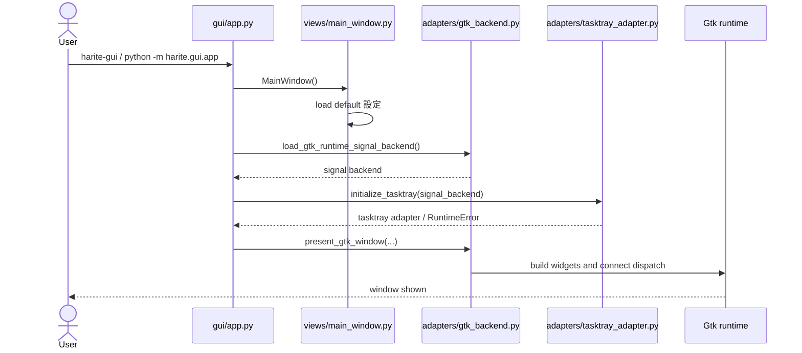
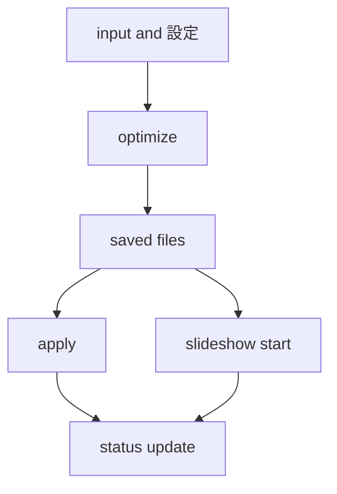
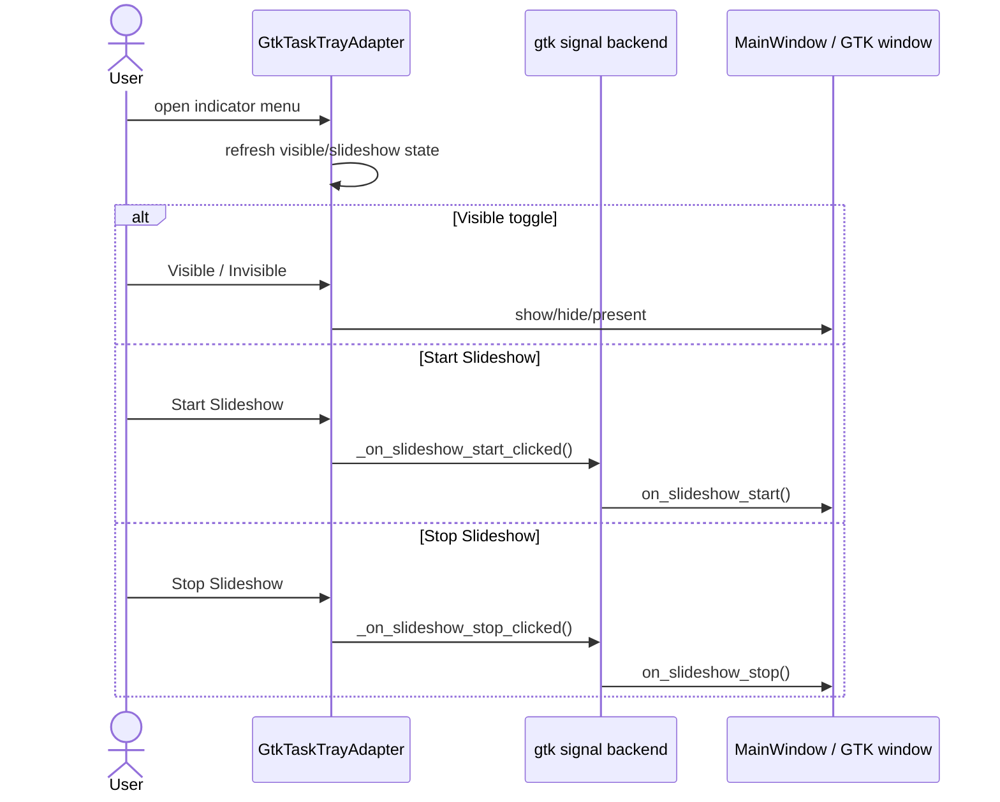

# Harite GUI 仕様 (GUI Spec)

最終更新: 2026-05-29

## 1. GUI の責務

- GUI は日常操作面として、compose -> optimize -> apply -> slideshow の導線を提供する。
- framework-neutral な状態モデルと GTK runtime を分離し、保守可能性を確保する。
- GUI は `MainWindow` を中心に、設定、スライドショー、status、message history を一貫した状態として保持する。

## 2. GUI 起動導線



起動時の実際の流れ:

- entrypoint は最初に `MainWindow()` を生成し、ここで既定の設定ファイル読み込みまで完了する。
- その後に GTK signal backend の読み込み、signal dispatch 接続、tray 初期化、実 window 表示を順に試みる。
- GTK / PyGObject が利用できない場合や tray 初期化が失敗した場合でも、entrypoint 全体は即失敗せず、可能な範囲で `window.show()` へフォールバックする。
- したがって GUI 起動は、GTK runtime の完全初期化に成功する経路と、部分機能で継続する経路の 2 面を持つ。

## 3. 画面全体構成

layout 戦略:

- GUI は top-level window の直下を単一の縦積み root container とし、header、center body、footer の 3 層で構成する。
- center body は notebook を 1 つ持ち、tab 順は `Main`、`Margins (for each display)`、`Slideshow (...)` とする。
- `Main` は日常操作の主導線、`Margins` は配置と margin text の詳細調整、`Slideshow` は継続実行面という役割分担を持つ。
- page ごとの内容は page shell や spacer を使って中央寄せしつつ、各 page 内では必要に応じて fill と center を切り替える。
- GUI の常設補助説明面は以下である。
  - header の flow legend
  - footer の status / slideshow summary / error
  - Main tab の `apply mode help row`
  - Margins tab の `notes`
  - Slideshow tab の `mode help row`
  - settings dialog の state/notice
  - color dialog の state/notice
- これらの補助説明面は、操作 widget と同一 row に埋め込まず、対応する操作面の近傍に独立 row または独立 block として置く。
- したがって GUI layout の基本方針は「window 全体は縦 3 層」「center body は notebook」「各 page は独立した責務を持つ」である。

Main Window:

- header は 2 行構成で、1 行目は title を左、command bar を右に置く。
- command bar には `Color`、`Settings`、`About` を右寄せで並べる。
- 2 行目の flow row では左に `Compose -> Optimize -> Apply` を置き、右に `Export Image` を置く。
- flow row の `Export Image` は optimize 結果画像の書き出し導線であり、設定ファイル保存とは別面である。
- flow row の左端には導線説明として flow legend を常設する。
- footer も 2 行構成で、1 行目は左に `Status`、右に `Slideshow summary` を置く。
- footer 2 行目は separator の下に `Error` を置き、status と error を縦 2 段で分離する。
- footer の `Status`、`Slideshow summary`、`Error` は実行状態と失敗面を読むための常設説明面である。

Main tab:

- `Main` tab は縦積みの `main_col` を持ち、その上段に compose grid、下段に action cluster を置く。
- compose grid は左・中央・右の 3 列構成で、左 panel と右 panel は display ごとの入力・方向操作面、中央 panel は pick state の表示面とする。
- 左右 panel は同型で、上段に十字配置の direction toggle と `Open-L/R`、下段に選択 path 表示と `Clear-L/R` を置く。
- direction toggle 群は `Top/Bottom/Left/Right` を display ごとに十字状へ配置し、画像 picker button を中央に置く。
- action cluster は横 3 群構成で、左から `Preview`、`Optimize`、`Apply` を置く。
- `Optimize` 群は button と result label を 1 行にまとめる。
- `Apply` 群は button と target label の行に加え、`apply mode row` と `apply mode help row` を別行で持つ。
- `apply mode row` は `No Split` / `Auto-Split` の radio を置き、`apply mode help row` は選択意味の説明 label を置く。
- `Preview` 群は左右 preview box を横並びに置き、その上下に assignment、画像 preview、result、state/source/assist を縦積みする。

Margins tab:

- `Margins` tab は単一の縦積み column を持ち、その中で current state block を上に、cross-grid editor を下に置く。
- cross-grid editor は上に top margin、左に left margin、右に right margin、下に bottom margin を置き、中央に詳細編集 stack を置く。
- 中央 stack は上から `current alignment summary`、`embed pattern`、`margin text notebook`、`position selector`、`notes` を縦積みする。
- `embed pattern` は `Off` / `Settings` / `Text only` / `Both` の radio row を持つ。
- `margin text notebook` は `Settings` page と `Text` page の 2 page 構成とする。
- `Settings` page は preview label を中心とした状態確認面、`Text` page は margin text entry 面とする。
- `position selector` は `Left` 列と `Right` 列を横並びに置き、それぞれ `Top` / `Bottom` radio を持つ。
- `notes` には line limit hint、priority rule、current behavior legend を縦積みする。

Slideshow tab:

- `Slideshow` tab は外周を縦積みで組み、top spacer、srcdir row、controls shell、detail shell、bottom spacer の順に置く。
- srcdir row は左右 2 ブロック構成で、`Srcdir-L` / `L: ...` と `Srcdir-R` / `R: ...` を左右対称に配置する。
- controls shell の中央には `slideshow_controls_group` を置き、その中を `mode row`、`mode help row`、`interval/start/stop row` の 3 段に分ける。
- `mode row` は `Mode`、`sequential`、`random` を独立 row として中央寄せで置く。
- `mode help row` は mode の選択規則と runtime 反映条件を補足する説明 label を置く。
- `interval/start/stop row` は `Interval`、spin、`Slideshow Start`、`Slideshow Stop` を 1 行にまとめる。
- detail shell は `current` と `output` を縦積みした detail row を中央に置く。
- したがって slideshow mode は controls row の 1 要素ではなく、`apply mode row` と同様に独立 row と補助説明 row を持つ面として扱う。

Dialogs:

- settings dialog は単一の縦積み editor box を持ち、上から `header row`、`settings rows`、`actions row`、`notice separator`、`state/notice` を並べる。
- settings dialog の header row は左に title、右に `Save Settings` を置く。
- settings dialog の `Save Settings` は設定ファイル保存を指し、main window の `Export Image` や image export dialog とは別の保存面である。
- settings dialog の現行 runtime 実装で常設 row として露出するのは `Resolution`、`Scaling`、`Plugin`、`Apply` である。
- settings dialog の `Apply` row は radio を横並びに持つが、main tab の apply mode help label に相当する補助説明 row は持たない。
- settings dialog は下段に `Settings: current values` を起点とする state label と notice label を持つ。
- optimize 結果画像の書き出しには別の image export dialog を使い、user-facing surface は dialog title に `Export Image`、状態表示に `Export path`、選択結果表示に `Export target` を使う。
- color dialog は title、picker host、値 entry、actions row、separator、state/notice の順で縦積みする。
- color dialog は下段に `Color: ...` を起点とする state label と notice label を持つ。
- about dialog は content 全体を window 内で上下中央寄せし、icon、title、version、description、credits、license、close button を縦積みする。
- about dialog の `Version`、`description`、`Credits`、`License` は product 情報を読むための常設情報 label 群である。
- dialog 群は main window より小さい独立 window として扱い、settings だけ resizable、color/about は fixed-size 寄りの扱いを取る。

## 4. メイン操作フロー



- GUI は日常操作面として apply や slideshow を直接起動するが、内部では core / plugin / slideshow helper の経路を利用する。

apply mode の user-facing 意味:

- action cluster の apply mode は現行 UI では `No Split` と `Auto-Split` の 2 択である。
- `No Split` は内部的に `single-file` へ対応し、最適化済み画像を 1 ファイルのまま plugin apply する。
- `Auto-Split` は内部的に `per-monitor-auto-split` へ対応し、最適化済み画像を display ごとに分割して apply する。
- apply mode の補助ラベルは `No Split` 時に `Apply the optimized image as a single file.`、`Auto-Split` 時に `Split the optimized image and apply per display.` を表示する。
- CLI にある `per-monitor-explicit` は expert 向け escape hatch として残るが、GUI 主導線には露出しない。
- GUI は plugin 名を settings から保持するが、`Auto-Split` target の解決規則そのものは core に従う。選択済み plugin が monitor map を実行できるかは GUI / plugin 側の責務として扱う。

## 5. 設定 (settings) 保存と再読込

- startup 時に既定の設定ファイル (settings file) を読む。
- 設定 dialog (settings dialog) から apply / load / save を行える。
- 物理保存先と key 仕様は core spec に従う。

設定読み込みの扱い:

- startup では既定 path を解決し、ファイルが存在する場合だけ読み込みを試みる。
- startup 読み込みで `FileNotFoundError`, `OSError`, `ValueError` が起きた場合は、GUI 全体を失敗させず message history に skip 理由を残して続行する。
- startup 読み込み時は、既存の `status_level`, `status_phase`, `status_message`, `last_error` を退避し、設定反映後に復元することで、起動直後の status を不必要に上書きしない。

設定 dialog の責務:

- dialog を開く時点で form state を取り込み、必要なら two-screen 状態を同期する。
- apply ではアプリ設定モデルを GUI state に展開し、optimize / apply / slideshow の各状態へ反映する。
- save では現在の GUI state をアプリ設定モデルへ戻して JSON payload を作り、指定 path または既定 path へ保存する。
- load では指定 path の JSON を読み込み、設定ファイルからアプリ設定モデルへ変換したうえで GUI state に反映する。

## 6. slideshow との接続

- GUI のスライドショー機能は `MainWindow` 側に運用責務を持つ。
- slideshow start 時に srcdir, plugin, apply_mode, dual-source 条件を検証する。
- slideshow tick は GTK runtime timer と owner state の同期で動く。
- GUI は CLI slideshow helper をそのまま露出するのではなく、GUI 状態管理を被せたうえで利用する。
- GUI は slideshow tab に mode 選択面を持つ。
- mode の user-facing 表記は `sequential` / `random` とする。
- slideshow tab の mode 既定値は `random` とする。
- mode は slideshow 関連設定値として load / save 対象に含める。
- mode 選択面は srcdir row の下、interval/start/stop row の上に独立 row として置く。
- mode help row は選択中 mode の簡潔な補助説明を表示する user-facing surface とし、`sequential` 時は `Sequential rotates images.`、`random` 時は `Random rotates images.` を表示する。

slideshow start / tick / stop:

- start では slideshow source directory を 1 件または左右 2 件集め、source が空なら開始前に `slideshow srcdir is required` として止める。
- GUI の slideshow source は `Srcdir-L`, `Srcdir-R` の 2 面で固定し、順序は left source, right source である。
- start 時点では slideshow tab 上の mode 選択値を採用する。
- start 時点で各 source から初回選択を行い、現在表示を更新してから apply を試みる。
- tick では次画像を選び直し、現在表示を更新したうえで apply を行う。
- apply に失敗した場合はスライドショー実行を停止し、status と message history に failure を残す。
- monitor 検出欠落のような一部条件では stop ではなく pause として扱い、状態表示を `paused` へ更新する。
- 実行中に mode 選択値を変えても進行中の run には反映しない。新しい mode を使うには stop 後に start し直す。
- dual-source auto-split 実行中は、optimize 出力（composite と per-monitor 分割ファイル）をサイクルごとに差し替え、直前サイクル分を削除したうえで `harite_output_{NNNN}.jpg` などのファイル名を再利用する。詳細は [docs/specs/slideshow/harite-slideshow-spec.md §6.1](docs/specs/slideshow/harite-slideshow-spec.md) を参照する。

## 7. tray / indicator / app icon surface



- tray は可視状態切り替えと slideshow 開始停止の補助面である。
- icon は slideshow 状態に応じて切り替わる。

tray 初期化の前提:

- task tray binding は `AyatanaAppIndicator3` を先に試し、利用できない場合に `AppIndicator3` を試す。
- tray 初期化には signal backend が main GTK window を解決できることが必要で、window を解決できない場合は task tray adapter を作らず初期化失敗として扱う。

icon / resource surface:

- main window と about dialog は product icon として `harite_app.svg` を優先利用する。
- main GTK window では window icon surface に `harite_app.svg` を与え、GTK runtime がそれを採る環境では taskbar / launcher / window surface 側の application identity に使われる。
- about dialog では window icon に加えて dialog content 内にも `harite_app.svg` を表示する。
- task tray indicator は slideshow 実行中に `harite.svg`、停止中に `harite_off.svg` を使い分ける。
- task tray indicator の icon surface は application icon の再利用ではなく、slideshow 状態を示す専用の product icon surface として分ける。
- product icon resource が見つからない場合、tray は system theme icon へフォールバックする。
- tray fallback は slideshow 実行中に `applications-graphics`、停止中に `media-playback-pause` を使う。
- header / tab / dialog の各 button icon は package 内の lucide SVG resource を使う。
- 現行 runtime で使う icon や button image は package resource として `src/harite/gui/resources/icons/` 配下に置き、legacy glade 資産とは混線させない。

button と icon の対応:

- header command では `Color` に `palette.svg`、`Settings` に `settings.svg`、`About` に `info.svg` を割り当てる。
- flow row の `Export Image` には `image-down.svg` を割り当てる。
- action cluster の `Optimize` には `image.svg`、`Apply` には `wallpaper.svg` を割り当てる。
- input 面の direction toggle は `Top-*` に `arrow-up.svg`、`Bottom-*` に `arrow-down.svg`、`Left-*` に `arrow-left.svg`、`Right-*` に `arrow-right.svg` を割り当てる。
- input 面の `Open-L` / `Open-R` と slideshow 面の `Srcdir-L` / `Srcdir-R` には `folder-open.svg` を割り当てる。
- input 面の `Clear-L` / `Clear-R` には `folder-x.svg` を割り当てる。
- slideshow 面の `Slideshow Start` と `Slideshow Stop` にはそれぞれ `play.svg` と `pause.svg` を割り当てる。
- settings dialog では header の `Save Settings` に `save.svg` を割り当てる。
- 一方で settings dialog の `OK` / `Cancel` には現行実装で専用 icon 割当てはない。

tray menu の現行項目:

- tray menu は `Visible/Invisible`, `Start Slideshow`, `Stop Slideshow`, `Settings`, `BaseColor`, `About`, `Quit` を持つ。
- `Visible/Invisible` は main window の show/hide を切り替える。
- `Settings`, `BaseColor`, `About` は dialog open request の補助導線である。

## 8. GUI の層構造

```text
app -> views/main_window -> controllers/services -> adapters(GTK runtime)
```

margin text position の visible semantics:

- `Margins` 面は margin text position を 4 つの radio で見せる: `Left Top`, `Left Bottom`, `Right Top`, `Right Bottom`。
- GUI state / Settings / CLI / core の `embed_position` は `left-top|left-bottom|right-top|right-bottom` で統一する。
- GUI の margin text position 変更 handler はこの 4 値だけを受け付ける。
- radio 表示と内部値は 1 対 1 に対応し、`Left Top=left-top`, `Left Bottom=left-bottom`, `Right Top=right-top`, `Right Bottom=right-bottom` である。
- `embed_position` が未指定のときの既定値は `right-bottom` である。

### 詳細分類

```text
views/
  main_window.py          主状態モデル
  main_window_preview.py  preview 補助計算
controllers/
  optimize_controller.py  optimize bridge
services/
  cli_mapper.py           GUI state to CLI args
adapters/
  gtk_backend.py          GTK runtime 統合窓口
  ui_adapter.py           signal dispatch table
  tasktray_adapter.py     tray / indicator
  gtk_layout_builders.py / gtk_tab_builders.py / gtk_dialog_builders.py
  gtk_runtime_*           signal, sync, dialog, slideshow, helper 群
```

preview 補助計算の現行規則:

- preview widget の目標サイズは container 幅から計算し、`target_width = max(120, min(320, int((allocated_width - 6) * 0.48)))`, `target_height = max(68, round(target_width * 9 / 16))` で決める。container 幅が取れない場合は `160x90` を使う。
- auto-split preview の crop box は、保存済み合成画像の幅 `comp_width` に対して `split_x = round((left_width / (left_width + right_width)) * comp_width)` で左右分割する。`comp_width > 1` のときは `split_x` を `1..comp_width-1` に clamp する。
- 左 preview box は `(0, 0, split_x, comp_height)`、右 preview box は `(split_x, 0, comp_width - split_x, comp_height)` であり、現行 GUI preview も y 方向は分割せず full-height の縦スライスを使う。
- `build_result_preview_state(...)` では、まず form state の `l_display`, `r_display` を読み、その後 `resolve_optimize_display_settings(...)` が成功した場合だけ、そこから得た display size で上書きする。したがって GUI preview の左右 display 情報は core と同じ display 解決結果へ寄せられる。
- preview assignment 表示のファイル名は、basename が 36 文字を超える場合だけ `head + "..." + tail` へ切り詰める。既定では末尾 12 文字を残し、head 側は `36 - 12 - 3` 文字を使う。

margin text preflight の現行規則:

- GUI は margin text mode が `none` のとき、preflight を `margin text off` として終了する。
- mode が `none` 以外のときは、まず `embed_position` を `_normalize_margin_text_position(...)` で正規化し、その値を form state へ書き戻す。
- preflight で使う margin area は `resolve_margin_text_region(...)` を通じて求め、結果が `None` なら `margin area unavailable` で失敗扱いにする。
- area が取れた場合でも、`area_width < 40` または `area_height < 12` なら `selected margin area is too small for margin text` として失敗扱いにする。
- area が十分あれば、GUI は `margin text ready in ... position ({area_width}x{area_height})` を status / log へ出す。
- GUI の実効行数は widget 値をそのままは使わず、`_effective_margin_text_max_lines()` により `free=5`, `combo=8`, それ以外は `3` へ正規化して optimize request へ渡す。
- free text 入力は GUI 側で先に最大 5 行へ切り詰め、空文字・空行のみなら `None` として保持する。

## 9. GUI での失敗時挙動

- GUI は `status_level`, `status_phase`, `status_message`, `last_error` を持つ。
- footer に `Status:` と `Error:` を表示する。
- slideshow, apply, 設定, input dialog などの failure は phase 単位で表示する。
- GUI の `logs` 相当領域も、利用者向けには message history として扱う。
- CLI の実行メッセージ粒度 option のような概念を GUI に持ち込まず、GUI 側は状態表示と履歴表示の面として説明する。

status 更新の原則:

- `_set_status(...)` は `status_level`, `status_phase`, `status_message`, `last_error` を一括更新する統一入口である。
- `settings`, `slideshow`, `apply`, `input` など phase 名を揃えて、どの面の失敗かを footer で読めるようにする。
- message history は設定 dialog open/apply/save、slideshow start/tick/pause/resume/stop、startup settings load skip などの運用イベントを残す。

## 10. メッセージ分類

- `idle`: 待機
- `running`: 実行中
- `success`: 完了
- `paused`: 一時停止
- `error`: 失敗

## 11. CLI / core / slideshow との境界

- core 挙動は [docs/specs/core/harite-core-spec.md](docs/specs/core/harite-core-spec.md)
- CLI command surface は [docs/specs/cli/harite-cli-spec.md](docs/specs/cli/harite-cli-spec.md)
- slideshow 詳細は [docs/specs/slideshow/harite-slideshow-spec.md](docs/specs/slideshow/harite-slideshow-spec.md)

境界整理:

- GUI は widget と状態表示の面を持つが、設定ファイルの物理仕様や apply target 解決規則そのものは core に依存する。
- GUI のスライドショー機能は slideshow helper を利用するが、pause / resume 的な扱い、状態表示、message history は GUI 側の責務である。
- tray は GUI の補助導線であり、独立した業務規則の一次置き場にはしない。
