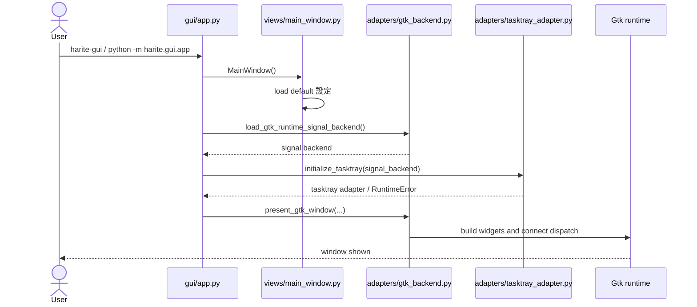
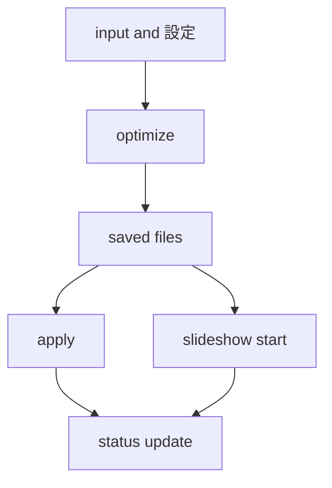
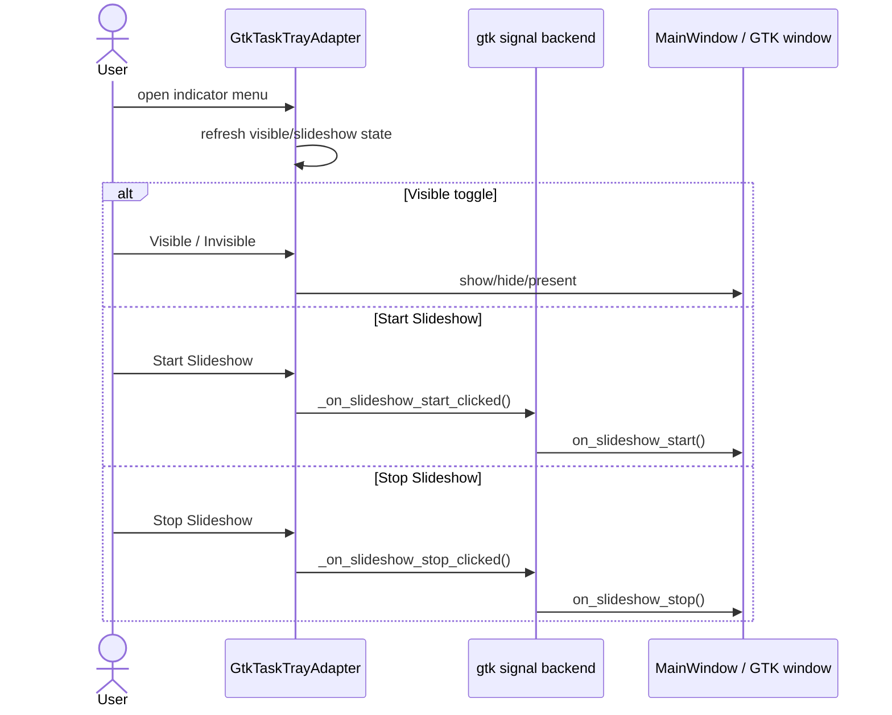

# Harite GUI 仕様 (GUI Spec)

最終更新: 2026-05-19

## 1. GUI の責務

- GUI は日常操作面として、compose -> optimize -> apply -> slideshow の導線を提供する。
- framework-neutral な状態モデルと GTK runtime を分離し、保守可能性を確保する。
- GUI は `MainWindow` を中心に、設定、スライドショー、status、message history を一貫した状態として保持する。

## 2. GUI 起動導線



起動時の実際の流れ:

- entrypoint は最初に `MainWindow()` を生成し、ここで既定の設定ファイル読み込みまで完了する。
- その後に GTK signal backend の読み込み、signal dispatch 接続、tray 初期化、実 window 表示を順に試みる。
- GTK / PyGObject が利用できない場合や tray 初期化が失敗した場合でも、entrypoint 全体は即失敗せず、可能な範囲で `window.show()` へフォールバックする。
- したがって GUI 起動は、GTK runtime の完全初期化に成功する経路と、部分機能で継続する経路の 2 面を持つ。

## 3. 画面全体構成

- title / menu / flow / save-as
- compose / input / position
- margins tab
- action cluster
- slideshow tab
- status footer

## 4. メイン操作フロー



- GUI には CLI の `--do-it` / `dry-run` に相当する同名オプションは存在しない。
- GUI は日常操作面として apply や slideshow を直接起動するが、内部では core / plugin / slideshow helper の経路を利用する。
- したがって「dry-run 既定かどうか」は CLI 仕様の論点であり、GUI ではボタン操作と状態表示の挙動として読む。

apply mode の user-facing 意味:

- action cluster の apply mode は現行 UI では `No Split` と `Auto-Split` の 2 択である。
- `No Split` は内部的に `single-file` へ対応し、最適化済み画像を 1 ファイルのまま plugin apply する。
- `Auto-Split` は内部的に `per-monitor-auto-split` へ対応し、最適化済み画像を display ごとに分割して apply する。
- apply mode の補助ラベルは `No Split` 時に `Apply the optimized image as a single file.`、`Auto-Split` 時に `Split the optimized image and apply per display.` を表示する。
- CLI にある `per-monitor-explicit` は expert 向け escape hatch として残るが、GUI 主導線には露出しない。

## 5. 設定 (settings) 保存と再読込

- startup 時に既定の設定ファイル (settings file) を読む。
- 設定 dialog (settings dialog) から apply / load / save を行える。
- 物理保存先と key 仕様は core spec に従う。

設定読み込みの扱い:

- startup では既定 path を解決し、ファイルが存在する場合だけ読み込みを試みる。
- startup 読み込みで `FileNotFoundError`, `OSError`, `ValueError` が起きた場合は、GUI 全体を失敗させず message history に skip 理由を残して続行する。
- startup 読み込み時は、既存の `status_level`, `status_phase`, `status_message`, `last_error` を退避し、設定反映後に復元することで、起動直後の status を不必要に上書きしない。

設定 dialog の責務:

- dialog を開く時点で form state を取り込み、必要なら two-screen 状態を同期する。
- apply では `AppPreferences` を GUI state に展開し、optimize / apply / slideshow の各状態へ反映する。
- save では現在の GUI state を `AppPreferences` へ戻して JSON payload を作り、指定 path または既定 path へ保存する。
- load では指定 path の JSON を読み込み、`AppPreferences.from_config_dict(...)` を経由して GUI state に反映する。

## 6. slideshow との接続

- GUI のスライドショー機能は `MainWindow` 側に運用責務を持つ。
- slideshow start 時に srcdir, plugin, apply_mode, dual-source 条件を検証する。
- slideshow tick は GTK runtime timer と owner state の同期で動く。
- GUI は CLI slideshow helper をそのまま露出するのではなく、GUI 状態管理を被せたうえで利用する。
- GUI は slideshow tab に mode 選択面を持つ。
- mode の user-facing 表記は `sequential` / `random` とする。
- slideshow tab の mode 既定値は `random` とする。
- mode は slideshow 関連設定値として load / save 対象に含める。
- このため CLI にある `--do-it` / `--dry-run` の説明は GUI にそのまま持ち込まず、GUI 側では status, history, error 表示を中心に説明する。

slideshow start / tick / stop:

- start では slideshow source directory 群を集め、source が空なら開始前に `slideshow srcdir is required` として止める。
- start 時点では slideshow tab 上の mode 選択値を採用する。
- start 時点で各 source から初回選択を行い、現在表示を更新してから apply を試みる。
- tick では次画像を選び直し、現在表示を更新したうえで apply を行う。
- apply に失敗した場合はスライドショー実行を停止し、status と message history に failure を残す。
- monitor 検出欠落のような一部条件では stop ではなく pause として扱い、状態表示を `paused` へ更新する。
- 実行中に mode 選択値を変えても進行中の run には反映しない。新しい mode を使うには stop 後に start し直す。

## 7. tray / indicator / app icon surface



- tray は可視状態切り替えと slideshow 開始停止の補助面である。
- icon は slideshow 状態に応じて切り替わる。

tray 初期化の前提:

- task tray binding は `AyatanaAppIndicator3` を先に試し、利用できない場合に `AppIndicator3` を試す。
- tray 初期化には signal backend が main GTK window を解決できることが必要で、window を解決できない場合は task tray adapter を作らず初期化失敗として扱う。

icon / resource surface:

- main window と about dialog は product icon として `harite_app.svg` を優先利用する。
- main GTK window では window icon surface に `harite_app.svg` を与え、GTK runtime がそれを採る環境では taskbar / launcher / window surface 側の application identity に使われる。
- about dialog では window icon に加えて dialog content 内にも `harite_app.svg` を表示する。
- task tray indicator は slideshow 実行中に `harite.svg`、停止中に `harite_off.svg` を使い分ける。
- task tray indicator の icon surface は application icon の再利用ではなく、slideshow 状態を示す専用の product icon surface として分ける。
- product icon resource が見つからない場合、tray は system theme icon へフォールバックする。
- tray fallback は slideshow 実行中に `applications-graphics`、停止中に `media-playback-pause` を使う。
- header / tab / dialog の各 button icon は package 内の lucide SVG resource を使う。
- 現行 runtime で使う icon や button image は package resource として `src/harite/gui/resources/icons/` 配下に置き、legacy glade 資産とは混線させない。

button と icon の対応:

- header command では `Color` に `palette.svg`、`Settings` に `settings.svg`、`About` に `info.svg` を割り当てる。
- flow row の `Save As` には `save.svg` を割り当てる。
- action cluster の `Optimize` には `image.svg`、`Apply` には `wallpaper.svg` を割り当てる。
- input 面の direction toggle は `Top-*` に `arrow-up.svg`、`Bottom-*` に `arrow-down.svg`、`Left-*` に `arrow-left.svg`、`Right-*` に `arrow-right.svg` を割り当てる。
- input 面の `Open-L` / `Open-R` と slideshow 面の `Srcdir-L` / `Srcdir-R` には `folder-open.svg` を割り当てる。
- input 面の `Clear-L` / `Clear-R` には `folder-x.svg` を割り当てる。
- slideshow 面の `Slideshow Start` と `Slideshow Stop` にはそれぞれ `play.svg` と `pause.svg` を割り当てる。
- settings dialog では header の `Save` に `save.svg` を割り当てる。
- 一方で settings dialog の `OK` / `Cancel` には現行実装で専用 icon 割当てはない。

tray menu の現行項目:

- tray menu は `Visible/Invisible`, `Start Slideshow`, `Stop Slideshow`, `Settings`, `BaseColor`, `About`, `Quit` を持つ。
- `Visible/Invisible` は main window の show/hide を切り替える。
- `Settings`, `BaseColor`, `About` は dialog open request の補助導線である。

## 8. GUI の層構造

```text
app -> views/main_window -> controllers/services -> adapters(GTK runtime)
```

margin text position の visible semantics:

- `Margins` 面は margin text position を 4 つの radio で見せる: `Left Top`, `Left Bottom`, `Right Top`, `Right Bottom`。
- GUI state / config / CLI / core の内部値は `embed_position=top|left|right|bottom` で統一する。
- visible 4 位置との対応は `top=Left Top`, `left=Left Bottom`, `right=Right Top`, `bottom=Right Bottom` である。
- `auto` が読み込まれた場合、GUI 表示上は `bottom` と同義に正規化して扱う。
- `auto` だけでなく未知値も、現行 GUI では `_normalize_margin_text_position(...)` により `bottom` へ正規化する。

### 詳細分類

```text
views/
  main_window.py          主状態モデル
  main_window_preview.py  preview 補助計算
controllers/
  optimize_controller.py  optimize bridge
services/
  cli_mapper.py           GUI state to CLI args
adapters/
  gtk_backend.py          GTK runtime 統合窓口
  ui_adapter.py           signal dispatch table
  tasktray_adapter.py     tray / indicator
  gtk_layout_builders.py / gtk_tab_builders.py / gtk_dialog_builders.py
  gtk_runtime_*           signal, sync, dialog, slideshow, helper 群
```

preview 補助計算の現行規則:

- preview widget の目標サイズは container 幅から計算し、`target_width = max(120, min(320, int((allocated_width - 6) * 0.48)))`, `target_height = max(68, round(target_width * 9 / 16))` で決める。container 幅が取れない場合は `160x90` を使う。
- auto-split preview の crop box は、保存済み合成画像の幅 `comp_width` に対して `split_x = round((left_width / (left_width + right_width)) * comp_width)` で左右分割する。`comp_width > 1` のときは `split_x` を `1..comp_width-1` に clamp する。
- 左 preview box は `(0, 0, split_x, comp_height)`、右 preview box は `(split_x, 0, comp_width - split_x, comp_height)` であり、現行 GUI preview も y 方向は分割せず full-height の縦スライスを使う。
- `build_result_preview_state(...)` では、まず form state の `l_display`, `r_display` を読み、その後 `resolve_optimize_display_settings(...)` が成功した場合だけ、そこから得た display size で上書きする。したがって GUI preview の左右 display 情報は core と同じ display 解決結果へ寄せられる。
- preview assignment 表示のファイル名は、basename が 36 文字を超える場合だけ `head + "..." + tail` へ切り詰める。既定では末尾 12 文字を残し、head 側は `36 - 12 - 3` 文字を使う。

margin text preflight の現行規則:

- GUI は margin text mode が `none` のとき、preflight を `margin text off` として終了する。
- mode が `none` 以外のときは、まず `embed_position` を `_normalize_margin_text_position(...)` で正規化し、その値を form state へ書き戻す。
- preflight で使う margin area は `resolve_margin_text_region(...)` を通じて求め、結果が `None` なら `margin area unavailable` で失敗扱いにする。
- area が取れた場合でも、`area_width < 40` または `area_height < 12` なら `selected margin area is too small for margin text` として失敗扱いにする。
- area が十分あれば、GUI は `margin text ready in ... position ({area_width}x{area_height})` を status / log へ出す。
- GUI の実効行数は widget 値をそのままは使わず、`_effective_margin_text_max_lines()` により `free=5`, `combo=8`, それ以外は `3` へ正規化して optimize request へ渡す。
- free text 入力は GUI 側で先に最大 5 行へ切り詰め、空文字・空行のみなら `None` として保持する。

## 9. GUI での失敗時挙動

- GUI は `status_level`, `status_phase`, `status_message`, `last_error` を持つ。
- footer に `Status:` と `Error:` を表示する。
- slideshow, apply, 設定, input dialog などの failure は phase 単位で表示する。
- GUI の `logs` 相当領域も、利用者向けには message history として扱う。
- CLI の実行メッセージ粒度 option のような概念を GUI に持ち込まず、GUI 側は状態表示と履歴表示の面として説明する。

status 更新の原則:

- `_set_status(...)` は `status_level`, `status_phase`, `status_message`, `last_error` を一括更新する統一入口である。
- `settings`, `slideshow`, `apply`, `input` など phase 名を揃えて、どの面の失敗かを footer で読めるようにする。
- message history は設定 dialog open/apply/save、slideshow start/tick/pause/resume/stop、startup settings load skip などの運用イベントを残す。

## 10. メッセージ分類

- `idle`: 待機
- `running`: 実行中
- `success`: 完了
- `paused`: 一時停止
- `error`: 失敗

## 11. CLI / core / slideshow との境界

- core 挙動は [docs/specs/core/harite-core-spec.md](docs/specs/core/harite-core-spec.md)
- CLI command surface は [docs/specs/cli/harite-cli-spec.md](docs/specs/cli/harite-cli-spec.md)
- slideshow 詳細は [docs/specs/slideshow/harite-slideshow-spec.md](docs/specs/slideshow/harite-slideshow-spec.md)

境界整理:

- GUI は widget と状態表示の面を持つが、設定ファイルの物理仕様や apply target 解決規則そのものは core に依存する。
- GUI のスライドショー機能は slideshow helper を利用するが、pause / resume 的な扱い、状態表示、message history は GUI 側の責務である。
- tray は GUI の補助導線であり、独立した業務規則の一次置き場にはしない。
