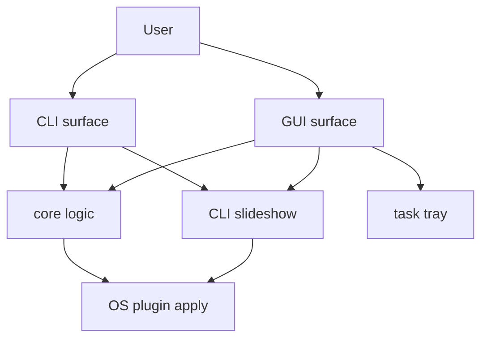

# Harite 基本仕様 (Foundation Spec)

最終更新: 2026-05-20

## 1. 文書の目的と適用範囲

- 本書は Harite の常設仕様書群の入口である。
- 主題は、現行 Harite が何を目的とし、どの環境で、どの操作面を持ち、どの分冊へ読むべきかを示すことにある。
- planning 履歴、過去判断の時系列、没案の説明は対象外とする。

本書の読み方:

- Harite 全体の位置づけ、対象利用者、運用前提を知りたい場合は本書を最初に読む。
- 各操作面の具体仕様を知りたい場合は、本書末尾の分冊導線から core / CLI / GUI / スライドショー へ進む。
- 実装変更時に参照する場合も、まず本書で責務境界を確認してから個別分冊へ降りる。

## 2. Harite の目的

- Harite は、壁紙画像の最適化と適用を、GUI と CLI の両面から扱うためのツールである。
- 主な責務は、入力画像の解決、表示条件に応じた最適化、OS / desktop plugin を通じた適用、継続運用としてのスライドショー機能にある。
- 特に GUI では、compose -> optimize -> apply の流れを日常操作として扱えることを重視する。

目的をもう少し具体化すると、Harite は次の 3 面を一続きの体験として扱う。

1. 入力画像と表示条件から、適切な壁紙出力を作る。
2. 作られた出力を、現在の OS / desktop 環境へ適用する。
3. 単発操作だけでなく、スライドショー機能により継続的な更新運用を行う。

そのため Harite は、単なる画像変換ツールでも、単なる壁紙 setter でもなく、最適化と適用の間をつなぐアプリケーションとして位置づけられる。

## 3. 想定利用者

- 日常的に壁紙最適化と適用を行う owner
- 将来の保守者
- 新しい仕様変更や実装変更の前提確認をしたい contributor

想定していない読み手:

- 画像処理アルゴリズムだけを独立利用したい利用者
- packaging / release 運用だけを知りたい利用者
- planning 履歴や過去議論の経緯を主目的に追いたい利用者

## 4. 対象環境と前提依存

- Python ベースのアプリケーションとして動作する。
- CLI は cross-platform を志向するが、plugin 実装により適用面は OS ごとに差分を持つ。
- GUI は GTK / PyGObject が利用可能な環境を前提とする。
- Linux / XFCE では per-monitor apply, スライドショー, tray, desktop entry まわりの説明比重が高い。

環境前提の整理:

- 画像の最適化自体は OS 依存を最小化するが、実適用は plugin 実装に依存する。
- Windows plugin と macOS plugin は単一画像適用を基本とする。
- Linux plugin は desktop 環境ごとの差分を吸収しつつ、per-monitor apply と XFCE 系の説明比重が高い。
- GUI の常用面は GTK runtime の有無に強く依存するため、headless 環境では CLI が主操作面になる。

## 5. 全体アーキテクチャ概要

Harite の主な面は以下の 6 つである。

1. 基本仕様 (foundation): 全体像と分冊導線
2. コア仕様 (core): 最適化、設定、適用条件の基底仕様
3. CLI 仕様 (CLI): command surface
4. GUI 仕様 (GUI): 画面、操作、状態、tray
5. スライドショー仕様: 継続実行、pause / retry、観測面
6. plugin 仕様 (plugin): OS / desktop 環境ごとの適用実行

この 6 面は、責務を分離するための文書分冊であって、実装が完全に独立していることを意味しない。実装上は core, plugin, GUI state, slideshow state が相互に接続しているため、本書は「どこからどこまでをどの分冊で説明するか」の境界線として機能する。

## 6. GUI / CLI / スライドショー / tray の関係



- GUI と CLI は別の操作面だが、基底挙動は core に寄せる。
  - スライドショー機能は CLI 専用ではなく、GUI 側にも長時間運用の責務を持つ。
- tray は GUI の補助操作面であり、スライドショーの開始停止と可視状態制御に関与する。

操作面ごとの基本役割:

- GUI は日常操作と状態可視化を担う。
- CLI は明示的な command 実行と再現性の高い呼び出しを担う。
- スライドショー機能は単発操作を継続運用へ拡張する。
- tray は GUI 常駐時の補助導線であり、独立した業務面ではない。

## 7. 設定 (settings) / save / apply の責務分担

- 設定 (settings) は論理設定モデルとして保持され、物理保存は 設定ファイル (harite-settings.json) を使う。
- save は optimize 結果の出力先決定と書き出しを扱う。
- apply は最終適用対象を解決したうえで plugin へ委譲する。

責務を混同しないための整理:

- 設定は「次回以降も使いたい既定値や運用値」を保持する。
- save は「今回の optimize 結果をどこへ書くか」を扱う。
- apply は「生成済みまたは既存の画像を、環境へどう反映するか」を扱う。

この 3 面は GUI 上では近く見えるが、仕様上は別責務として扱う。

plugin 分冊:

- plugin 実装の正本は [docs/specs/plugins/harite-plugin-spec.md](docs/specs/plugins/harite-plugin-spec.md)

## 8. README と仕様書の役割分担

- README は導入、インストール、最小の使用導線を扱う。
- 仕様書は、現行挙動、責務分担、状態、失敗時挙動を扱う。
- README に長い仕様説明や履歴説明を戻さない。

README に残すもの:

- 何のツールか
- どうインストールするか
- どう最短で起動するか
- 主要 command の最小例

仕様書へ寄せるもの:

- 各操作面の責務
- 設定ファイルの意味
- スライドショーと apply の条件分岐
- GUI / CLI / plugin / tray の境界
- 失敗時挙動と観測面

## 9. ソースディレクトリ構成と責務境界

```text
src/harite/
  cli.py                  CLI entrypoint と command surface
  settings_file.py        設定ファイル (harite-settings.json) の path 解決と JSON load/save
  settings.py             設定モデルと JSON との相互変換
  core.py                 optimize の基底ロジック
  apply_settings.py       apply 対象の解決
  slideshow.py            スライドショー実行の選択ループとサイクル state
  plugins.py              OS / desktop plugin registry と apply 実装
  linux_xdg_launcher.py   Linux/XDG launcher 生成
  gui/
    app.py                GUI entrypoint
    views/                framework-neutral な状態モデル
    controllers/          GUI から core への接続制御
    adapters/             GTK runtime, dialog, tray, signal wiring
    services/             GUI 補助サービス
    resources/            icon などの同梱リソース
```

### GUI 配下の詳細分類

```text
src/harite/gui/
  app.py
    起動入口。MainWindow 生成、GTK backend load、tasktray 初期化、window present を束ねる。
  views/
    main_window.py
      主状態モデル。status, history, 設定, optimize/apply/slideshow の業務状態を持つ。
    main_window_preview.py
      preview 表示専用の補助計算を持つ。
  controllers/
    optimize_controller.py
      GUI form state を core.optimize 実行へ橋渡しする。
  services/
    cli_mapper.py
      GUI state を CLI 相当の引数列へ写像する。
  adapters/
    gtk_backend.py
      GTK runtime 統合窓口。
    ui_adapter.py
      runtime signal と MainWindow method の対応表を持つ。
    tasktray_adapter.py
      tray / indicator の生成と menu action を持つ。
    gtk_layout_builders.py / gtk_tab_builders.py / gtk_dialog_builders.py
      widget 構築責務を分割する。
    gtk_runtime_* modules
      signal, sync, dialog, slideshow, helper などの細粒度 runtime 責務を持つ。
```

## 10. 分冊導線

- core 詳細は [docs/specs/core/harite-core-spec.md](docs/specs/core/harite-core-spec.md)
- CLI 詳細は [docs/specs/cli/harite-cli-spec.md](docs/specs/cli/harite-cli-spec.md)
- GUI 詳細は [docs/specs/gui/harite-gui-spec.md](docs/specs/gui/harite-gui-spec.md)
- スライドショー詳細は [docs/specs/slideshow/harite-slideshow-spec.md](docs/specs/slideshow/harite-slideshow-spec.md)

推奨読順:

1. 本書で全体像と責務境界を掴む。
2. core で最適化、設定ファイル、適用条件の基底仕様を読む。
3. その後、必要に応じて CLI / GUI / スライドショー の各分冊へ進む。
