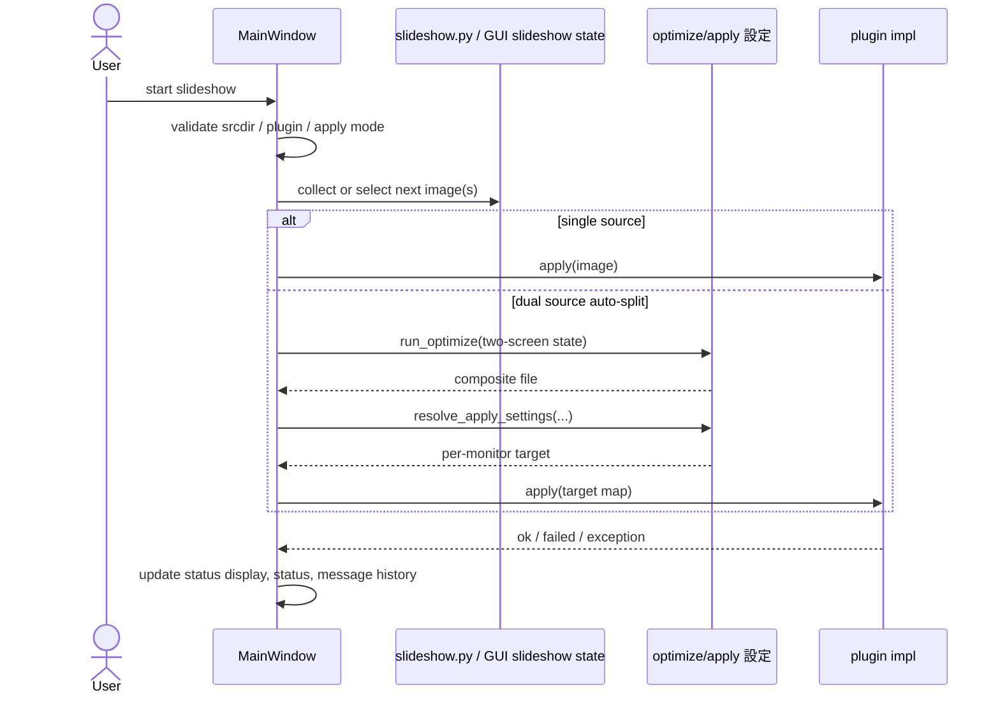

# Harite スライドショー仕様 (Slideshow Spec)

最終更新: 2026-05-20

## 1. スライドショー機能の責務

- 入力画像列を一定間隔で選択し、apply 面へ接続する。
- CLI と GUI の両面で、スライドショー機能としての継続実行を説明する。

public surface では、この機能を `スライドショー` と呼ぶ。これは filesystem event 監視の仕組みではなく、画像候補集合を一定間隔で巡回し、次に適用する画像を選ぶ継続実行面を指す。

## 2. 起動条件

- CLI 側のスライドショー実行は入力 directory, interval, mode, plugin 条件を満たす必要がある。
- GUI 側のスライドショー実行は srcdir, plugin, dual-source 時の display 条件を満たす必要がある。

CLI 側の最低要件:

- `--input` が既存 directory であること
- directory 内に画像ファイルが 1 件以上あること
- `--interval-sec >= 1`
- `--mode` が `sequential` または `random`

GUI 側では、これに加えて現在の画面状態、設定、スライドショー source directory の整合が必要になる。

## 3. スライドショーシーケンス図 (slideshow sequence)

## 4. 継続実行ループの基本動作

- この機能は filesystem event 監視ではなく、サイクルごとの選択ループである。
- `sequential` と `random` の選択モードを持つ。
- 選択モードは CLI / helper だけに閉じず、GUI 側にも user-visible な選択面を持つ。
- GUI 側の mode 表記は `sequential` / `random` とする。
- GUI 側の mode 既定値は `random` とする。
- GUI 側でも `random` を選べるようにし、`sequential` は互換的な選択肢として残す。
- GUI 実行中に mode 選択値を変えても、その run には反映しない。新しい mode は stop 後の次回 start から使う。

slideshow helper の最小構成:

- `collect_slideshow_input_images(...)` は directory 妥当性と画像列収集を受け持つ。
- `select_next_image(...)` は `sequential` / `random` の選択規則を受け持つ。
- `run_slideshow_cycle(...)` は 1 サイクル分の選択と state 更新を受け持つ。
- `run_slideshow_cycles(...)` は interval を加えた継続ループを受け持つ。

状態モデル:

- `index`: sequential 時の次位置
- `previous_selected`: random 時に直前重複を避けるための参照
- `completed`: 完了サイクル数

状態遷移の現行規則:

- `sequential` では `selected_index = index % len(images)` で選び、次 state は `index = index + 1`, `previous_selected = selected`, `completed = completed + 1` になる。
- `random` では候補数が 2 件以上かつ `previous_selected` が候補に含まれる場合だけ、その 1 件を除外した候補集合から選ぶ。候補が 1 件しかない場合や直前画像が候補集合にない場合は、全候補から選ぶ。
- `random` の next state は `index` を進めず、`previous_selected` と `completed` だけを更新する。
- `run_slideshow_cycles(...)` の callback へ渡す cycle 番号は `completed - 1` であり、内部 callback 番号は 0 始まりになる。
- sleep は継続実行を続ける場合にだけ入る。

## 5. pause / resume / retry

- GUI 側のスライドショー実行は display loss や auto-split 条件未成立時に pause 的な扱いを持つ。
- CLI 側は簡潔な実行ループとして実行メッセージを返す。

整理すると、明示的な pause / resume API を slideshow helper 自体は持たない。pause / resume 的な制御は主に GUI 側の状態管理として現れ、CLI 側は開始から終了まで 1 本のループを実行するモデルである。

GUI pause / resume の現行条件:

- dual-source auto-split の `tick` 中に `per-monitor apply requires at least two detected displays` が返った場合、GUI は stop せず pause へ遷移する。
- この pause は `slideshow paused: waiting for two detected displays for auto-split` を status message に入れ、状態表示を `paused` に切り替える。
- pause 中に次 tick が成功すると GUI は `slideshow resumed` を出して running へ戻る。
- 同じ `ValueError` でも `start` 時は transient 扱いせず、start failure として止める。

GUI timer / side state の現行規則:

- GUI runtime timer は `interval_ms = max(1, int(interval_seconds)) * 1000` で作る。したがって現行 GUI は秒未満を扱わず、秒整数へ量子化して GLib timer に渡す。
- dual-source 実行では L/R で独立した slideshow state を持ち、それぞれ `run_slideshow_cycle(images, "sequential", backend._slideshow_state_l|r)` で更新する。
- したがって GUI dual-source の左右選択は、同じ tick の中でも 1 本の共有 index ではなく、L side state と R side state を別々に進める。
- signal handler 経由の slideshow tick が使える場合は owner 側 callback を優先し、callback が `False` を返した時点で timer を止める。signal handler がない fallback 経路のときだけ GUI runtime 自身が L/R 選択を進める。

## 6. GUI のスライドショー責務

- srcdir 解決
- 現在表示 / 状態表示 / 出力表示の更新
- dual-source auto-split の準備
- tray からの start / stop 接続

GUI は単なるタイマー処理ではなく、状態表示の責務を強く持つ。特に次の情報を UI 上で維持する必要がある。

- 現在選ばれている入力や出力
- スライドショー実行が進行中か停止中か
- 直近 apply の成否
- display 条件不足や plugin 失敗の理由

## 7. CLI `slideshow` command の責務

- 入力 directory からの画像収集
- サイクル実行
- dry-run / do-it 切り替え
- `Slideshow start` / `Slideshow cycle` / `Slideshow completed` 実行メッセージ出力

CLI `slideshow` command の特徴:

- `dry_run=True` では plugin を使わず、サイクル数のみを進める。
- `dry_run=False` のときだけ plugin を解決し、各サイクルで `apply(...)` を呼ぶ。
- plugin が例外を投げてもループ全体を即停止せず、そのサイクルの `apply_error` カウンタを 1 件増やす。
- plugin が `False` を返した場合は、そのサイクルの `apply_failed` カウンタを 1 件増やす。
- これらのカウンタは各サイクルの途中で保持され、最後に `Slideshow completed` 行の実行メッセージ要約として出力される。
- `log_level` option は持たず、固定方針は旧 `normal` 相当とする。
- 失敗がない間は `Slideshow start` と `Slideshow completed` を中心に出し、`Slideshow cycle=...` は失敗サイクルでだけ出す。
- したがって dry-run や成功のみの実 apply では cycle 行を出さない。

集計規則の補足:

- helper が返す `completed` は実行済みサイクル数そのものであり、dry-run 時はこの件数が `cycles` と `dry_run_cycles` に反映される。
- 実 apply 時の `apply_ok`, `apply_failed`, `apply_error` はサイクルごとの結果分類であり、1 サイクルで多重加算しない。

## 8. 出力と観測面

- CLI `slideshow` command は stdout に実行メッセージを出す。
- CLI は固定の自然な user-facing 実行メッセージ方針を採る。現行英語表記では `Slideshow ...` を使い、全部大文字の prefix は使わない。
- GUI は status, history, output display を併用する。
- 現行 slideshow には専用保存ファイルへの書き出し機能はない。

GUI feedback の補足:

- GUI runtime は `status_message` を 1 行目、`last_error` を 2 行目へ同期する。
- ただし `last_error == status_message` のときは 2 行目を抑止し、同一内容を二重表示しない。
- 状態表示 / tab title は `running|paused|stopped` の 3 状態を共有する。

CLI の主な観測値:

- 開始時の `input`, `images`, `interval_sec`, `mode`, `plugin`, `dry_run`
- 各サイクルの selected image
- `apply_ok`, `apply_failed`, `apply_error`
- 完了時の total サイクル数

完了時 summary の見方:

- dry-run では `cycles` と `dry_run_cycles` が出る。
- 実 apply では `apply_ok`, `apply_failed`, `apply_error`, `apply_failed_total` が `Slideshow completed` 行へ出る。

固定方針では start 行と completed 行が基本であり、cycle 行は failure が起きたサイクルでだけ観測される。

## 9. 安定性上の注意点

- dual-source slideshow は linux plugin と two detected displays を要件に持つ。
- plugin exception は apply_error 系として扱う。
- input directory が空なら起動前に止める。

追加の注意点:

- `interval_sec < 1` は helper 側でも不正として扱う。
- random 選択では候補が複数ある場合、直前と同じ画像を避ける。
- `KeyboardInterrupt` は CLI では異常終了ではなく、ユーザー中断として `0` 扱いにする。
- GUI dual-source auto-split では、display 条件喪失が一時的なら pause で吸収し、raw な `ValueError` をそのまま user-facing failure にしない。

## 10. core / GUI / CLI との境界

- スライドショー helper の最小ループは `slideshow.py` にある。
- GUI 実運用の状態管理は `MainWindow` と GTK runtime に跨る。
- core / apply target 解決は [docs/specs/core/harite-core-spec.md](docs/specs/core/harite-core-spec.md) を参照する。

境界整理:

- slideshow helper は画像選択と cycle 制御を持つが、GUI 特有の state 表示や tray 制御は持たない。
- CLI `slideshow` command は helper の呼び出しと実行メッセージ出力を担う。
- GUI は helper だけでは表現しきれない dual-source, auto-split, status 表示を追加で担う。
