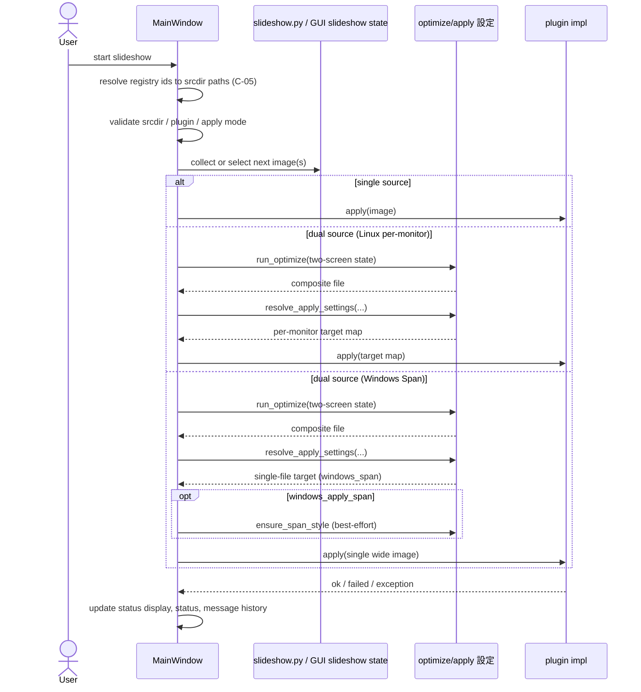

# Harite スライドショー仕様 (Slideshow Spec)

最終更新: 2026-06-06（P-03 単 display start 条件 — §2 追補）

## 1. スライドショー機能の責務

- 入力画像列を一定間隔で選択し、apply 面へ接続する。
- CLI と GUI の両面で、スライドショー機能としての継続実行を説明する。

public surface では、この機能を `スライドショー` と呼ぶ。画像候補集合を一定間隔で巡回し、次に適用する画像を選ぶ継続実行面を指す。

## 2. 起動条件

- CLI 側のスライドショー実行は入力 directory 1 件または最大 2 件, interval, mode, plugin 条件を満たす必要がある。
- GUI 側のスライドショー実行は srcdir, plugin, dual-source 時の display 条件を満たす必要がある。

CLI 側の最低要件:

- `--input` 正規化後に採用された 1 件または 2 件の各要素が既存 directory であること
- directory 内に画像ファイルが 1 件以上あること
- `--interval-sec >= 1`
- `--mode` が `sequential` または `random`

CLI 側の入力正規化:

- `--input` は複数回指定できる。
- 1 回の `--input` 値内ではカンマ区切りで複数 directory を指定できる。
- CLI は各値をカンマ分割し、空要素を落とし、順序を保った directory 列へ正規化する。
- public surface で採用する source directory 数は最大 2 件であり、3 件以上与えられた場合は先頭 2 件だけを使う。
- 1 件入力時は single-source slideshow として扱う。
- 採用済み source directory の順序は保持され、画像列収集時もその順に連結する。
- CLI current command は left source / right source の別 apply target を直接は持たず、GUI の `Srcdir-L` / `Srcdir-R` のような左右別 owner state は持たない。

GUI 側では、これに加えて現在の画面状態、設定、スライドショー source directory の整合が必要になる。

GUI の registry 連動（C-05）:

- Start 前に [source-spec §6.4](../source/harite-source-spec.md) に従い、tracking `source_id` / `profile_id` から **再 resolve** して `slideshow_srcdir_l/r` を更新する（§6.6）。
- **検出 2 枚以上**（`len(detect_displays()) >= 2`）: **Srcdir-L と Srcdir-R の両方**が非空であること。どちらか空なら start 前に拒否。
- **検出 1 枚**（P-03 — [gui-spec §6](../gui/harite-gui-spec.md)）: **Srcdir-L のみ**非空で start 可。第二スロット UI は disabled。profile / saved source の R 指定は実行時に無視。start は L source のみで single-file apply。
- 手動 Srcdir のみ（tracking key なし）の side は、既存 path をそのまま検証する。
- CLI は registry tracking を使わず、従来どおり `--input` directory path のみ。

## 3. スライドショーシーケンス図 (slideshow sequence)

### 3.1 start / tick / apply / pause の責務分離

スライドショー面は 1 本の機能に見えるが、仕様上は少なくとも次の 4 段階へ分かれる。

1. start: 実行開始前の入力条件と owner state を確定する段階
2. tick: 各サイクルで次画像または次画像群を選ぶ段階
3. apply: 選ばれた画像または target を plugin 実行面へ渡す段階
4. pause / stop: 一時条件不成立と恒久 failure を owner state へ反映する段階

各段階の主責務は次のとおりである。

| 段階 | 主責務 | 補助責務 / 呼び出し先 | 持ち込まないもの |
| --- | --- | --- | --- |
| start | CLI / GUI owner | slideshow helper, core, plugin registry | plugin 実適用 |
| tick | slideshow helper または GUI owner state | 画像列収集済み state, mode 規則 | widget 更新詳細 |
| apply | plugin | core が必要なら target を先に解決する | mode 選択や timer 管理 |
| pause / stop | GUI owner / CLI command | status, history, completed 集計 | plugin fallback の詳細 |

この整理により、「次画像を選ぶこと」と「選ばれた target を実際に適用すること」と「条件不足時に paused とみなすこと」は別層の責務として読む。

## 4. 継続実行ループの基本動作

- この機能はサイクルごとの選択ループである。
- `sequential` と `random` の選択モードを持つ。
- 選択モードは CLI / helper だけに閉じず、GUI 側にも user-visible な選択面を持つ。
- GUI 側の mode 表記は `sequential` / `random` とする。
- GUI 側の mode 既定値は `random` とする。
- GUI 側でも `random` を選べるようにし、`sequential` は互換的な選択肢として残す。
- GUI の mode 選択面は slideshow tab 上で srcdir row と interval/start/stop row の間に独立 row として置く。
- GUI 実行中に mode 選択値を変えても、その run には反映しない。新しい mode は stop 後の次回 start から使う。

slideshow helper の最小構成:

- source directory 正規化 helper は、採用済み source directory の妥当性確認と画像列収集を受け持つ。
- source directory 正規化 helper は、採用済み source directory を順にたどり、各 directory の画像列をその順のまま連結した 1 本の候補列へ正規化する。
- `select_next_image(...)` は `sequential` / `random` の選択規則を受け持つ。
- `run_slideshow_cycle(...)` は 1 サイクル分の選択と state 更新を受け持つ。
- `run_slideshow_cycles(...)` は interval を加えた継続ループを受け持つ。

状態モデル:

- `index`: sequential 時の次位置
- `previous_selected`: random 時に直前重複を避けるための参照
- `completed`: 完了サイクル数

状態遷移の現行規則:

- `sequential` では `selected_index = index % len(images)` で選び、次 state は `index = index + 1`, `previous_selected = selected`, `completed = completed + 1` になる。
- `random` では候補数が 2 件以上かつ `previous_selected` が候補に含まれる場合だけ、その 1 件を除外した候補集合から選ぶ。候補が 1 件しかない場合や直前画像が候補集合にない場合は、全候補から選ぶ。
- `random` の next state は `index` を進めず、`previous_selected` と `completed` だけを更新する。
- `run_slideshow_cycles(...)` の callback へ渡す cycle 番号は `completed - 1` であり、内部 callback 番号は 0 始まりになる。
- sleep は継続実行を続ける場合にだけ入る。

## 5. pause / resume / retry

- GUI 側のスライドショー実行は display loss や auto-split 条件未成立時に pause 的な扱いを持つ。
- CLI 側は簡潔な実行ループとして実行メッセージを返す。

整理すると、明示的な pause / resume API を slideshow helper 自体は持たない。pause / resume 的な制御は主に GUI 側の状態管理として現れ、CLI 側は開始から終了まで 1 本のループを実行するモデルである。

GUI pause / resume の現行条件:

- dual-source auto-split の `tick` 中に `per-monitor apply requires at least two detected displays` が返った場合、GUI は stop せず pause へ遷移する。
- この pause は `slideshow paused: waiting for two detected displays for auto-split` を status message に入れ、状態表示を `paused` に切り替える。
- pause 中に次 tick が成功すると GUI は `slideshow resumed` を出して running へ戻る。
- 同じ `ValueError` でも `start` 時は transient 扱いせず、start failure として止める。

pause / stop 判定の境界:

- start 前の条件不足は pause ではなく start failure として扱う。
- tick 中に起きる一時的な display 条件不足だけを GUI は paused として吸収してよい。
- plugin が `False` を返した場合や plugin exception は、GUI / CLI の owner が failure として分類するが、その失敗理由の生成自体は plugin 側の契約に属する。
- auto-split target 解決失敗と plugin 実 apply failure は同じ `apply failed` に潰さず、owner 側の status / history では別理由として保持する。

GUI timer / side state の現行規則:

- GUI runtime timer は `interval_ms = max(1, int(interval_seconds)) * 1000` で作る。したがって現行 GUI は秒未満を扱わず、秒整数へ量子化して GLib / Qt timer に渡す。
- **Start 直前**に Interval spin の現値を owner `slideshow_interval_seconds` へ commit する。timer は commit 後の owner 値で起動する。settings ファイルに保存された値より、Start 時点の spin 表示が優先される（詳細は [GUI spec §6.2](docs/specs/gui/harite-gui-spec.md)）。
- dual-source 実行では L/R で独立した slideshow state を持ち、それぞれ `run_slideshow_cycle(images, backend.slideshow_mode, backend._slideshow_state_l|r)` で更新する。
- したがって GUI dual-source の左右選択は、同じ tick の中でも 1 本の共有 index ではなく、L side state と R side state を別々に進める。
- signal handler 経由の slideshow tick が使える場合は owner 側 callback を優先し、callback が `False` を返した時点で timer を止める。signal handler がない fallback 経路のときだけ GUI runtime 自身が L/R 選択を進める。

## 6. GUI のスライドショー責務

- srcdir 解決
- 現在表示 / 状態表示 / 出力表示の更新
- dual-source auto-split の準備
- tray からの start / stop 接続

GUI は単なるタイマー処理ではなく、状態表示の責務を強く持つ。特に次の情報を UI 上で維持する必要がある。

- 現在選ばれている入力や出力
- スライドショー実行が進行中か停止中か
- 直近 apply の成否
- display 条件不足や plugin 失敗の理由

### 6.0 GUI 表示面（current / output）

- **`Slideshow current`**: 現在 tick（または start 直後）で選ばれた L/R 画像 path を示す。user-facing label では full path をそのまま出さず、[GUI spec §6.1](docs/specs/gui/harite-gui-spec.md) の basename 省略規則（`format_slideshow_path_display`）を使う。長いマウント path（例: クラウド同期 drive 配下）でもファイル名中心で読めること。
- **`Slideshow output`**: §6.1（slideshow 作業ディレクトリ）の path を示す（省略規則の対象外。directory path をそのまま表示してよい）。
- owner の `slideshow_current_display` も、上記と同じ整形済み L/R を含める。

### 6.1 slideshow 作業ディレクトリ（案 A: ピクチャ配下）

GUI slideshow が生成する optimize 成果物（composite と per-monitor 分割画像）は、手動 Optimize / Export の出力先とは **別の slideshow 作業ディレクトリ** に書く。

#### 解決規則（Windows）

1. **ピクチャ根** — `SHGetFolderPathW`（Pictures、CSIDL 0x27）。未解決時は `~/Pictures`。
2. **slideshow 作業ディレクトリ** — `{ピクチャ根}/Harite/slideshow/`（Linux と同型）。

#### 解決規則（Linux / XDG）

1. **ピクチャ根**（手動 Optimize / Export の既定 `output_dir` と同型）  
   - `XDG_PICTURES_DIR` 環境変数  
   - 未設定時は `$XDG_CONFIG_HOME/user-dirs.dirs` の `XDG_PICTURES_DIR=`  
   - さらに未解決時は `~/Pictures`
2. **slideshow 作業ディレクトリ**  
   - `{ピクチャ根}/Harite/slideshow/`（製品固定のサブディレクトリ名。未存在なら作成する）

`XDG_CACHE_HOME` 等のキャッシュ領域は **採用しない**。Linux / XFCE 系 plugin は `xfconf-query` 等で壁紙 path を永続設定に書き込むため、apply 対象の画像実体は **ユーザーが通常アクセスできる非揮発のディレクトリ**（ピクチャ配下）に置く。キャッシュ削除で壁紙 path が無効化されるリスクを避ける。

#### GUI surface

- slideshow tab の `Slideshow output` は **slideshow 作業ディレクトリ** の path を示す。
- Main 導線の手動 Optimize / Export の出力先（`form_state.output_dir`、既定はピクチャ根）とは別 surface とする。

#### 実装方針

- §6.3 の要件 **R1–R5 はいずれも対応する**（issue #317 の解消条件）。現行コードは R1–R5 未達の過渡状態である。

### 6.2 GUI dual-source auto-split 時の optimize 出力ファイル管理（目標挙動）

GUI が dual-source slideshow を `per-monitor-auto-split` で実行するとき、各 tick で `optimize` と auto-split により §6.1 の作業ディレクトリへ出力する。R1–R3 により、継続実行中に作業ディレクトリへ **追跡スロット以外のファイルが残らない** ことを保証する。

#### 固定スロット（R2）

作業ディレクトリ内のファイル名は tick ごとに増えない **固定スロット** とする。存在ベース採番（`harite_output_{NNNN}.jpg`）は slideshow 経路では使わない。

| 種別 | ファイル名 |
| --- | --- |
| composite | `harite_slideshow.jpg` |
| per-monitor 分割（Linux plugin のみ） | `harite_slideshow_{display_name_safe}.jpg`（`display.name` を file-safe 化した suffix。例: `HDMI-1` → `harite_slideshow_HDMI-1.jpg`） |

Windows **Span** 経路（`windows_span`）では **composite スロットのみ** を生成・apply する。per-monitor 分割ファイルは作らない（B-lite / [gui-spec § Main Apply](../gui/harite-gui-spec.md) と同型）。

- dual-source の optimize / split は、上記 path を `output_path` / `output_dir` として明示指定し、毎 tick 上書きする。
- 手動 Optimize（ピクチャ根）は従来どおり `harite_output_{NNNN}.jpg` 採番でよい（R5 により作業ディレクトリと分離）。

#### tick 終了時の整理（R1, R3）

各 dual-source tick の終了時（成功・pause・失敗を問わない）に、当該 tick で生成した path 集合 `_slideshow_tick_generated_files` を確定し、次を行う。

1. **R3 rollback** — apply 未完了（pause、prepare 失敗、apply 失敗）のとき、当該 tick 生成分を作業ディレクトリから削除する。追跡スロット（`_slideshow_active_generated_files`）は更新しない。
2. **R1 作業ディレクトリのスロット外掃除** — 作業ディレクトリ直下で、現行スロット集合および `_slideshow_active_generated_files` に含まれる path 以外の `harite_slideshow_*.jpg` / レガシー `harite_output_*.jpg` を削除する（移行期の掃除を含む）。
3. **apply 成功時** — 当該 tick のスロット集合を `_slideshow_active_generated_files` に記録する（path は tick ごと固定のため、実体は上書き済み）。

single-source:

- optimize 出力は生成しない。apply 成功時は `_slideshow_active_generated_files` を空にし、作業ディレクトリのスロットファイル（R1 掃除対象）を削除する。

対象範囲:

- R1–R3 は **GUI dual-source auto-split** が optimize を呼ぶ経路に適用する。
- **CLI `slideshow` command** は optimize 出力を生成しないため対象外（§8）。

ライフサイクル（目標・R1–R5 適用後）:

| タイミング | 挙動 |
| --- | --- |
| dual-source tick / apply 成功 | スロットへ上書き → `_slideshow_active_generated_files` 更新 → R1 掃除 |
| dual-source tick / pause | R3 で当該 tick 生成分 rollback → R1 掃除。timer は継続可 |
| dual-source tick / apply 失敗 | R3 rollback → slideshow 停止 → R1 掃除 |
| single-source / apply 成功 | 作業ディレクトリのスロットファイル削除、追跡を空に |
| `on_slideshow_stop` | スロットファイルは残す。追跡 state のみクリア（§6.3 R4） |

実装参照（目標）:

- 作業ディレクトリ: `MainWindow._resolve_slideshow_work_dir`
- tick 生成追跡: `_slideshow_tick_generated_files`
- スロット apply 成功追跡: `_slideshow_active_generated_files`
- dual-source サイクル: `MainWindow._apply_slideshow_selection`
- optimize 呼び出し: `OptimizeController.run_slideshow_optimize`（スロット path 固定）

### 6.3 要件 R1–R5（issue #317 — 対応方針: すべて実装）

product 方針として **R1–R5 をすべて満たす**。以下は実装仕様である。

| ID | 要件 | 状態 |
| --- | --- | --- |
| R5 | 手動 Optimize はピクチャ根（`form_state.output_dir`）。slideshow 作業は `{ピクチャ根}/Harite/slideshow/`。`XDG_CACHE_HOME` は使わない（xfconf 壁紙実体の非揮発性）。 | **対応する**（§6.1） |
| R2 | 作業ディレクトリ内は §6.2 の固定スロットのみ。`harite_output_{NNNN}.jpg` 採番は slideshow 経路で使わない。 | **対応する** |
| R3 | pause / apply 失敗 / prepare 失敗 tick で、当該 tick の `_slideshow_tick_generated_files` を rollback 削除する。 | **対応する** |
| R1 | dual-source 継続実行中、各 tick 終了時に作業ディレクトリへスロット外ファイルを残さない（§6.2 の掃除）。 | **対応する** |
| R4 | `on_slideshow_stop` 時の作業ディレクトリと追跡 state の扱い（下記確定）。 | **対応する** |

#### issue #317 での観測と対応（完了）

issue #317 では次の純増パターンを観測した。R1–R5 の実装完了（[issue #317](../../online-issues/closed/issue-317.md) 参照）により解消済みである。

1. pause tick で optimize のみ成功し rollback しない（R3 対応済み）
2. apply 失敗で生成ファイルを残す（R3 対応済み）
3. ピクチャ根と作業ディレクトリ未分離で手動 Optimize と採番競合（R5 対応済み）
4. 存在ベース採番で orphan が次 tick の番号を押し上げる（R2 対応済み）

#### R4（`on_slideshow_stop`）— 確定

stop 時は作業ディレクトリ内のスロットファイル **を削除しない**。

- XFCE 系は最終 tick で apply 済みの path を `xfconf-query` が参照しうる。stop 直後に削除すると、設定上の壁紙 path が無効になる。
- stop 時に `_slideshow_active_generated_files` と `_slideshow_tick_generated_files` は **クリア**する（次回 start で古い追跡を引き継がない）。
- 次回 `on_slideshow_start` では、R2 スロット path へ上書きする前提で作業ディレクトリを用意する（必要なら `mkdir -p`）。R1 掃除は各 tick 終了時に継続する。

### 6.6 Registry 連動実行（C-05）

[source-spec](../source/harite-source-spec.md) の catalog と GUI slideshow 実行の接続。

#### start 前の resolve

`on_slideshow_start`（および tray からの start が同経路の場合）の **画像収集より前**に次を行う。

1. in-memory catalog を参照する（**この時点で disk からの再 load は必須ではない** — 起動時 / Manage dialog Close 済み catalog でよい）。
2. 実行 L/R が参照する **すべての `remote-*`** source について `sync_remote_source`（[source-spec §12.4](../source/harite-source-spec.md)）。
3. `slideshow_profile_id` が設定されていれば `resolve_profile_members` で L/R path と tracking id を揃える。
4. 各 side で `slideshow_source_id_l` / `slideshow_source_id_r` が設定されていれば `resolve_source` で当該 side の `slideshow_srcdir_*` を上書きする（profile 展開と矛盾する場合は **profile 優先** — 実装は start 直前の単一パスで L/R を確定すること）。
5. `resolve_*` が `ValueError`（inaccessible / 未知 id）なら **start failure** とし、slideshow は開始しない（transient / pause 扱いにしない）。
6. 確定した `slideshow_srcdir_l/r` で §2 の directory 検証と `collect_slideshow_input_images` を行う。

`remote-*` source の cache directory は `local-dir` と同型の slideshow 入力 directory として扱う（[source-spec §12.5 / §15.5](../source/harite-source-spec.md)）。

手動 Srcdir のみの side（tracking key 空）は、手順 2–3 をスキップし、既存 `slideshow_srcdir_*` を検証する。

#### remote source と Mode（sequential / random）

[source-spec §12.5](../source/harite-source-spec.md) が正本。要約:

- **Sync 時**（Start / Refresh）に provider がリモートから **1 枚**を選び `latest.*` へ上書きする（NDL はサーバー random、CODH は `total` + random `start` 等 — §15.6–15.7）。
- **tick 時**の Mode は、各 side の cache をスキャンした **ファイル列**に対して `select_next_image` を適用する。
- remote cache は通常 **1 枚**のため、**remote のみの side では Mode を変えても表示は変わらない**。Mode が効くのは **複数枚ある `local-dir`**（または手動で cache に複数置いた例外）を参照する side。
- L/R は独立 cycle。片側だけ `local-dir` なら **その side だけ** Mode が意味を持つ。

#### tick 中

- **catalog の再 load も、id からの再 resolve も行わない**。start 時に確定した path で `collect_slideshow_input_images` / cycle を継続する。
- directory がアクセス不能になった場合、または画像 0 件になった場合は、**新規取り決めを設けず** §9 および [source-spec §7.5](../source/harite-source-spec.md) / [core-spec §7](../core/harite-core-spec.md) の既存 failure 分類に従い **stop / failure** とする（display loss による **pause** とは別軸）。
- start 条件（L/R 両方必須）・dual-source cycle 算法・L/R 独立 `SlideshowCycleState` は **変更しない**。

#### 実行中の catalog 変更

[source-spec §7.6](../source/harite-source-spec.md) が正本。実行に影響する保存内容があれば GUI は **slideshow stop** する。

#### path 種別（NAS / GVFS）

[source-spec §4.1](../source/harite-source-spec.md)。GVFS path の slideshow 成功は保証しない。Windows UNC / ドライブレターは `local-dir` のまま利用する。

## 7. CLI `slideshow` command の責務

- 入力 directory 1 件または最大 2 件からの画像収集
- サイクル実行
- plugin 解決と各サイクルの実 apply
- `Slideshow start` / `Slideshow cycle` / `Slideshow interrupted by user` 実行メッセージ出力

CLI `slideshow` command の特徴:

- 開始後は各サイクルで `apply(...)` を呼ぶ。
- CLI `slideshow` の `--mode` 既定値は `sequential` である。
- plugin が例外を投げてもループ全体を即停止せず、そのサイクルの `apply_error` カウンタを 1 件増やす。
- plugin が `False` を返した場合は、そのサイクルの `apply_failed` カウンタを 1 件増やす。
- これらのカウンタは各サイクルの途中で保持され、bounded run や将来の明示完了経路がある場合にだけ `Slideshow completed` 行の実行メッセージ要約として出力する。
- `log_level` option は持たず、固定方針は旧 `normal` 相当とする。
- 継続実行の通常停止は `Ctrl+C` による `Slideshow interrupted by user` を中心に扱い、`Slideshow cycle=...` は失敗サイクルでだけ出す。
- したがって成功のみの実 apply では cycle 行を出さない。

集計規則の補足:

- 実 apply 時の `apply_ok`, `apply_failed`, `apply_error` はサイクルごとの結果分類であり、1 サイクルで多重加算しない。

## 8. 出力と観測面

- CLI `slideshow` command は stdout に実行メッセージを出す。
- CLI は固定の自然な user-facing 実行メッセージ方針を採る。現行英語表記では `Slideshow ...` を使い、全部大文字の prefix は使わない。
- GUI は status, history, output display を併用する。
- CLI には slideshow 専用の画像保存先はない。GUI dual-source では §6.1 の作業ディレクトリへ一時的な optimize 出力を書く（ユーザーが Export した成果物とは別）。

GUI feedback の補足:

- GUI runtime は `status_message` を 1 行目、`last_error` を 2 行目へ同期する。
- ただし `last_error == status_message` のときは 2 行目を抑止し、同一内容を二重表示しない。
- 状態表示 / tab title は `running|paused|stopped` の 3 状態を共有する。
- `Slideshow current`（label / owner `slideshow_current_display`）は §6.0 および [GUI spec §6.1](docs/specs/gui/harite-gui-spec.md) の path 省略規則に従う。full path の生表示は観測面として採用しない。

CLI の主な観測値:

- 開始時の `input`, `images`, `interval_sec`, `mode`, `plugin`
- 各サイクルの selected image
- `apply_ok`, `apply_failed`, `apply_error`
- 完了時の total サイクル数

完了時 summary の見方:

- 実 apply では `apply_ok`, `apply_failed`, `apply_error`, `apply_failed_total` が `Slideshow completed` 行へ出る。

固定方針では start 行と completed 行が基本であり、cycle 行は failure が起きたサイクルでだけ観測される。

## 9. 安定性上の注意点

### dual-source 起動要件（GUI）

| plugin | display 条件 | apply 経路 |
| --- | --- | --- |
| `linux` | 2 枚以上検出 | per-monitor map（§6.2 分割スロット） |
| `windows` | 2 枚以上検出 | wide composite + OS **Span**（single-file apply、`windows_span`） |
| その他 | — | dual-source **非対応**（start 前に拒否） |

- Windows では linux plugin を要求しない（W-02）。`resolve_apply_settings` が `per-monitor-auto-split` を single-file に解決する（[plugin-spec §4.1](../plugins/harite-plugin-spec.md)）。
- Settings **`windows_apply_span`** が有効なとき、各 tick の apply 前に HKCU Span を best-effort 設定する（Main Apply B-lite と同型）。registry **自動復元は行わない**（[#343](../../online-issues/closed/issue-343.md)）。
- plugin exception は apply_error 系として扱う。
- input directory が空なら起動前に止める。

追加の注意点:

- `interval_sec < 1` は helper 側でも不正として扱う。
- random 選択では候補が複数ある場合、直前と同じ画像を避ける。
- `KeyboardInterrupt` は CLI では異常終了ではなく、ユーザー中断として `0` 扱いにする。
- GUI dual-source auto-split では、display 条件喪失が一時的なら pause で吸収し、raw な `ValueError` をそのまま user-facing failure にしない。

### registry / directory の実行時失敗（C-05）

| タイミング | 条件 | 扱い |
| --- | --- | --- |
| start 前 | `resolve_source` / `resolve_profile_members` 失敗 | start failure（§6.6） |
| start 前 | `collect_slideshow_input_images` が空 directory / 不存在 | start failure（§2） |
| tick 中 | start 時 path が inaccessible または画像 0 件 | stop / failure（source-spec §7.5 既存。pause ではない） |
| tick 中 | catalog 変更が [source-spec §7.6](../source/harite-source-spec.md) に該当 | slideshow stop |

片側のみ inaccessible になった場合の **可能 side のみ継続**は **採用しない**（現段階は現行どおり全体 stop）。

## 10. core / GUI / CLI との境界

- スライドショー helper の最小ループは `slideshow.py` にある。
- GUI 実運用の状態管理は `MainWindow` と GTK runtime に跨る。
- core / apply target 解決は [docs/specs/core/harite-core-spec.md](docs/specs/core/harite-core-spec.md) を参照する。
- source registry / start 前 resolve / catalog 変更は [source-spec](docs/specs/source/harite-source-spec.md) §6.4, §7.6 および本書 §6.6。

境界整理:

- slideshow helper は画像選択と cycle 制御を持つが、GUI 特有の state 表示や tray 制御は持たない。
- CLI `slideshow` command は helper の呼び出しと実行メッセージ出力を担う。
- GUI は helper だけでは表現しきれない dual-source, auto-split, status 表示を追加で担う。
- apply target の解決は core が担い、選択済み plugin がその target を受け付けるかと実 apply の成否は plugin 契約側で扱う。
- tray は slideshow owner state を直接持たず、GUI owner が持つ running / paused / stopped を補助操作面として起動・停止する。
