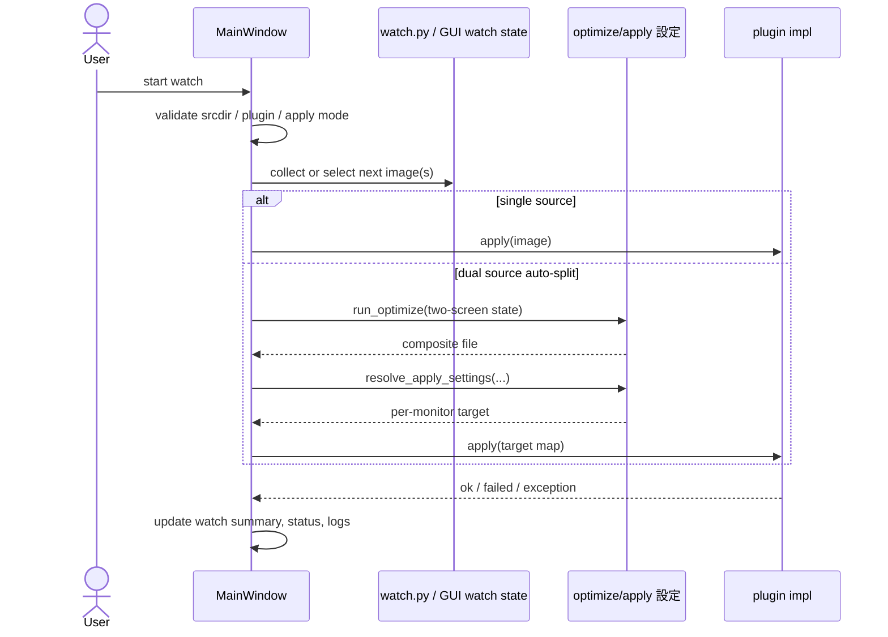

# Harite watch 仕様 (Watch Spec)

最終更新: 2026-05-19

## 1. watch の責務

- 入力画像列を周期的に選択し、apply 面へ接続する。
- CLI watch と GUI watch の両面で継続実行の説明を受け持つ。

## 2. 起動条件

- CLI watch は入力 directory, interval, mode, plugin 条件を満たす必要がある。
- GUI watch は srcdir, plugin, dual-source 時の display 条件を満たす必要がある。

## 3. watch シーケンス図 (watch sequence)

## 4. 監視ループの基本動作

- watch は filesystem event watch ではなく、周期ごとの選択ループである。
- `sequential` と `random` の選択モードを持つ。
- `iterations` 指定で bounded execution も可能である。

## 5. pause / resume / retry

- GUI watch は display loss や auto-split 条件未成立時に pause 的な扱いを持つ。
- CLI watch は簡潔な実行ループとして summary を返す。

## 6. GUI watch の責務

- srcdir 解決
- watch current / summary / output display の更新
- dual-source auto-split の準備
- tray からの start / stop 接続

## 7. CLI watch の責務

- 入力 directory からの画像収集
- cycle 実行
- dry-run / do-it 切り替え
- `WATCH start` / `WATCH cycle` / `WATCH completed` 出力

## 8. ログと観測面

- CLI watch は stdout に summary を出す。
- GUI watch は status, watch summary, logs を併用する。
- plugin logger は外部 command や apply failure の補助観測面になる。

## 9. 安定性上の注意点

- dual-source watch は linux plugin と two detected displays を要件に持つ。
- plugin exception は apply_error 系として扱う。
- input directory が空なら起動前に止める。

## 10. core / GUI / CLI との境界

- watch helper の最小ループは `watch.py` にある。
- GUI 実運用の watch 状態管理は `MainWindow` と GTK runtime に跨る。
- core / apply target 解決は [docs/specs/core/harite-core-spec.md](docs/specs/core/harite-core-spec.md) を参照する。
