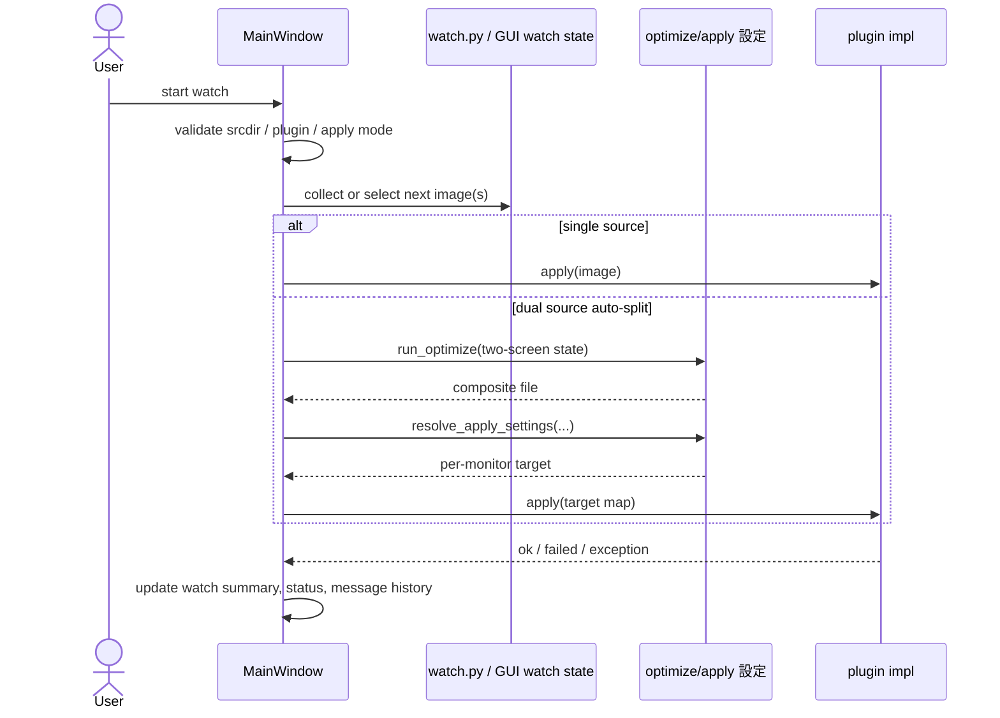

# Harite watch 仕様 (Watch Spec)

最終更新: 2026-05-19

## 1. watch の責務

- 入力画像列を周期的に選択し、apply 面へ接続する。
- CLI watch と GUI watch の両面で継続実行の説明を受け持つ。

watch は名前に反して filesystem event 監視の仕組みではない。Harite における watch は、画像候補集合を一定間隔で巡回し、次に適用する画像を選ぶ継続実行面を指す。

## 2. 起動条件

- CLI watch は入力 directory, interval, mode, plugin 条件を満たす必要がある。
- GUI watch は srcdir, plugin, dual-source 時の display 条件を満たす必要がある。

CLI 側の最低要件:

- `--input` が既存 directory であること
- directory 内に画像ファイルが 1 件以上あること
- `--interval-sec >= 1`
- `--mode` が `sequential` または `random`
- `--log-level` が `normal` または `detail`

GUI 側では、これに加えて現在の画面状態、設定、watch source directory の整合が必要になる。

## 3. watch シーケンス図 (watch sequence)

## 4. 監視ループの基本動作

- watch は filesystem event watch ではなく、周期ごとの選択ループである。
- `sequential` と `random` の選択モードを持つ。
- 選択モードを明示的に持つのは現行では主に CLI / helper 側である。
- GUI watch は現状 `sequential` 前提で動いており、`random` を選ぶ UI は持たない。
- 現行 CLI / helper には `iterations` による回数上限指定が残っている。
- `iterations` も同様に現行では CLI / helper 側の要素であり、GUI にも母体相当の操作面にも露出していない。
- changer としての通常利用では、指定回数で停止する挙動は直感的ではない。

watch helper の最小構成:

- `collect_watch_input_images(...)` は directory 妥当性と画像列収集を受け持つ。
- `select_next_image(...)` は `sequential` / `random` の選択規則を受け持つ。
- `run_watch_cycle(...)` は 1 cycle 分の選択と state 更新を受け持つ。
- `run_watch_cycles(...)` は interval と iterations を加えた継続ループを受け持つ。

状態モデル:

- `index`: sequential 時の次位置
- `previous_selected`: random 時に直前重複を避けるための参照
- `completed`: 完了 cycle 数

## 5. pause / resume / retry

- GUI watch は display loss や auto-split 条件未成立時に pause 的な扱いを持つ。
- CLI watch は簡潔な実行ループとして summary を返す。

整理すると、明示的な pause / resume API を watch helper 自体は持たない。pause / resume 的な制御は主に GUI 側の状態管理として現れ、CLI 側は開始から終了まで 1 本のループを実行するモデルである。

GUI pause / resume の現行条件:

- dual-source auto-split の `tick` 中に `per-monitor apply requires at least two detected displays` が返った場合、GUI watch は stop せず pause へ遷移する。
- この pause は `watch paused: waiting for two detected displays for auto-split` を status message に入れ、watch summary を `Watch: paused` に切り替える。
- pause 中に次 tick が成功すると GUI watch は `watch resumed` を出して running へ戻る。
- 同じ `ValueError` でも `start` 時は transient 扱いせず、start failure として止める。

## 6. GUI watch の責務

- srcdir 解決
- watch current / summary / output display の更新
- dual-source auto-split の準備
- tray からの start / stop 接続

GUI watch は単なるタイマー処理ではなく、状態表示の責務を強く持つ。特に次の情報を UI 上で維持する必要がある。

- 現在選ばれている入力や出力
- watch が進行中か停止中か
- 直近 apply の成否
- display 条件不足や plugin 失敗の理由

## 7. CLI watch の責務

- 入力 directory からの画像収集
- cycle 実行
- dry-run / do-it 切り替え
- `WATCH start` / `WATCH cycle` / `WATCH completed` 出力

CLI watch の特徴:

- `dry_run=True` では plugin を使わず、cycle 数のみを進める。
- `dry_run=False` のときだけ plugin を解決し、各 cycle で `apply(...)` を呼ぶ。
- plugin が例外を投げてもループ全体を即停止せず、その cycle の `apply_error` カウンタを 1 件増やす。
- plugin が `False` を返した場合は、その cycle の `apply_failed` カウンタを 1 件増やす。
- これらのカウンタは各 cycle の途中で保持され、最後に `WATCH completed` 行の summary として出力される。

## 8. 出力と観測面

- CLI watch は stdout に summary を出す。
- CLI watch の `normal` / `detail` は stdout に出す `WATCH ...` 行の粒度を切り替える。
- GUI watch は status, watch summary, message history を併用する。
- plugin logger は外部 command や apply failure の補助観測面になる。
- 現行 watch には専用保存ファイルへの書き出し機能はない。
- plugin logger は別系統であり、出力されるかどうかや出力先は Python logging の設定に依存する。

GUI feedback の補足:

- GUI runtime は `status_message` を 1 行目、`last_error` を 2 行目へ同期する。
- ただし `last_error == status_message` のときは 2 行目を抑止し、同一内容を二重表示しない。
- watch summary / tab title は `running|paused|stopped` の 3 状態を共有する。

CLI watch の主な観測値:

- 開始時の `input`, `images`, `interval_sec`, `mode`, `log_level`, `plugin`, `dry_run`, `iterations`
- 各 cycle の selected image
- `apply_ok`, `apply_failed`, `apply_error`
- 完了時の total cycle 数

完了時 summary の見方:

- dry-run では `cycles` と `dry_run_cycles` が出る。
- 実 apply では `apply_ok`, `apply_failed`, `apply_error`, `apply_failed_total` が `WATCH completed` 行へ出る。

`detail` 出力では各 cycle が見えるが、`normal` では失敗系と最終 summary が中心になる。

## 9. 安定性上の注意点

- dual-source watch は linux plugin と two detected displays を要件に持つ。
- plugin exception は apply_error 系として扱う。
- input directory が空なら起動前に止める。

追加の注意点:

- `interval_sec < 1` や `iterations < 1` は helper 側でも不正として扱う。
- random 選択では候補が複数ある場合、直前と同じ画像を避ける。
- `KeyboardInterrupt` は CLI では異常終了ではなく、ユーザー中断として `0` 扱いにする。
- GUI dual-source auto-split では、display 条件喪失が一時的なら pause で吸収し、raw な `ValueError` をそのまま user-facing failure にしない。

## 10. core / GUI / CLI との境界

- watch helper の最小ループは `watch.py` にある。
- GUI 実運用の watch 状態管理は `MainWindow` と GTK runtime に跨る。
- core / apply target 解決は [docs/specs/core/harite-core-spec.md](docs/specs/core/harite-core-spec.md) を参照する。

境界整理:

- watch helper は画像選択と cycle 制御を持つが、GUI 特有の state 表示や tray 制御は持たない。
- CLI watch は helper の呼び出しと summary 出力を担う。
- GUI watch は helper だけでは表現しきれない dual-source, auto-split, status 表示を追加で担う。
