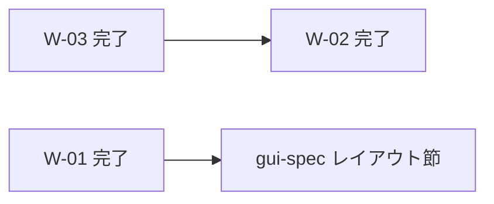

# Windows Qt 検証 backlog（post Phase 8）

最終更新: 2026-05-31（W-02 #356 マージ・#341 クローズ）

## 位置づけ

- [docs/working/20260518-2047-feature-overview.md](20260518-2047-feature-overview.md) の C-xx（post-1.0.0 機能 inventory）とは **別軸**。
- Qt 移行完了直後に表面化した **現行 surface の polish / プラットフォームギャップ** を束ねる。
- 仕様正本（`docs/specs/`）へ昇格する前の planning 入口。詳細観測は [docs/online-issues/](../online-issues/README.md) へ。

## 一覧

| ID | 項目 | 分類 | Issue | 優先感 | 現判断 |
| --- | --- | --- | --- | --- | --- |
| W-01 | Main タブ action cluster レイアウト | UI polish | [#342](../online-issues/issue-342.md) | 高（見た目・可読性） | **完了**（#346, 2026-05-31） |
| W-02 | Windows スライドショー方針 | planning | [#341](../online-issues/issue-341.md) | **高** | **完了**（#355 spec + #356 impl, 2026-05-31） |
| W-03 | Windows Apply / 壁紙表示 / 解像度検出 | investigation | [#343](../online-issues/issue-343.md) | — | **完了**（C #349 + B-lite #352） |

## 依存関係

- **W-01 / W-02 / W-03** はいずれも完了（2026-05-31）。本 backlog の active 項目はなし。
- **W-02-A:** dual-source start ゲート解除 + 正本追記 + Interval commit / current path 省略（#355 + #356）。
- 現行正本: Windows plugin は **単一画像 apply**。Span 表示は B-lite。slideshow dual-source は **wide composite + Span**（linux per-monitor map は不要）。

## 推奨着手順（2026-05-31 更新）

1. ~~**W-01（#342）**~~ — 完了（PR #346）。
2. ~~**W-03-C（#343 解像度検出）**~~ — 完了（PR #349）。
3. ~~**W-03-B-lite（#343 Apply / Span）**~~ — 完了（docs #350 + impl #352）。
4. ~~**W-02（#341）**~~ — 完了（#355 + #356、手元確認済み）。

## W-02 完了メモ（#356）

- `_prepare_slideshow_apply`: Windows + display 2+ で dual-source start を許可。
- tick: B-lite 同型（composite → Span apply）。tray Start も同一経路。
- 副次: Start 直前 Interval spin commit（GTK/Qt）、`Slideshow current` path 省略（gui-spec §6.1–6.2）。
- **見送り（W-02-B）:** GUI single-srcdir Start は **不採用**（2026-05-31 オーナー判断）。source 1 件は display 1 枚が通例とし、single-source slideshow は CLI（`harite slideshow --input` 1 件）で足りる。GUI で L/R 片方のみ Start を許す整理は **別機会**（single display / single source 横断テーマ）。

## W-03 方針候補と実施順

| 順 | 案 | 内容 | 状態 |
| --- | --- | --- | --- |
| 1 | **C. 解像度検出強化** | マルチモニタ bounds / 仮想解像度 / two-screen context / `scale_percent` | **完了**（#349） |
| 2 | **B-lite. Span 後押し（opt-in）** | Settings `windows_apply_span` 有効時、Span モード Apply で HKCU `WallpaperStyle=22` | **完了**（#352） |

背景色の重畳問題は **案 A ならノータッチ** で整理可能（#343 本文参照）。

## W-03-C 実装メモ（spec ドラフト用）

### 現状（Linux vs Windows）

| 項目 | Linux（GTK 参考） | Windows（現行） |
| --- | --- | --- |
| 検出入口 | `workspace.detect_displays()` → `xrandr --query` | 同入口 → `_detect_windows()` |
| ディスプレイ名 | `HDMI-1`, `DP-1` 等 | **空文字**（primary のみ） |
| ジオメトリ | width / height / x_offset / y_offset / primary | primary 1 枚の width / height のみ |
| 下流 | `display_context.build_two_screen_optimize_context()` → GUI two-screen / auto 解像度 | 2 枚検出不可 → two-screen 不可 |

### 強化の当たり所（コード）

- **主:** `src/harite/workspace.py` の `_detect_windows()` — `EnumDisplayMonitors` + `MONITORINFOEX` で `DeviceName`（`\\.\DISPLAYn`）、bounds（width/height/x/y）、primary を返す（`Screen.AllScreens` 相当。PowerShell は使わない）。
- **再利用:** `display_context.order_displays` / `derive_virtual_resolution` / `build_two_screen_optimize_context` — Linux と同じ経路。
- **既存:** `optimize_settings.resolve_optimize_display_settings` — primary 1 枚 fallback は Phase 8 で追加済み。C 完了で dual-input + two-screen も Windows 上で解決可能に。

### 正本ライティングで相談すること

- ~~Windows の `Display.name` に何を載せるか~~ → **オーナー判断: `\\.\DISPLAYn`（Screen.DeviceName 相当）をベース**（2026-05-31 実機確認）。
- **plugin 層**でディスプレイ名補完をどこまで約束するか — WMI 製品名は **空間順序には使わない**。Auto-Split ファイル名の部分文字列候補としての利用は **予備検討**（Linux xfconf 的用途）。解像度検知とは独立。
- GUI two-screen / Span を Windows で **Apply まで有効化** — **B-lite 完了**（#352）。slideshow dual-source — **W-02 完了**（#356）。

## spec 改訂が必要になるタイミング

| トリガ | 想定正本 |
| --- | --- |
| action cluster の補助ラベル配置（Qt 下段） | ~~`harite-gui-spec.md` § Main tab~~ **反映済**（#346） |
| Windows で slideshow を新たに約束する | ~~`harite-slideshow-spec.md`, `harite-gui-spec.md` §6~~ **反映済**（#355 + #356） |
| Windows Apply で Fit/Fill 等を Harite が制御する | **不採用**（B-full 見送り） |
| 解像度 auto 検出の Windows 経路 | **完了**（#349） |
| Windows Span Apply（B-lite） | **完了**（gui-spec #350, plugin-spec + impl #352） |

## 完了条件（この backlog 文書として）

- [x] W-01 が Issue クローズまたは spec + 実装 PR に分解された（#346, 2026-05-31）
- [x] W-03-C（解像度検出）が spec + 実装 PR に分解された（#349）
- [x] W-03-B-lite（Span UI / Apply / opt-in）が spec + 実装 PR に分解された（#350 + #352, 2026-05-31）
- [x] W-03-A / 旧 B-full は **不採用**（Fit/Fill 全面制御は見送り）として resolution 記録
- [x] W-02 の Windows slideshow 方針が spec または Issue resolution に記録された（#355 + #356, #341 クローズ, 2026-05-31）
- [x] W-03 確定事項は online-issues / specs 正本へ反映された

## 関連

- Qt 移行計画: [20260530-2201-pyqt6-migration-plan.md](20260530-2201-pyqt6-migration-plan.md)
- Phase 8 監査: [20260531-0843-qt-phase8-3layer-audit.md](20260531-0843-qt-phase8-3layer-audit.md)
- 精査（post W-03）: [20260531-1530-windows-post-w03-status-and-w02-slideshow.md](20260531-1530-windows-post-w03-status-and-w02-slideshow.md)
- Feature inventory（C-xx）: [20260518-2047-feature-overview.md](20260518-2047-feature-overview.md)
