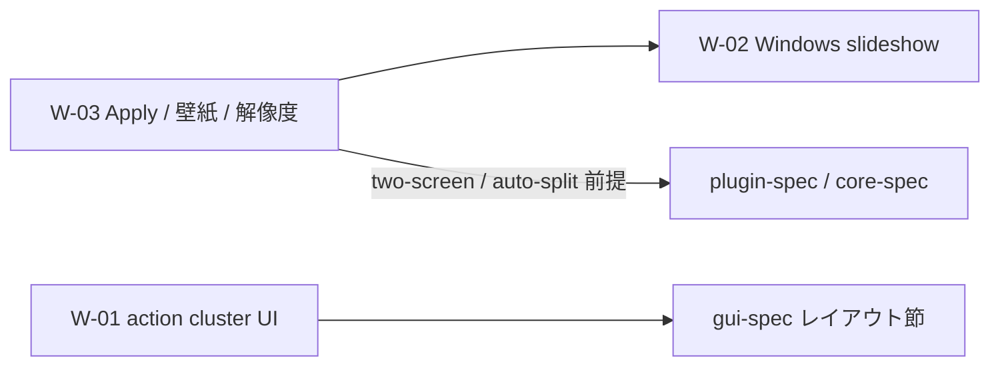

# Windows Qt 検証 backlog（post Phase 8）

作成: 2026-05-31  
起点: `harite-qt` の Windows 実機検証と Phase 8 監査 PR マージ後の残論点

## 位置づけ

- [docs/working/20260518-2047-feature-overview.md](20260518-2047-feature-overview.md) の C-xx（post-1.0.0 機能 inventory）とは **別軸**。
- Qt 移行完了直後に表面化した **現行 surface の polish / プラットフォームギャップ** を束ねる。
- 仕様正本（`docs/specs/`）へ昇格する前の planning 入口。詳細観測は [docs/online-issues/](../online-issues/README.md) へ。

## 一覧

| ID | 項目 | 分類 | Issue | 優先感 | 現判断 |
| --- | --- | --- | --- | --- | --- |
| W-01 | Main タブ action cluster レイアウト | UI polish | [#342](../online-issues/issue-342.md) | 高（見た目・可読性） | **完了**（#346, 2026-05-31） |
| W-02 | Windows スライドショー方針 | planning | [#341](../online-issues/issue-341.md) | 中（設計判断） | **保留**。W-03 / two-screen / auto-split とセットで決める |
| W-03 | Windows Apply / 壁紙表示 / 解像度検出 | investigation | [#343](../online-issues/issue-343.md) | 中（Apply 品質） | **調査継続**。レジストリ触るかは未決 |

## 依存関係

- **W-01** は W-02 / W-03 と独立。Qt layout builder のみで完結可能。
- **W-02** と **W-03** は「Windows で per-monitor / dual-source をどこまで約束するか」が共通テーマ。
- 現行正本: Windows plugin は **単一画像 apply のみ**（[plugin-spec §4.1](../specs/plugins/harite-plugin-spec.md)）。Linux plugin 必須の dual-source slideshow は **仕様どおり**。

## 推奨着手順

1. ~~**W-01（#342）**~~ — 完了（PR #346）。
2. **W-03（#343）** — 調査結果を整理し、方針を 3 択程度に落とす（下記）。
3. **W-02（#341）** — W-03 の方針とセットで「Windows slideshow を提供する / しない / 限定提供」を決め、必要なら spec PR。

## W-03 方針候補（未決）

| 案 | 内容 | 工数 | メモ |
| --- | --- | --- | --- |
| A. 最小（現行維持） | `SystemParametersInfoW` でファイル差し替えのみ。OS の Fit/Fill 等・背景色はユーザー任せ | 低 | **現時点の有力**。plugin-spec §4.1 と一致 |
| B. 表示方式同期 | レジストリ `WallpaperStyle` / `TileWallpaper` を Apply 前後で設定 | 中 | 要実機検証・テスト戦略。Harite 最適化結果と OS スケールの整合 |
| C. 解像度検出強化 | Qt / PowerShell でマルチモニタ bounds を GUI optimize に反映 | 中〜高 | W-02 / auto-split 議論と連動 |

背景色の重畳問題は **案 A ならノータッチ** で整理可能（#343 本文参照）。

## spec 改訂が必要になるタイミング

| トリガ | 想定正本 |
| --- | --- |
| action cluster の補助ラベル配置（Qt 下段） | ~~`harite-gui-spec.md` § Main tab~~ **反映済**（#346） |
| Windows で slideshow を新たに約束する | `harite-slideshow-spec.md`, `harite-plugin-spec.md` |
| Windows Apply で Fit/Fill 等を Harite が制御する | `harite-plugin-spec.md` §4.1 |
| 解像度 auto 検出の Windows 経路を追加 | `harite-core-spec.md`, `optimize_settings` 関連 |

## 完了条件（この backlog 文書として）

- [x] W-01 が Issue クローズまたは spec + 実装 PR に分解された（#346, 2026-05-31）
- [ ] W-03 で A/B/C のいずれか（または組合せ）がオーナー判断で固定された
- [ ] W-02 の Windows slideshow 方針が spec または Issue resolution に記録された
- [ ] 確定事項は online-issues の `resolution` 節と specs 正本へ反映された

## 関連

- Qt 移行計画: [20260530-2201-pyqt6-migration-plan.md](20260530-2201-pyqt6-migration-plan.md)
- Phase 8 監査: [20260531-0843-qt-phase8-3layer-audit.md](20260531-0843-qt-phase8-3layer-audit.md)
- Feature inventory（C-xx）: [20260518-2047-feature-overview.md](20260518-2047-feature-overview.md)
