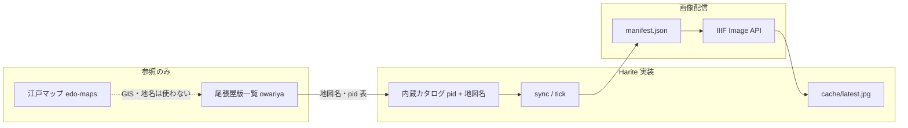
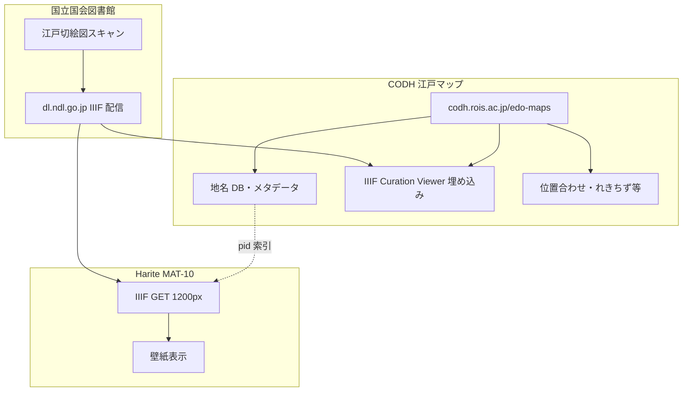

# MAT-10 — 江戸切絵図「雰囲気絵」source 計画

最終更新: 2026-05-31  
親: [maturation §MAT-10](../online-issues/maturation-20260609-qt-common.md#mat-10--江戸切絵図を雰囲気絵ソースにできないか検討)  
前提: Preset Slideshow の **仕組み**（sync / tick / apply / op log）は成立（op5 まで確認）。MAT-18 / MAT-14b 完了。

---

## 1. 何を作るか（product）

MAT-04 で削除した **江戸買物**（文字図版偏重）の代替として、slideshow に **地図1枚全体**の雰囲気絵を出す。

| やること | やらないこと |
| --- | --- |
| 尾張屋版江戸切絵図の **全体図**を壁紙に | 地名検索・GIS・緯度経度連動（edo-maps の本業） |
| エリア別 preset（浅草・日本橋…） | 「れきちず」風の合成地図・町家領域マスク |
| NDL IIIF で画像取得 | edo-maps の Canvas Indexer API（存在しない） |
| 出典表記（NDL + 地図名） | 特定1枚への固定（例示の築地八丁堀は雰囲気イメージのみ） |

**オーナー判断（2026-05-31）**

| 項目 | 選択 | 理由 |
| --- | --- | --- |
| preset 範囲 | **A+B+C 三段**（2026-05-31 更新） | A=全区29、B=大グループ5、C=単エリア7。interval はユーザー任せ |
| IIIF 幅 | **A: 1200px**（`full/1200,/0/default.jpg`） | 2000px はクローズアップしすぎて地図のテーマが見えにくい。フル解像度は「れきちず」級の手間 |

試験値（`pid=1286208` 今戸箕輪浅草）: 1200px ≈ **396KB**、2000px ≈ 912KB、フル ≈ 4.7MB。

---

## 2. CODH / NDL の整理 — 「どのサイトの話か」

Harite の remote source 周辺には **名前が似た CODH プロジェクトが複数**ある。MAT-10 で触るのは **江戸マップ（edo-maps）が参照している NDL 画像**であり、**江戸観光（edo-spots）の挿絵切り出し**ではない。

### 2.1 一覧（勉強用）

| サイト | URL | 中身 | Harite との関係 |
| --- | --- | --- | --- |
| **江戸マップ** | [codh.rois.ac.jp/edo-maps/](https://codh.rois.ac.jp/edo-maps/) | NDL 所蔵 **江戸切絵図**（尾張屋版 **32地図**）の地名 DB + 地図ビューア | **MAT-10 の題材**。画像は NDL IIIF、地名 CSV は CC BY |
| 尾張屋版一覧 | [edo-maps/owariya/](https://codh.rois.ac.jp/edo-maps/owariya/) | 29+ 地図の **名前・NDL pid 対応表**（実装のカタログ正本） | カタログ棚卸の入口 |
| **江戸観光案内** | [codh.rois.ac.jp/edo-spots/](https://codh.rois.ac.jp/edo-spots/) | 名所案内・名所図会などの **挿絵**（Canvas Indexer `edo-spots`、1309件） | **既存 preset**（`codh-edo-spots-*`）。小さな矩形切り出し |
| 江戸買物案内 | [codh.rois.ac.jp/edo-shops/](https://codh.rois.ac.jp/edo-shops/) | 商店案内の **文字図版**（`edo-shops`） | **MAT-04 で同梱削除**。コード経路は残存 |
| IIIF Curation Platform | [codh.rois.ac.jp/icp/](https://codh.rois.ac.jp/icp/) | キュレーション JSON + **Canvas Indexer** 検索基盤 | edo-spots / edo-shops がここ経由。**edo-maps は Indexer 未公開** |
| Canvas Indexer API | `https://mp.ex.nii.ac.jp/api/{indexer}/search` | 検索 → `canvasThumbnail`（IIIF 矩形済み） | Harite CODH 実装が使用 |
| NDL 次世代 DL | `lab.ndl.go.jp/dl/api/illustration/...` | 図版メタ + `pct` 切り出し | **既存 NDL preset**（facet / keyword）。MAT-18 領域 |
| NDL デジタルコレクション IIIF | `dl.ndl.go.jp/api/iiif/{pid}/...` | 古典籍・絵図の **フルキャンバス** | **MAT-10 の画像取得先** |

### 2.2 データの流れ（MAT-10）

**ポイント:** edo-maps は **「どの NDL 地図か」の索引**として使う。API で画像を取るのではなく、**NDL に直接 GET** する（C-01-E inventory が edo-maps をパスした理由＝GIS 中心で、Indexer が無い）。

### 2.3 edo-spots との見分け方

[江戸観光](https://codh.rois.ac.jp/edo-spots/) の1件は、出版物ページ上の **名所挿絵の切り抜き**（`canvasThumbnail` に `xywh` 矩形入り）。出典は「江戸名所記」等の **観光ガイド本**（江戸切絵図そのものではない件が多い）。

MAT-10 が狙うのは [尾張屋版一覧](https://codh.rois.ac.jp/edo-maps/owariya/) の **「築地八町堀日本橋南絵図」全体図**のような、**1枚が1エリアを担う地図板**。

### 2.4 「れきちず」と町家領域データセット（スコープ外）

edo-maps には [町家領域データセット](https://codh.rois.ac.jp/edo-maps/)（旧称 れきちず）がある。江戸風の **合成地図**や領域マスク用で、**フル切絵図1枚**とは別物。オーナー判断どおり **MAT-10 では採用しない**（手間と product イメージがずれる）。

---

## 3. 技術設計

### 3.1 kind / モジュール

| 項目 | 案 |
| --- | --- |
| `kind` | `remote-ndl-kiriezu`（新規。`remote-ndl` illustration とは分離） |
| モジュール | `sources_remote_ndl_kiriezu.py`（CODH / MAT-18b の index+cycle パターン流用） |
| カタログ | リポジトリ内 JSON（`kiriezu-catalog.json`）— [owariya](https://codh.rois.ac.jp/edo-maps/owariya/) から pid を棚卸 |

### 3.2 画像 URL

1. `GET https://dl.ndl.go.jp/api/iiif/{pid}/manifest.json`
2. 先頭 canvas の image id（例 `R0000001`）を cache
3. 取得: `https://dl.ndl.go.jp/api/iiif/{pid}/{canvas}/full/1200,/0/default.jpg`

| パラメータ | 値 | 備考 |
| --- | --- | --- |
| 幅 | **1200** | 固定（settings 化は第2弾） |
| `/max/` | **使わない** | kiriezu で 500/404 になる例あり |
| 形式 | `default.jpg` | 既存 remote と同様 |

### 3.3 sync / tick

| 操作 | 動作 |
| --- | --- |
| Manage Refresh | カタログ先頭へ cursor リセット |
| Slideshow start | `resume`（cursor 維持） |
| tick | preset 内カタログで cursor 進行。末尾で wrap |
| エリア preset | カタログ **1〜3 枚**（同一エリアの複数絵図） |

op log 案: `NDL_KIRIEZU_PICK`（`preset_id`, `pid`, `map_label`, `cursor_index`）。

### 3.4 既存との再利用

- slideshow: `ndl_slideshow_tick` 同型の provider 分岐
- optimize: MAT-14b auto 倍率（地図全体は大きいので auto は通常 1.0x 想定）
- UI: Manage Presets に追加。キーワード UI **なし**（第1弾）

---

## 4. preset 案（A / B / C）

[尾張屋版一覧](https://codh.rois.ac.jp/edo-maps/owariya/) の地図名・NDL pid を正本とする（**29 pid**）。

| 層 | preset_id | 枚数 | 用途 |
| --- | --- | ---: | --- |
| **A** | `ndl-kiriezu-all` | 29 | 全区 cursor 巡回 |
| **B** | `ndl-kiriezu-group-shitamachi` 他4本 | 7+10+4+5+3 | 大グループ（下町・山の手・日本橋・北・南） |
| **C** | 下表 7 本 | 1〜3 | 単エリア・雰囲気固定 |

**C 層（単エリア）:**

| preset_id | 表示名 | カタログ（pid / 地図名） |
| --- | --- | --- |
| `ndl-kiriezu-asakusa` | 江戸切絵図・浅草 | `1286208` 今戸箕輪浅草絵図、`1286209` 浅草御蔵前辺図 |
| `ndl-kiriezu-nihonbashi` | 江戸切絵図・日本橋 | `1286660` 築地八町堀日本橋南絵図、`1286645` 日本橋北神田浜町絵図 |
| `ndl-kiriezu-shiba` | 江戸切絵図・芝 | `1286662` 芝愛宕下絵図、`1286663` 芝高輪辺絵図 |
| `ndl-kiriezu-ueno` | 江戸切絵図・上野・湯島 | `1286676` 本郷湯島絵図、`1286207` 下谷絵図 |
| `ndl-kiriezu-fukagawa` | 江戸切絵図・深川 | `1286680` 深川絵図 |
| `ndl-kiriezu-honjo` | 江戸切絵図・本所 | `1286679` 本所絵図 |
| `ndl-kiriezu-yamanote` | 江戸切絵図・山の手 | `1286666` 赤坂絵図、`1286665` 麻布絵図、`1286670` 市ヶ谷牛込絵図 |

**見送り:** 地名キーワード（edo-maps 連携）。

### 4.1 全地図 pid 一覧（owariya 2026-05-31 棚卸）

実装時は UTF-8 JSON に落とす。番号は [地図一覧](https://codh.rois.ac.jp/edo-maps/owariya/) 準拠。

| # | 地図名 | NDL pid |
| ---: | --- | ---: |
| 01 | 御江戸大名小路絵図 | 1286656 |
| 02 | 築地八町堀日本橋南絵図 | 1286660 |
| 03 | 日本橋北神田浜町絵図 | 1286645 |
| 04 | 芝愛宕下絵図 | 1286662 |
| 05 | 芝高輪辺絵図 | 1286663 |
| 06 | 駿河台小川町絵図 | 1286659 |
| 07 | 外桜田永田町絵図 | 1286657 |
| 08 | 四ツ谷絵図 | 1286668 |
| 09 | 赤坂絵図 | 1286666 |
| 10 | 御江戸番町絵図 | 1286658 |
| 11 | 麻布絵図 | 1286665 |
| 12 | 市ヶ谷牛込絵図 | 1286670 |
| 13 | 下谷絵図 | 1286207 |
| 14 | 深川絵図 | 1286680 |
| 15 | 小日向絵図 | 1286672 |
| 16 | 本所絵図 | 1286679 |
| 17 | 浅草御蔵前辺図 | 1286209 |
| 18 | 青山渋谷絵図 | 1286667 |
| 19 | 音羽絵図 | 1286673 |
| 20 | 本郷湯島絵図 | 1286676 |
| 21 | 今戸箕輪浅草絵図 | 1286208 |
| 22 | 駒込絵図 | 1286675 |
| 23 | 巣鴨絵図 | 1286674 |
| 24 | 大久保絵図 | 1286671 |
| 25 | 目黒白銀絵図 | 1286664 |
| 26 | 小石川絵図 | 1154577 |
| 27 | 隅田川向島絵図 | 1286678 |
| 28 | 根岸谷中辺絵図 | 1286677 |
| 30 | 内藤新宿千駄ヶ谷絵図 | 1286669 |

※ サイト表記「地図件数 32」のうち、一覧 HTML から自動抽出できたのは **29 pid**（拡大版・未作業地図等は owariya 注記どおり）。

---

## 5. ライセンス・出典

| 層 | 確認先 | メモ |
| --- | --- | --- |
| **素地画像（地図スキャン）** | [NDL デジタルコレクション](https://dl.ndl.go.jp/) | **Harite が GET する実体**。`dl.ndl.go.jp/api/iiif/...` |
| 地名 CSV | [江戸マップ地名データセット](https://codh.rois.ac.jp/edo-maps/dataset/) **CC BY 4.0** | 画像ではない。索引・研究用 |
| 町家領域・れきちず | edo-maps 派生データ | **使わない**（合成・マスク） |
| CODH サイト | [policy](https://codh.rois.ac.jp/policy/) | 画像ホストは NDL。CODH は **索引・GIS・ビューア** |

**notes 定型（案）:** `出典：国立国会図書館デジタルコレクション「{地図名}」（江戸切絵図 尾張屋版）／地図索引：CODH 江戸マップ`

### 5.1 壁紙表示は問題なさそうか（2026-05-31 整理）

**結論（product 判断・法的助言ではない）:** 尾張屋版江戸切絵図の **NDL 素地画像**を、**自分の PC の壁紙として表示する**利用は、通常の Harite の使い方として **おおむね問題なさそう**。

| 観点 | 内容 |
| --- | --- |
| 著作権 | 嘉永〜文久の古地図。NDL 上 **「インターネット公開（保護期間満了）」** であれば [転載案内](https://www.ndl.go.jp/use/reproduction) どおり **自由利用可**（申請不要）。掲載・展示等も含む |
| 壁紙 | 公衆への再配布ではなく **端末ローカル表示**。転載規定の想定より弱い利用 |
| 再配布 | Harite は cache に保存するが **外部公開・販売はしない**。既存 remote source と同型 |
| 出典表示 | NDL は利用時に出典明示を求める → preset `notes` で対応 |
| 確認手順 | 実装前に代表 pid（例 `1286208`）の [資料ページ](https://dl.ndl.go.jp/pid/1286208) で **個々の画像**の公開範囲を目視確認（資料単位と画像単位がずれる場合あり） |
| 注意 | [§6 ご注意](https://www.ndl.go.jp/use/reproduction) — 著作者人格権・表現内容への配慮。edo-maps も当時の表現をそのまま載せる旨を注記 |

**GIS・edo-maps 側の「素地」:** [江戸マップ](https://codh.rois.ac.jp/edo-maps/) の地図ビューアに見える **古地図そのもの**は NDL IIIF。CODH が足しているのは **地名マーカー・位置合わせ・れきちず** 等の **別レイヤー**。Harite が取るのは **NDL 素地のみ**なので、町家領域 CC やれきちず合成のライセンスは **画像取得には直結しない**。

### 5.2 edo-maps は CODH だが、画像は NDL — 裏はつながっている

両方正しい。役割分担で整理する。

| 誰 | URL | 何をしているか |
| --- | --- | --- |
| **NDL** | `dl.ndl.go.jp` | 原本の **デジタル画像をホスト**（IIIF の正本） |
| **CODH** | `codh.rois.ac.jp/edo-maps` | NDL 画像を **引用・表示**し、地名を構造化・GIS 化（[owariya 一覧](https://codh.rois.ac.jp/edo-maps/owariya/) の「国立国会図書館」リンクが pid） |
| **Harite** | （直接 NDL） | edo-maps を **地図名↔pid の索引**に使い、**同じ NDL 素地**を取得。GIS レイヤーは使わない |

[江戸観光 edo-spots](https://codh.rois.ac.jp/edo-spots/) も CODH だが、そちらは **別プロジェクト**（観光ガイド挿絵の切り出し + Canvas Indexer）。MAT-10 の edo-maps とは **データセットが違う**。

---

## 6. 実装フェーズ

| フェーズ | 内容 | 完了条件 |
| --- | --- | --- |
| ~~**P0 スパイク**~~ | ライセンス整理（§5.1）+ 1200px live 試験（計画時） | **完了** |
| ~~**P1 コア**~~ | `remote-ndl-kiriezu`、`sources_remote_ndl_kiriezu.py`、sync/tick | **完了**（`test_c01_ndl_kiriezu.py`） |
| ~~**P2 preset**~~ | 同梱 **A1+B5+C7=13本**、`harite-source-spec.md` §15.8 | **完了** |
| ~~**P3 観測**~~ | 浅草 Start → 今戸箕輪浅草（1286208）確認 | **オーナー OK**（2026-05-31） |

**Q-01 との順序:** GTK UI 不要。Qt preset + core は **Q-01 と並行可**。

---

## 7. リスク

| リスク | 対策 |
| --- | --- |
| IIIF 500/404 | manifest 再取得、カタログ次候補へ skip（NDL keyword と同型） |
| 地図の向き・縦横ばらつき | optimize の align / margin は既存どおり。product 判断は「雰囲気優先」 |
| 1200px でもテーマが見えない枚 | エリア preset で絵図を選別（全区おまかせは第2弾） |
| pid 表の drift | owariya を正本としてバージョンコメントを JSON に残す |

---

## 8. 関連ドキュメント

- [C-01-E CODH inventory（edo-maps は当時パス）](finished/20260603-c01-e-codh-icp-inventory.md)
- [C-01-E NDL inventory](finished/20260603-c01-e-ndl-tsugidigi-inventory.md)
- [harite-source-spec §15.7 CODH edo-spots](../specs/source/harite-source-spec.md)（対比用）
- [maturation MAT-10](../online-issues/maturation-20260609-qt-common.md)

---

## 変更履歴

| 日付 | 内容 |
| --- | --- |
| 2026-05-31 | 初版。CODH 整理、経路確定（NDL manifest）、オーナー判断（エリア preset + 1200px）、owariya pid 棚卸 |
