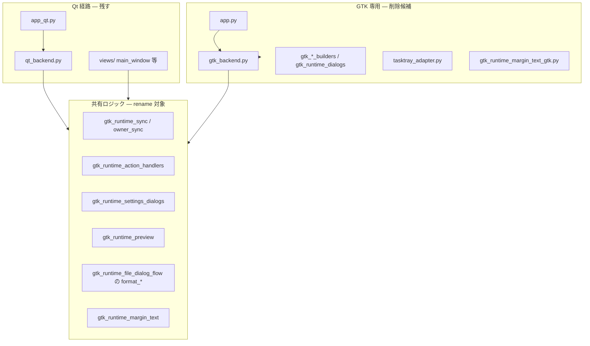

# Q-01 — GTK メンテ対象外化・Qt 一本化 計画（棚卸）

最終更新: 2026-06-10（オーナー承認）  
親: [maturation §Q-01](../online-issues/maturation-20260609-qt-common.md#q-01--gtk-メンテ対象外化qt-一本化)  
前提: MAT-01〜18 / MAT-10 / MAT-14b 完了（#442〜#470）。Post Main Merge CI 緑（#470 マージ後）。**Q-01 承認済み**（付録 C レビュー後）。

---

## 1. 何をするか（product）

**GTK backend を製品線から外し、Qt を唯一の GUI 開発・メンテ対象にする。** v2.0.0 の骨格。

| やること | やらないこと |
| --- | --- |
| entrypoint / packaging / docs で **GTK を非推奨または削除** | GTK への **parity 拡張**（Preset / Profile UI 等） |
| 共有ロジック（誤名 `gtk_runtime_*`）の **rename / 移設** | [overview §Xfce 熟成メモ](20260609-1200-feature-overview.md#熟成運転メモxfce-実機) の **削除** |
| `harite-foundation-spec` / `harite-gui-spec` の **Qt 一本化記述** | 図版品質フィルタ等の **source 特別対策**（別論点） |

**オーナー判断（2026-06-10 · 確定）**

| 項目 | 決定 | 理由 |
| --- | --- | --- |
| **方針全体** | **承認** — 重複は rename、それ以外は GTK 削除 | デュアル維持は管理限界（付録 C）。Qt に製品価値が集約済み |
| v2.0.0 と GTK | **B: v2.0.0 で GTK コード削除** | Qt 一本化を版と一致させる |
| 共有 `gtk_runtime_*` | **rename / 移設**（P3） | Qt が依存。削除ではなく `gui_runtime_*` 等へ |
| GTK UI 専用層 | **削除**（P2） | `gtk_backend`, builders, `app.py`, GTK tasktray 等 |
| `harite-gtk` | **削除** | GTK entry 廃止 |
| `harite-gui` | **`harite-qt` へエイリアス**（実装時確定） | 旧名利用者への移行緩和。正は `harite-qt` |
| Linux tray | GTK AppIndicator **廃止** → **Qt `QSystemTrayIcon` 継続** | `qt_tray_adapter` 既存 |
| parity 拡張 | **しない** | 付録 C の ✗/△ は GTK に足さない |

---

## 2. 現状アーキテクチャ（2026-06-10 棚卸）

### 2.1 エントリーポイント

| script | モジュール | 備考 |
| --- | --- | --- |
| `harite` | `harite.cli` | CLI（GTK 非依存） |
| `harite-gtk` | `harite.gui.app` | GTK 専用 |
| `harite-gui` | `harite.gui.app` | **gtk と同一**（後方互換名） |
| `harite-qt` | `harite.gui.app_qt` | Qt（開発フォーカス） |

`pyproject.toml`: `gui-qt = ["PyQt6>=6.4"]` のみ。PyGObject は **同梱しない**（ホスト `python3-gi` + GTK3 依存）。

### 2.2 三層の切り分け（実装の核心）

GTK 関連は **一括削除不可**。`gtk_runtime_*` の多くは **Qt backend から import されている**（歴史的命名）。

**教訓:** Q-01 は「GTK ファイル削除」ではなく **(1) GTK UI 層の除去** + **(2) 共有モジュールの rename** の二段。

### 2.3 `src/harite/gui/adapters/` — ファイル棚卸（行数）

| ファイル | 行数 | 層 | Qt 依存 | Q-01 扱い |
| --- | ---: | --- | --- | --- |
| `gtk_backend.py` | 1001 | GTK UI | ✗ | **削除** |
| `gtk_runtime_dialogs.py` | 863 | GTK UI | ✗ | **削除** |
| `gtk_tab_builders.py` | 849 | GTK UI | ✗ | **削除** |
| `gtk_runtime_settings_dialogs.py` | 420 | 共有 | ◎ `qt_backend` | **rename → `gui_runtime_settings` 等** |
| `gtk_runtime_file_dialog_flow.py` | 277 | 混在 | ◎ `format_*` | **分割**（format ヘルパー抽出 / ダイアログ handler 削除） |
| `gtk_dialog_builders.py` | 232 | GTK UI | ✗ | **削除** |
| `gtk_runtime_sync.py` | 221 | 共有 | ◎ | **rename** |
| `gtk_runtime_object_registry.py` | 211 | GTK UI | ✗ | **削除** |
| `gtk_runtime_slideshow_ui.py` | 193 | 混在 | △ `commit_slideshow_interval` | **分割** |
| `gtk_layout_builders.py` | 182 | GTK UI | △ drawer icon のみ | **削除**（drawer の GTK 分岐は views 側と同時） |
| `gtk_runtime_widget_access.py` | 179 | GTK UI | ✗ | **削除** |
| `gtk_runtime_preview.py` | 149 | 共有 | ◎ | **rename**（`set_preview_widget_gtk` 等は削除） |
| `gtk_runtime_signal_wiring.py` | 146 | GTK UI | ✗ | **削除** |
| `gtk_runtime_slideshow.py` | 89 | GTK UI | ✗ | **削除** |
| `gtk_runtime_action_handlers.py` | 57 | 共有 | ◎ | **rename** |
| `gtk_runtime_margin_text_gtk.py` | 38 | GTK UI | ✗ | **削除** |
| `gtk_runtime_state_labels.py` | 37 | GTK UI | ✗ | **削除** |
| `gtk_runtime_save_path_access.py` | 37 | GTK UI | ✗ | **削除** |
| `gtk_runtime_owner_sync.py` | 37 | 共有 | ◎ | **rename** |
| `gtk_runtime_builders.py` | 33 | GTK UI | ✗ | **削除** |
| `gtk_runtime_margin_text.py` | 27 | 共有 | ◎ | **rename** |

**合計（adapters gtk*.py）:** 22 ファイル · 約 **5,300 行**（うち GTK 専用 約 **3,900 行**、共有・混在 約 **1,400 行**）。

**両 backend 共用（削除しない）:** `ui_adapter.py`（`RUNTIME_HANDLER_MAP`）。

### 2.4 `views/` の GTK 分岐

| ファイル | GTK 固有 | 備考 |
| --- | --- | --- |
| `slideshow_options_drawer.py` | `_gtk_*`, `gi.repository.Gtk` | `apply_drawer_open_state` 内分岐 |
| `margins_options_drawer.py` | 同上 | 同上 |
| `display_scale_surface.py` | `build_*_gtk`, `read_*_gtk` | Qt 版は `build_*_qt` あり |
| `footer_feedback.py` | `configure_footer_error_label_gtk` | Qt 版あり |
| `drawer_window_resize.py` | `Gtk` import 分岐 | |
| `main_window.py` | `format_slideshow_path_display` import のみ | 共有ヘルパー経由 |

### 2.5 その他

| 対象 | GTK 依存 | Q-01 |
| --- | --- | --- |
| `app.py` | ◎ PyGObject 必須 | 削除 or 非推奨スタブ |
| `app_qt.py` | ✗ | **正**の GUI entry |
| `tasktray_adapter.py` | ◎ AppIndicator + GTK | **削除**（GTK 専用） |
| `sources_remote*` / `core` | ✗ | 触らない |
| CI (`.github`) | Qt matrix のみ | **GTK ジョブなし** — 変更小 |

---

## 3. テスト棚卸

| ファイル | 行数 | 扱い |
| --- | ---: | --- |
| `test_gtk_runtime_backend.py` | 2739 | **削除**（GTK backend 専用・最大） |
| `test_gtk_runtime_action_handlers.py` | 69 | **移設**（handler ロジックは残る） |
| `test_runtime_preview.py` | — | **移設**（`gtk_runtime_preview` → rename 先） |
| `test_app_entrypoint.py` | — | GTK present をモック — **Qt entry に寄せる** |
| `test_qt_*`, `test_p03_*` 等 | — | `gtk_runtime_*` import — rename 追従 |
| `test_slideshow_options_drawer.py` | — | `test_toggle_gtk_revealer` — **削除** |
| `test_margins_options_drawer.py` | — | 同上 |
| `test_tasktray_adapter.py` | — | **削除 or 縮小** |
| `test_settings_canonical_guard.py` | — | `SettingsDialogProxy` — GTK 削除後に整理 |

---

## 4. ドキュメント棚卸

### 4.1 正本（実装と同期必須）

| 文書 | GTK 記述量 | 更新方針 |
| --- | --- | --- |
| [harite-foundation-spec.md](../specs/harite-foundation-spec.md) §4, §9, §10 | 多い | デュアル → **Qt 一本** |
| [harite-gui-spec.md](../specs/gui/harite-gui-spec.md) | **厚い**（GTK 章） | GTK 節を **付録 or 削除**、Qt を正 |
| [harite-slideshow-spec.md](../specs/slideshow/harite-slideshow-spec.md) | 少 | GTK 言及除去 |
| [harite-core-spec.md](../specs/core/harite-core-spec.md) | ほぼなし | 軽微 |

### 4.2 運用・配布

| 文書 | 更新 |
| --- | --- |
| [README.md](../../README.md) | `harite-gui` / GTK → **`harite-qt` 中心** |
| [release-delivery.md](../release-delivery.md) | XFCE `harite-gui` 手順 → 歴史 or Qt |
| [CHANGELOG.md](../../CHANGELOG.md) | v2.0.0 で GTK 廃止を明記 |
| [manual-validation-gate.md](../manual-validation-gate.md) | GTK 実機ゲートの扱い |

### 4.3 残す（削除しない）

| 文書 | 理由 |
| --- | --- |
| [overview §Xfce 熟成メモ](20260609-1200-feature-overview.md#熟成運転メモxfce-実機) | **観測記録**（maturation 方針） |
| `docs/working/finished/*pyqt6*` 等 | migration 履歴 |
| `docs/working/design/*glade*` | レガシー解釈 |

### 4.4 ステータス更新が必要な working

| 文書 | 現状 | 更新 |
| --- | --- | --- |
| [20260609-1200-feature-overview.md](20260609-1200-feature-overview.md) | MAT-10 等が旧ステータス | Q-01 **着手**、MAT-10/18/14b **完了** |
| [20260610-v2-roadmap-op3-planning.md](20260610-v2-roadmap-op3-planning.md) | Q-01 未着手 | **planning 中** |
| [online-issues/README.md](../online-issues/README.md) | backlog 表が旧 | MAT 完了反映 |

---

## 5. GTK の既知ギャップ（parity しない根拠）

[overview §Xfce](20260609-1200-feature-overview.md) より — **記載のみ・特別対策しない**:

| 事象 | 方針 |
| --- | --- |
| Preset / Profile UI なし | settings が部分的に展開される副作用 — **直さない** |
| Slideshow remote preset の体験 | Qt で成立済み（op5）。GTK はメンテ対象外 |
| path label / drawer 等の Xfce 細部 | 修正履歴は熟成メモに残す。GTK コード削除で **実害は消える** |

---

## 6. 実装フェーズ案

| Phase | 内容 | ゲート |
| --- | --- | --- |
| ~~**P0**~~ | 本計画 + オーナー判断（§1 表）+ 付録 C | **完了**（2026-06-10 承認） |
| **P1** | entrypoint: `harite-gui` 方針、`harite-gtk` 非推奨/削除、README | 手動 `harite-qt` |
| **P2** | GTK UI 層削除（`gtk_backend`, builders, `app.py`, tasktray） | pytest 緑（GTK テスト削除後） |
| **P3** | `gtk_runtime_*` rename / 分割（`gui_runtime_*` or `services/gui_*`） | `qt_backend` import 更新 |
| **P4** | `views/` の `_gtk_*` 分岐削除 | drawer / margin テスト |
| **P5** | spec / foundation / CHANGELOG / v2.0.0 版上げ | Post Main Merge CI |

**推奨:** P2 と P3 は **別 PR**（P2 だけで 4k 行削除、P3 は広範 rename）。

---

## 7. リスク・依存

| リスク | 緩和 |
| --- | --- |
| rename で import 漏れ | grep ゲート + pytest |
| `test_gtk_runtime_backend.py` 削除でカバレッジ低下 | 共有ロジックは `test_runtime_preview` 等へ移設 |
| Linux 利用者が `harite-gui` 前提 | README + CHANGELOG + エイリアス期間 |
| K-04（plugin 拡張パック） | Q-01 後の packaging 議論と接続（overview §2） |

---

## 8. 次のアクション

1. ~~オーナー承認~~ **完了**（2026-06-10）
2. **P2** PR — GTK UI 層削除（最大 diff。`test_gtk_runtime_backend.py` 等）
3. **P3** PR — `gtk_runtime_*` rename（Qt import 追従）
4. **P4** — `views/` GTK 分岐削除
5. **P1/P5** — entrypoint（`harite-gtk` 削除・`harite-gui`→`harite-qt`）、spec / CHANGELOG / **v2.0.0**

**推奨着手順:** P2 → P3 → P4 → P1+P5（rename 後に entrypoint を締めると import 漏れが少ない）。小さく刻むなら P2 を GTK-only ファイル単位で分割 PR も可。

---

## 付録 A — `qt_backend.py` が import する `gtk_runtime_*`（rename 必須一覧）

- `gtk_runtime_preview` — sync / set preview
- `gtk_runtime_sync` — action / slideshow / main / input / margins / feedback
- `gtk_runtime_owner_sync` — owner → widget 同期一式
- `gtk_runtime_settings_dialogs` — settings / color / about ダイアログロジック
- `gtk_runtime_margin_text` — `sanitize_margin_text`
- `gtk_runtime_action_handlers` — `run_optimize_clicked`, `run_apply_clicked`
- `gtk_runtime_slideshow_ui` — `commit_slideshow_interval_from_spin` のみ

## 付録 B — 関連 PR / マージ

| PR | 内容 |
| --- | --- |
| #470 | MAT-10 江戸切絵図（Q-01 直前までの最後の feature PR） |

## 付録 C — GTK / Qt 機能差（レビュー用）

**読み方**

| 記号 | 意味 |
| --- | --- |
| ◎ | UI・操作とも Qt/GTK で **同等**（または GTK でも widget あり） |
| △ | **部分** — settings / owner state は読むが UI が無い・弱い・副作用あり |
| ✗ | **Qt のみ**（GTK に widget / 導線なし） |
| — | 該当なし / backend 非依存 |

**方針（Q-01）:** ✗ / △ の GTK 側は **parity 拡張しない**。v2.0.0 で GTK を外すと、表の **✗ 列が製品の正** になる。

**正本・補足:** [p03 3layer audit](finished/20260606-p03-3layer-audit.md) §Widget 棚卸、[overview §Xfce](20260609-1200-feature-overview.md#熟成運転メモxfce-実機)、maturation §MAT-14b / §MAT-18 等。

### C.1 一覧

| 領域 | 機能 | GTK | Qt | GTK 削除の影響 | 備考 |
| --- | --- | --- | --- | --- | --- |
| **起動** | GUI entrypoint | `harite-gtk` / `harite-gui` | `harite-qt` | Linux も Qt 起動に統一 | PyGObject 不要に |
| **起動** | 依存 | ホスト GTK3 + `python3-gi` | `PyQt6`（`gui-qt` extra） | packaging 簡素化 | |
| **Core** | optimize / apply / slideshow 本体 | — | — | **変化なし** | `MainWindow` + core 共通 |
| **Core** | remote preset sync / tick | — | — | **変化なし** | MAT-02b / MAT-10 等は core |
| **Main** | 入力 path L/R・Clear L/R | ◎ | ◎ | — | |
| **Main** | **Swap L/R** | ✗ | ◎ | 欠落解消（Qt のみだった差） | [p03 audit](finished/20260606-p03-3layer-audit.md) |
| **Main** | direction toggle 十字 | ◎ | ◎ | — | MAT-01 Qt 修正済 |
| **Main** | display scale %（100–200） | ◎ | ◎ | — | MAT-14。Compose combo |
| **Main** | **auto 倍率** checkbox（MAT-14b） | ✗ | ◎ | 欠落解消 | GTK は `gtk_runtime_sync` が checkbox **同期のみ**（widget 未配置） |
| **Main** | Optimize / Apply / preview | ◎ | ◎ | — | 共有 `gtk_runtime_*` 経由 |
| **Main** | Color dialog フロー | ◎ | ◎ | — | MAT-03 Qt 修正済 |
| **Main** | margin text（embed） | ◎ | ◎ | — | MAT-07 Qt 修正済 |
| **Main** | Margins 一括変更（MAT-09） | ◎ | ◎ | — | maturation §MAT-09 |
| **Main** | Margins drawer | ◎ | ◎ | — | Xfce で revealer 登録問題は修正済 |
| **Slideshow** | Srcdir L/R 選択 | ◎ | ◎ | — | |
| **Slideshow** | **Srcdir Clear L/R** | ✗ | ◎ | 欠落解消 | C-02 Qt-only layout |
| **Slideshow** | **Srcdir Swap L/R** | ✗ | ◎ | 欠落解消 | 同上 |
| **Slideshow** | **Preset combo L/R**（catalog） | ✗ | ◎ | **主要ギャップ解消** | C-02。NDL/CODH/JMA/kiriezu 選択 |
| **Slideshow** | **Profile combo** | ✗ | ◎ | 欠落解消 | L/R 一括 profile |
| **Slideshow** | **Manage sources and profiles** | ✗ | ◎ | 欠落解消 | `qt_source_registry_dialog`。local 追加・preset 一覧・keyword |
| **Slideshow** | keyword chip（CODH / NDL） | ✗ | ◎ | 欠落解消 | 読み取り専用表示 |
| **Slideshow** | **auto 倍率** L/R（MAT-14b） | ✗ | ◎ | 欠落解消 | Slideshow タブ checkbox |
| **Slideshow** | Interval / Start・Stop / Mode | ◎ | ◎ | — | |
| **Slideshow** | options drawer（詳細行） | ◎ | ◎ | — | current / output 等 |
| **Slideshow** | path ラベル省略 | △ | ◎ | — | GTK は basename 省略が弱い（overview 追記） |
| **Slideshow** | **settings 由来の preset 表示** | △ | ◎ | 副作用消滅 | UI 無しでも `slideshow_source_id_*` 等が **部分展開**（overview 記載） |
| **Slideshow** | remote preset の **運用体験** | △ | ◎ | **MAT-08 op5 相当が GTK では不可** | combo / Manage / keyword 無し |
| **Settings** | Settings / Color / About  dialog | ◎ | ◎ | — | ロジックは共有モジュール |
| **Settings** | `ndl_keyword` / `codh_keyword` 編集 | ✗ | ◎ | Manage 経由のみ（Qt） | MAT-18 / MAT-05 |
| **表示** | footer error 赤（MAT-13） | ◎ | ◎ | — | |
| **表示** | 単 display 時 R スロット無効（P-03） | △ | ◎ | — | GTK は slideshow combo 等が無く fade 対象が少ない |
| **Tray** | タスクトレイ | ◎ AppIndicator | ◎ `QSystemTrayIcon` | 実装方式変更 | 両方ある。Linux で見え方は異なりうる |
| **Platform** | Windows 開発フォーカス | ✗ 非推奨 | ◎ | — | |
| **Platform** | Xfce + Qt IME（keyword） | — | △ | — | MAT-06: distro PyQt6 + `qtsvg` 等（#448） |
| **CLI** | `harite slideshow` + settings（MAT-17） | — | — | **変化なし** | GUI backend 非依存 |

### C.2 まとめ（レビュー判断用）

| 観点 | GTK 現状 | Qt 現状 | Q-01 で捨ててよいか |
| --- | --- | --- | --- |
| **Preset / Profile slideshow** | UI ほぼ無し。settings 漏れで紛らわしい | op5 まで成立（#467–#470） | **はい** — GTK に足さない |
| **MAT-14b auto 倍率** | checkbox 無し | Main + Slideshow 露出 | **はい** |
| **MAT-18 / MAT-10 preset** | 選べない | 同梱 preset フル | **はい** |
| **Main/Slideshow の L/R 操作** | Swap・一部 Clear 無し | 揃っている | **はい** |
| **XFce 細部（path 省略・drawer）** | 熟成メモに残る | 実用十分 | **はい**（メモは残す） |

**結論:** GTK 削除で失うのは「GTK 版として不完全だった UI」が中心。v2.0.0 の製品価値は **Qt 列** に既に載っている。
