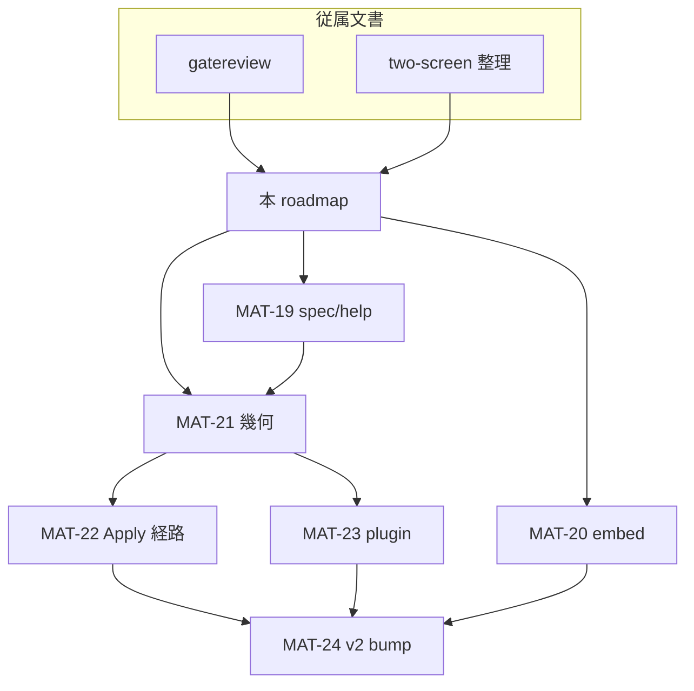

# v2.0.0 前 CLI / 幾何 — next roadmap

最終更新: 2026-06-12（MAT-23 plugin 自動判定）  
親: [20260609 feature-overview](20260609-1200-feature-overview.md) §1  
ブランチ文脈: `docs/pre-bump-v2.0.0-planning`（Q-01 #472 完了後）

**ステータス: planning 中（実装未着手）。** 本稿が **独立 planning 入口**。従属文書は観測・方針の根拠のみ。

## 従属文書

| 文書 | 役割 |
| --- | --- |
| [20260611-pre-bump-cli-gatereview.md](20260611-pre-bump-cli-gatereview.md) | CLI 実機観測・仕様ギャップ・修正すべき点の列挙 |
| [20260611-two-screen-display-params-clarification.md](20260611-two-screen-display-params-clarification.md) | `two_screen` / `resolution` / `l_display` / `r_display` の母体対比・四重露出の整理 |

正本（改定は各 MAT 着手時）: [harite-cli-spec.md](../specs/cli/harite-cli-spec.md)、[harite-core-spec.md §3](../specs/core/harite-core-spec.md#3-入力解決と表示コンテキスト)

---

## 1. 背景

- **きっかけ:** v2.0.0 bump 前の CLI 総点検。Slideshow 実機確認の宿題から Optimize / Apply / 表示パラメータへ波及。
- **Q-01 完了後の位置づけ:** GTK 廃止は済。**製品線として Qt 一本化の次**は、CLI と表示幾何の「一本筋」を通してから `v2.0.0` を切る。
- **破壊的 CLI 変更:** **v2.0.0 への必須ゲート**。利用者はまだ広くないため、まとめて載せてよい（オーナー判断 2026-06-11）。

---

## 2. 一本筋が通っていない点（修正対象の整理）

従属文書から抽出。層ごとに並べ、後続 MAT のスコープ境界とする。

### A. 表示幾何（根幹）

| # | 問題 | 参照 |
| --- | --- | --- |
| A1 | 2枚入力でも `two_screen=OFF` → **1キャンバス半分ずつ**の第3経路（母体に無い） | two-screen §4.1 |
| A2 | `two_screen` / `resolution` / `l_display` / `r_display` の **四重露出** | two-screen §4.2 |
| A3 | Settings の TwoScreen Off が JSON 経由で意図しない OFF を生む | two-screen §5.2 |
| A4 | Apply の Span / auto-split / left-right-file が optimize 幾何と **二重管理** | gatereview §Apply |

### B. CLI サーフェス

| # | 問題 | 参照 |
| --- | --- | --- |
| B1 | Optimize と Apply の **分断**（`--file`、左右別ファイルの再入力） | gatereview §Apply |
| B2 | `--plugin` 手動指定（Optimize / Apply / Slideshow） | gatereview 各節 |
| B3 | `--embed-info=none` が冗長 | gatereview §optimize |
| B4 | `--embed-info=params` が実態とずれる → `settings` へ | gatereview §optimize |
| B5 | `harite --help` の completion 系が説明なし | gatereview §CLI共通 |
| B6 | optimize `--help` の margins / two-screen 文言が MAT-15 と不整合 | gatereview §optimize |

### C. コア挙動・品質（観測）

| # | 問題 | 参照 |
| --- | --- | --- |
| C1 | embed-info がマージン未確保時に **画像へ重畳** | gatereview §埋め込み情報 |
| C2 | embed 文字色 — 背景に対する W3C 輝度ベース自動黒/白 | gatereview §埋め込み情報 |
| C3 | `Placement:` ダンプの意味が spec に無い | gatereview §仕様書 |
| C4 | margins 指定時の Placement 不変（要切り分け） | gatereview §margins |

### D. ドキュメント・リリース

| # | 問題 | 参照 |
| --- | --- | --- |
| D1 | CLI spec の現行挙動とのギャップ総点検（MAT 番号の網羅は不要） | gatereview §仕様書 |
| D2 | v2.0.0 bump + CHANGELOG + 熟成再確認 | 本稿 §6 |

---

## 3. MAT 一覧（MAT-19〜24）

| ID | 名称 | 主スコープ | 完了の目安 |
| --- | --- | --- | --- |
| **MAT-19** | CLI spec / help 点検反映 | B5, B6, C3, D1 | help と正本が現行コード + MAT-15 と一致 — **完了** |
| **MAT-20** | embed-info 整理 | B3, B4, C1, C2 | 重畳なし・CLI 名一致・文字色自動 |
| **MAT-21** | 表示幾何一本化 | A1–A3, A2（四重露出） | 2枚＝dual の一貫性。露出ノブの格下げ/廃止方針確定 |
| **MAT-22** | Optimize / Apply 経路整理 | A4, B1 | CLI で「合成→適用」の mental model が分断しない |
| **MAT-23** | plugin surface 縮小 | B2 | `--plugin` 廃止・自動判定 |
| **MAT-24** | 熟成 + v2.0.0 | D2 | ゲート消化・版 bump |

---

## 4. 改修順序（推奨）

```text
MAT-19 ──┬──► MAT-21 ──► MAT-22 ──┬──► MAT-24
         │                         │
MAT-20(前半: C1/C4 調査) ──────────┼──► MAT-20(後半: B3/B4/C2)
                                   │
                          MAT-23 ──┘
```

| 順 | MAT | 理由 |
| --- | --- | --- |
| 1 | **MAT-19** | コード変更前に「正」の文言を固定 |
| 2 | **MAT-20 前半** | 実機で見つかった品質問題を単体で潰す |
| 3 | **MAT-21** | Apply 整理・Slideshow・Settings の前提。四重露出の解き方がここで決まる |
| 4 | **MAT-22 + MAT-23** | 幾何確定後に CLI サーフェスを削れる |
| 5 | **MAT-20 後半** | CLI 破壊変更を v2.0.0 にまとめて載せる |
| 6 | **MAT-24** | 製品線として言える状態で版を切る |

**MAT-20 と MAT-24 の間（housekeeping）:** [20260612-pre-release-housekeeping.md](20260612-pre-release-housekeeping.md) — requirements / トレイ / 回帰 / 正本 MAT 除去の順序確定。

**横断（ID なしで並行可）:** PowerShell 複数 `--input` のエラーメッセージ改善、`Placement:` の人間可読化（verbose 分離）は MAT-19 に含めてよい。

---

## 5. オーナー判断・未決事項

### MAT-19 — CLI spec / help 点検反映（完了 2026-06-12）

**ステータス:** **完了**（`feature/mat-19-cli-spec-help-20260612`）。正本: [harite-cli-spec.md](../specs/cli/harite-cli-spec.md) §4 / §4.1 / §8。

| 項目 | 対応 |
| --- | --- |
| **B5** | ルート `--help` に Typer 既定の completion 説明あり。spec §8 で「残す」を確定 |
| **B6** | optimize docstring / `--margins` / `--align` / `--valign` help が MAT-15 幾何と一致。廃止フラグは help に非露出 |
| **C3** | `Placement:` 一行形式は spec §4.1（既存）。テスト `test_format_placement_line_matches_cli_spec` で固定 |
| **D1** | spec の apply `-c` 矛盾・旧 `resolution` フロー記述・廃止節の誤記を修正 |

**スコープ外（MAT-20）:** embed-info リネーム（`params`→`settings`）、`none` 既定の見直し。

### MAT-21 — 表示幾何（前半・後半完了）

**前半（実装済み）**

- 2枚入力 → dual 必須。半分キャンバス第3経路廃止。
- 2枚 + 検出 display `< 2` → **エラー**（1枚目フォールバックなし）。`--no-two-screen` / settings `two_screen: false` もエラー。
- GUI: 検出1台では片側コントロール無効化・1枚運用（従来どおり）。

**後半（実装済み — [two-screen 整理メモ](20260611-two-screen-display-params-clarification.md#6-将来整理の方向オーナー判断確定-2026-06-12)）**

- 四重露出（`two_screen` / `resolution` / `l_display` / `r_display`）を CLI・settings・GUI・embed から撤去。旧キーは読み捨て。
- public surface は **`canvas_scale_percent`（1–100）** のみ。CLI `--canvas-scale`、GUI Settings「Canvas scale %」。
- 手動 l/r override は廃止。内部 `two_screen` / 合成 `resolution` は `resolve_optimize_display_settings` が導出。
- §6.5 embed 略称正規化（`posit` 等）は別フェーズ。

### MAT-22 — Optimize / Apply 経路整理（オーナー判断確定 2026-06-12）

**ステータス:** **実装済み**（`feature/mat-22-apply-path-20260612`、PR 待ち）。正本: [harite-cli-spec.md §5](../specs/cli/harite-cli-spec.md#5-applymat-22) + 本節 + [gatereview §Apply](20260611-pre-bump-cli-gatereview.md)。

#### 何を「一本化」するか（再確認）

| 一本化する | 一本化しない |
| --- | --- |
| 合成結果の **再入力**（`apply --file` 必須の廃止） | サブコマンド名の物理マージ（`optimize` と `apply` は別 verb のまま可） |
| apply mode の **二重ノブ**（CLI `--auto-split` / `--left-file` 等 → settings `apply_mode` に寄せる） | GUI の **2 ボタン**（Optimize / Apply は維持） |
| Slideshow / GUI と同型の **optimize → apply 連鎖** | core 関数名（`optimize_wallpapers` / `resolve_apply_settings`） |

**採用困難（据え置き）:** `optimize --apply` だけ足す **フラグ延長** — 再入力は消えても「合成と適用が別フェーズ」という議論が残る。  
**採用困難:** CLI を **Apply 1 サブコマンドに名前マージ** — GUI の `Compose → Optimize → Apply` と用語がずれる。

#### 参照実装（既に一本化されている経路）

```text
GUI Main:  on_optimize → last_saved_files → on_apply → resolve_apply_settings(apply_mode from settings)
Slideshow: 毎 cycle run_slideshow_optimize → resolve_apply_settings（ユーザーに合成ファイル名を見せない）
```

CLI だけが `optimize` 出力を `--file` で再指定し、`--auto-split` 等で settings と別管理している。

#### 用語の揃え方（提案・オーナー確認）

| 層 | 合成（画像生成） | OS 壁紙設定 | 備考 |
| --- | --- | --- | --- |
| **GUI ボタン** | **Optimize** | **Apply** | 変更なし（spec §3 P-04） |
| **CLI サブコマンド** | **`optimize`** | **`apply`** | 名前は GUI と対応させる（Apply に寄せて1 verb化はしない） |
| **settings キー** | optimize 面（`canvas_scale_percent`, margins, …） | **`apply_mode`**, `plugin`, `windows_apply_span` | apply mode は Settings / GUI radio が正本 |
| **ユーザー向けフロー文言** | Compose → Optimize → Apply | 同上 | 「統合」は **データ経路** の話 |

→ **確定:** 公開用語は **Optimize＝合成、Apply＝壁紙設定** で統一。CLI も **両サブコマンドを残す**。

#### オーナー判断（確定）

| ID | 論点 | 決定（2026-06-12） |
| --- | --- | --- |
| **D1** | 常用 CLI ストーリー | **`optimize` → `apply` の 2 段**。再入力なし（D2/D3） |
| **D2** | `apply` の合成ファイル入力 | **省略時は直前 `optimize` 出力を追跡**。`--file` は上級・既存 JPEG 用に **任意残し可**（非推奨） |
| **D3** | 追跡の実装 | **副作用 JSON**（裏で保持）。Slideshow の固定スロット（`harite_slideshow.jpg` 等）と同系の「名前をユーザーに見せない」パターン |
| **D4** | apply mode の CLI 露出 | **settings `apply_mode` のみ**（`-c` 推奨）。シェル 1 行化は `optimize …; apply -c …` で足りる（専用フラグは不要） |
| **D5** | `per-monitor-explicit` | **CLI から廃止**（`--left-file` / `--right-file`） |
| **D6** | 合成のみ | **`optimize` 単体が既定**（Export / 確認用） |
| **D7** | `--plugin` | **MAT-23** へ。MAT-22 では settings `plugin` に追従 |

#### 確定後の CLI 像

```powershell
# 合成のみ（Export / 確認用）
harite optimize -i "left.jpg,right.jpg" -c settings.json -o ./out

# 壁紙まで（再入力なし）
harite optimize -i "left.jpg,right.jpg" -c settings.json -o ./out
harite apply -c settings.json

# 1 行（D4: 専用フラグ不要）
harite optimize -i "left.jpg,right.jpg" -c settings.json -o ./out; harite apply -c settings.json
```

- `apply` は `--file` 省略時、D3 の追跡 JSON から composite path を読む。`apply_mode` / `plugin` / `windows_apply_span` は `-c` の settings を正とする（CLI 側に mode フラグは出さない）。
- settings 未指定時: `apply_mode` 既定は GUI と同じ `per-monitor-auto-split`（単一 display 時は core 規則で `single-file` に落ちうる）。

#### D3 実装メモ（着手時）

| 項目 | 方針 |
| --- | --- |
| ファイル名 | 仮: `.harite-last-optimize.json`（spec 改定で確定） |
| 書き込み | `optimize` 成功時（`Saved:` と同タイミング） |
| 内容 | 最低限 `composite_path`（絶対 path）、任意で `output_dir`, `timestamp` |
| 読み込み | `apply` で `--file` 未指定時のみ。欠落・不正は終了コード `2` |
| 配置 | `output_dir` 直下、または settings 既定 output と同階層（spec で1つに固定） |

#### CLI から削る候補（D4/D5 確定時）

| 削除候補 | 代替 |
| --- | --- |
| `apply --file`（必須→任意/非推奨） | 直前 optimize 追跡（D3） |
| `--auto-split`, `--left-file`, `--right-file`, `--per-monitor` | settings `apply_mode` |
| （MAT-23）`--plugin` | OS 自動判定 + settings `plugin` |

#### MAT-22 完了の目安

- gatereview「optimize で生成したファイルを再入力させない」を CLI で満たす
- `apply` help が settings `apply_mode` 中心の説明になる
- spec（cli / gui / core §5）に追跡ファイル規則と apply 省略形が書かれる
- テスト: `optimize` → `apply`（`--file` なし）が GUI `_apply_latest` と同型

#### MAT-22 と MAT-23 の境界

- **MAT-22:** 再入力・apply mode 二重管理の解消、`apply` の薄型化
- **MAT-23:** `--plugin` 廃止と自動判定（optimize / apply / slideshow 横断）

### MAT-23 — plugin surface 縮小（実装済み・PR 待ち）

- **撤去:** `apply` / `slideshow` の CLI `--plugin` / `-p`
- **残す:** settings `plugin` キー、GUI Settings の Plugin 行、OS 既定（`_default_plugin_name()`）
- **優先順:** settings `plugin` > OS 既定（win32→windows, darwin→macos, else→linux）
- **完了目安:** help に `--plugin` なし、settings 経由で plugin 上書き可能、xfce smoke runner は `-c` 経由

### v2.0.0 ゲート（必須）

| 必須 | 内容 |
| --- | --- |
| MAT-21 | 表示幾何の製品ストーリーが通る |
| MAT-22 | Apply 分断（再入力・二重ノブ）の解消 |
| MAT-20 | embed 重畳バグ修正 |
| 再確認 | Slideshow CLI 実機（gatereview で一次確認済み → 幾何変更後に再実施） |
| MAT-19 | spec/help が現行と一致 — **完了** |

MAT-23（plugin）、MAT-20 後半（embed リネーム・輝度文字色）は **v2.0.0 に同梱**（破壊的変更のまとめ上げ）。シェル補完 option は **MAT-19 で残す**（Typer 既定）。

---

## 6. v2.0.0 リリースゲート（MAT-24）

- CHANGELOG 整備（CLI 破壊的変更を明示）
- `pyproject.toml` 版 bump
- Post Main Merge CI 緑
- チェックリスト（最低限）:
  - [ ] Optimize 2枚 dual（引用符付き input）
  - [ ] Slideshow dual + settings `-c`
  - [ ] embed-info 重畳なし
  - [ ] 2枚 + 検出1台のエラー（MAT-21 前半）
  - [x] 四重露出撤去・`canvas_scale_percent`（MAT-21 後半）
  - [ ] Apply 経路が gatereview の「再入力不要」に沿う（MAT-22 — PR マージ後に確認）

---

## 7. 依存関係



---

## 8. 変更履歴

| 日付 | 内容 |
| --- | --- |
| 2026-06-11 | 初版（gatereview + two-screen 整理から独立 planning 化。MAT-19〜24・順序・オーナー判断反映） |
| 2026-06-12 | MAT-21 完了反映。MAT-22 判断枠（D1–D7）追加 |
| 2026-06-12 | MAT-22 オーナー判断確定（D1–D7）。D4 は `;` 連鎖で 1 行化可 |
| 2026-06-12 | MAT-19 完了（spec D1 ギャップ修正、optimize/root help テスト強化、completion 残す方針） |
| 2026-06-12 | pre-release housekeeping 計画（requirements / トレイ / 正本 MAT 除去タイミング） |
