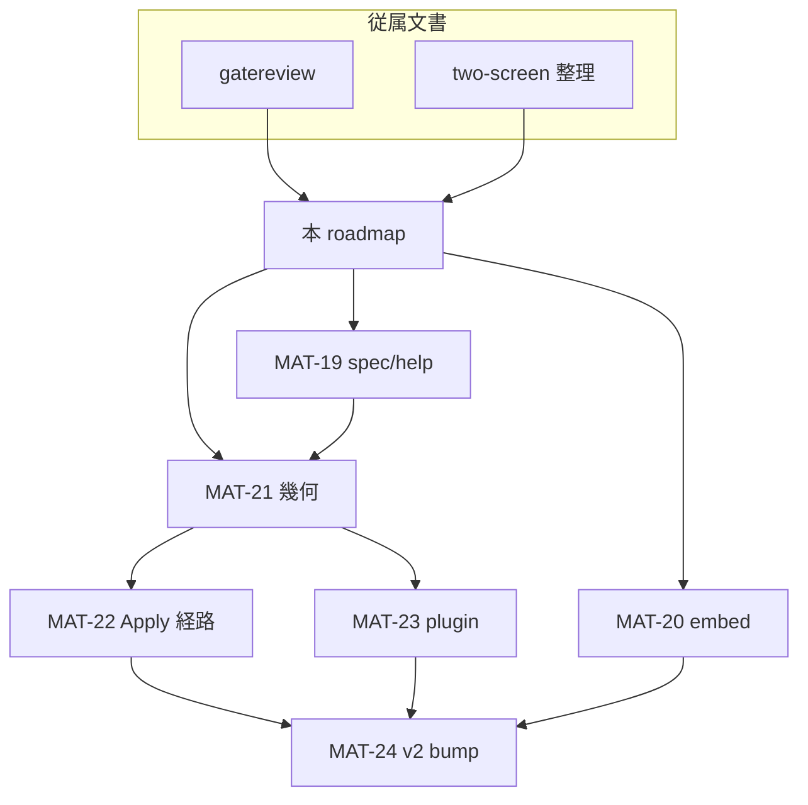

# v2.0.0 前 CLI / 幾何 — next roadmap

最終更新: 2026-06-11  
親: [20260609 feature-overview](20260609-1200-feature-overview.md) §1  
ブランチ文脈: `docs/pre-bump-v2.0.0-planning`（Q-01 #472 完了後）

**ステータス: planning 中（実装未着手）。** 本稿が **独立 planning 入口**。従属文書は観測・方針の根拠のみ。

## 従属文書

| 文書 | 役割 |
| --- | --- |
| [20260611-pre-bump-cli-gatereview.md](20260611-pre-bump-cli-gatereview.md) | CLI 実機観測・仕様ギャップ・修正すべき点の列挙 |
| [20260611-two-screen-display-params-clarification.md](20260611-two-screen-display-params-clarification.md) | `two_screen` / `resolution` / `l_display` / `r_display` の母体対比・四重露出の整理 |

正本（改定は各 MAT 着手時）: [harite-cli-spec.md](../specs/cli/harite-cli-spec.md)、[harite-core-spec.md §3](../specs/core/harite-core-spec.md#3-入力解決と表示コンテキスト)

---

## 1. 背景

- **きっかけ:** v2.0.0 bump 前の CLI 総点検。Slideshow 実機確認の宿題から Optimize / Apply / 表示パラメータへ波及。
- **Q-01 完了後の位置づけ:** GTK 廃止は済。**製品線として Qt 一本化の次**は、CLI と表示幾何の「一本筋」を通してから `v2.0.0` を切る。
- **破壊的 CLI 変更:** **v2.0.0 への必須ゲート**。利用者はまだ広くないため、まとめて載せてよい（オーナー判断 2026-06-11）。

---

## 2. 一本筋が通っていない点（修正対象の整理）

従属文書から抽出。層ごとに並べ、後続 MAT のスコープ境界とする。

### A. 表示幾何（根幹）

| # | 問題 | 参照 |
| --- | --- | --- |
| A1 | 2枚入力でも `two_screen=OFF` → **1キャンバス半分ずつ**の第3経路（母体に無い） | two-screen §4.1 |
| A2 | `two_screen` / `resolution` / `l_display` / `r_display` の **四重露出** | two-screen §4.2 |
| A3 | Settings の TwoScreen Off が JSON 経由で意図しない OFF を生む | two-screen §5.2 |
| A4 | Apply の Span / auto-split / left-right-file が optimize 幾何と **二重管理** | gatereview §Apply |

### B. CLI サーフェス

| # | 問題 | 参照 |
| --- | --- | --- |
| B1 | Optimize と Apply の **分断**（`--file`、左右別ファイルの再入力） | gatereview §Apply |
| B2 | `--plugin` 手動指定（Optimize / Apply / Slideshow） | gatereview 各節 |
| B3 | `--embed-info=none` が冗長 | gatereview §optimize |
| B4 | `--embed-info=params` が実態とずれる → `settings` へ | gatereview §optimize |
| B5 | `harite --help` の completion 系が説明なし | gatereview §CLI共通 |
| B6 | optimize `--help` の margins / two-screen 文言が MAT-15 と不整合 | gatereview §optimize |

### C. コア挙動・品質（観測）

| # | 問題 | 参照 |
| --- | --- | --- |
| C1 | embed-info がマージン未確保時に **画像へ重畳** | gatereview §埋め込み情報 |
| C2 | embed 文字色 — 背景に対する W3C 輝度ベース自動黒/白 | gatereview §埋め込み情報 |
| C3 | `Placement:` ダンプの意味が spec に無い | gatereview §仕様書 |
| C4 | margins 指定時の Placement 不変（要切り分け） | gatereview §margins |

### D. ドキュメント・リリース

| # | 問題 | 参照 |
| --- | --- | --- |
| D1 | CLI spec の現行挙動とのギャップ総点検（MAT 番号の網羅は不要） | gatereview §仕様書 |
| D2 | v2.0.0 bump + CHANGELOG + 熟成再確認 | 本稿 §6 |

---

## 3. MAT 一覧（MAT-19〜24）

| ID | 名称 | 主スコープ | 完了の目安 |
| --- | --- | --- | --- |
| **MAT-19** | CLI spec / help 点検反映 | B5, B6, C3, D1 | help と正本が現行コード + MAT-15 と一致 |
| **MAT-20** | embed-info 整理 | B3, B4, C1, C2 | 重畳なし・CLI 名一致・文字色自動 |
| **MAT-21** | 表示幾何一本化 | A1–A3, A2（四重露出） | 2枚＝dual の一貫性。露出ノブの格下げ/廃止方針確定 |
| **MAT-22** | Optimize / Apply 経路整理 | A4, B1 | CLI で「合成→適用」の mental model が分断しない |
| **MAT-23** | plugin surface 縮小 | B2 | `--plugin` 廃止・自動判定 |
| **MAT-24** | 熟成 + v2.0.0 | D2 | ゲート消化・版 bump |

---

## 4. 改修順序（推奨）

```text
MAT-19 ──┬──► MAT-21 ──► MAT-22 ──┬──► MAT-24
         │                         │
MAT-20(前半: C1/C4 調査) ──────────┼──► MAT-20(後半: B3/B4/C2)
                                   │
                          MAT-23 ──┘
```

| 順 | MAT | 理由 |
| --- | --- | --- |
| 1 | **MAT-19** | コード変更前に「正」の文言を固定 |
| 2 | **MAT-20 前半** | 実機で見つかった品質問題を単体で潰す |
| 3 | **MAT-21** | Apply 整理・Slideshow・Settings の前提。四重露出の解き方がここで決まる |
| 4 | **MAT-22 + MAT-23** | 幾何確定後に CLI サーフェスを削れる |
| 5 | **MAT-20 後半** | CLI 破壊変更を v2.0.0 にまとめて載せる |
| 6 | **MAT-24** | 製品線として言える状態で版を切る |

**横断（ID なしで並行可）:** PowerShell 複数 `--input` のエラーメッセージ改善、`Placement:` の人間可読化（verbose 分離）は MAT-19 に含めてよい。

---

## 5. オーナー判断・未決事項

### MAT-21 — 表示幾何（前半・後半完了）

**前半（実装済み）**

- 2枚入力 → dual 必須。半分キャンバス第3経路廃止。
- 2枚 + 検出 display `< 2` → **エラー**（1枚目フォールバックなし）。`--no-two-screen` / settings `two_screen: false` もエラー。
- GUI: 検出1台では片側コントロール無効化・1枚運用（従来どおり）。

**後半（実装済み — [two-screen 整理メモ](20260611-two-screen-display-params-clarification.md#6-将来整理の方向オーナー判断確定-2026-06-12)）**

- 四重露出（`two_screen` / `resolution` / `l_display` / `r_display`）を CLI・settings・GUI・embed から撤去。旧キーは読み捨て。
- public surface は **`canvas_scale_percent`（1–100）** のみ。CLI `--canvas-scale`、GUI Settings「Canvas scale %」。
- 手動 l/r override は廃止。内部 `two_screen` / 合成 `resolution` は `resolve_optimize_display_settings` が導出。
- §6.5 embed 略称正規化（`posit` 等）は別フェーズ。

### MAT-22 — Optimize / Apply 統合の形

- **採用困難:** `optimize --apply` のような **フラグによる分断**。所詮「合成と適用が別コマンド」の延長になり、設計議論が残る。
- **GUI との一貫性悩み:** GUI でも **Optimize（合成）と Apply（壁紙設定）でボタンが分かれる**。CLI をいきなり1サブコマンドにマージし **Apply に寄せる**と、GUI ラベル・ユーザ mental model との対応が崩れる。
- **MAT-22 で詰めること（未決）:**
  - CLI から削るのは `--file` / `left-file,right-file` / `auto-split` / 手動 `--plugin` 等の **余計な再入力・二重ノブ**
  - **サブコマンド名**（`optimize` と `apply` を残すか、別の一本化か）は spec 改定フェーズで GUI とセットで決める
- **目標は「経路の一本化」** であり、**名前のマージ必須ではない**。

### v2.0.0 ゲート（必須）

| 必須 | 内容 |
| --- | --- |
| MAT-21 | 表示幾何の製品ストーリーが通る |
| MAT-22 | Apply 分断（再入力・二重ノブ）の解消 |
| MAT-20 | embed 重畳バグ修正 |
| 再確認 | Slideshow CLI 実機（gatereview で一次確認済み → 幾何変更後に再実施） |
| MAT-19 | spec/help が現行と一致 |

MAT-23（plugin）、MAT-20 後半（embed リネーム・輝度文字色）、completion 廃止は **v2.0.0 に同梱**（破壊的変更のまとめ上げ）。

---

## 6. v2.0.0 リリースゲート（MAT-24）

- CHANGELOG 整備（CLI 破壊的変更を明示）
- `pyproject.toml` 版 bump
- Post Main Merge CI 緑
- チェックリスト（最低限）:
  - [ ] Optimize 2枚 dual（引用符付き input）
  - [ ] Slideshow dual + settings `-c`
  - [ ] embed-info 重畳なし
  - [ ] 2枚 + 検出1台のエラー（MAT-21 前半）
  - [ ] 四重露出撤去・Settings から two_screen 廃止（MAT-21 後半）
  - [ ] Apply 経路が gatereview の「再入力不要」に沿う（MAT-22 確定後）

---

## 7. 依存関係



---

## 8. 変更履歴

| 日付 | 内容 |
| --- | --- |
| 2026-06-11 | 初版（gatereview + two-screen 整理から独立 planning 化。MAT-19〜24・順序・オーナー判断反映） |
